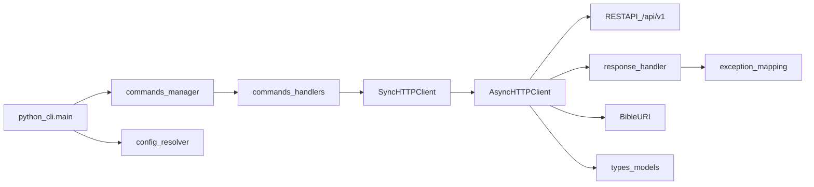

# Bible-CLI 代码框架计划（中文）

> 标记说明：`~~删除线~~` = 已完成；`<mark>高亮</mark>` = 与原设计有偏差、需要回写计划或设计文档。

## 目标与范围
- 以 [docs/designs/client_part/00-client-overview.md](/home/x61zhang/workspace/BiBLE-Atlas/docs/designs/client_part/00-client-overview.md) 为主约束，先完成“可运行、可扩展、可测试”的 CLI 框架。
- 首阶段优先实现：命令分发骨架、`BaseClient` 协议补齐、`AsyncHTTPClient/SyncHTTPClient` 基础能力、配置解析链、异常映射。
- 暂不深挖鉴权细节（仅预留接口扩展点），符合文档中的优先级说明。

## 现状评估（基于仓库）
- `bible-cli` 目录已有基础抽象：[bible-cli/baseclient.py](/home/x61zhang/workspace/BiBLE-Atlas/bible-cli/baseclient.py)。
- 客户端能力清单已有文字稿：[bible-cli/client-design.md](/home/x61zhang/workspace/BiBLE-Atlas/bible-cli/client-design.md)。
- 项目已有配置加载基础可复用：`bible/config/*` 与 `tests/test_config_loader.py`。

## 目标架构（代码框架）

## 分阶段实施

### Phase 1: 包结构与最小可运行骨架
- ~~在 `bible-cli` 下明确分层目录：~~
  - ~~`python_cli.py`（入口）~~
  - ~~`commands/`（命令解析与分发）~~
  - ~~`client/`（`base.py`、`async_http.py`、`sync_http.py`）~~
  - ~~`utils/`（配置、URI、异步桥接）~~
  - ~~`types/`（请求/响应与领域对象）~~
  - ~~`exceptions.py`（统一异常体系）~~
  - <mark>实际目录为 `bible_cli/`（下划线包名）而非 `bible-cli/`，计划与设计文档中的路径需统一。</mark>
- ~~`pyproject.toml` 对齐入口命令（`bs` / `biblesearch`）并保证 `uv run` 可直接执行 CLI。~~
- ~~产出：`--help` 可运行，命令树可展示，空实现命令返回明确“未实现”错误码。~~

### Phase 2: 客户端协议与 HTTP 主链路
- <mark>`BaseClient` 目前仍是最小抽象（仅初始化/关闭契约），尚未按 knowledge/session/relation/system 做接口分组；该任务需保留。</mark>
- ~~实现 `AsyncHTTPClient` 基础能力：~~
  - ~~endpoint 调用封装（统一方法、超时、重试策略占位）~~
  - ~~`_handle_response()` 统一 `{status,result,error}` 解包~~
  - ~~`_raise_exception()` 将服务端错误码映射到本地异常~~
- ~~实现 `SyncHTTPClient`：只做异步桥接，不重复业务逻辑。~~
- <mark>最小 API 已打通调用链；但 `knowledge list/search` 当前为服务端 `501 NOT_IMPLEMENTED` 占位能力，计划里“可通”建议改为“链路可用/能力占位”。</mark>

### Phase 3: 配置链路与运行时上下文
- <mark>尚未实现 `resolve_config_path()` 与“显式路径 -> 环境变量 -> 用户目录 -> 系统目录”完整优先级；当前仅支持环境变量读取。</mark>
- <mark>`ClientConfig` 已覆盖 `base_url/timeout/trust_env`，但尚未覆盖日志级别与 profile，计划项应改为“部分完成”。</mark>
- ~~CLI 启动时统一装配：读取配置 -> 构造 client -> 注入 command handlers。~~
- <mark>“零参数启动 + 环境覆盖”已支持；“显式配置覆盖”尚未在 CLI 参数层落地。</mark>

### Phase 4: 命令面分层落地
- ~~将命令拆分为可维护 Handler：`SystemCommands`、`KnowledgeCommands`、`MemoryCommands`、`SkillsCommands`。~~
- ~~每个 handler 只做参数校验与输出格式化，业务调用全部下沉 client。~~
- <mark>当前仅实现 JSON 输出；文本/表格模式尚未实现。</mark>
- <mark>当前闭环为 `health`、`system status/info`、`knowledge list/search(占位)`，尚未覆盖 knowledge 增改与 session 查询。</mark>

### Phase 5: 文件上传桥接与 URI 规范
- <mark>未完成：远端上传桥接尚未落地。</mark>
- <mark>`BibleURI` 目前是最小占位实现，尚未支持规范化/拼接/父节点/scope 校验。</mark>
- <mark>未完成：本地路径与远程路径双输入稳定处理链路未建立。</mark>

### Phase 6: 测试与质量门禁
- 单测：
  - <mark>配置解析优先级（完整优先级链）未完成。</mark>
  - ~~响应解包与异常映射~~
  - ~~命令参数校验与路由~~
- ~~集成测试：mock `/api/v1/*` 覆盖 `Sync -> Async -> HTTP` 主链路。~~
- <mark>质量流程是否完整执行（`format/check/mypy`）尚未在本计划中留痕，建议补充执行记录或 CI 结果链接。</mark>
- ~~产出：框架层达到可持续迭代状态。~~

## 关键设计约束
- 入口层不承载业务逻辑，仅调度。
- 同步/异步 API 语义保持一致，避免“双套实现漂移”。
- 异常必须强类型化（`BibleError` 及子类），命令层不直接处理裸 HTTP 错误。
- 配置解析行为可测试、可解释（打印实际生效配置来源）。

## 建议优先级（两周节奏）
- 第 1 周：Phase 1~3（框架骨架 + 主链路可跑通）
- 第 2 周：Phase 4~6（命令扩展 + 上传桥接 + 测试完善）

## 交付验收标准
- <mark>`bs --help` 与 `bs knowledge search` 已可执行；当前健康命令是 `bs health`（非 `bs system health`），验收口径需改写。</mark>
- <mark>“远端上传后创建资源”链路未实现，验收项保持未完成。</mark>
- ~~关键错误码可映射为本地异常并在 CLI 层给出可读信息。~~
- <mark>核心模块单测已补齐较大部分；类型检查/全流程质量门禁需补执行证据。</mark>
