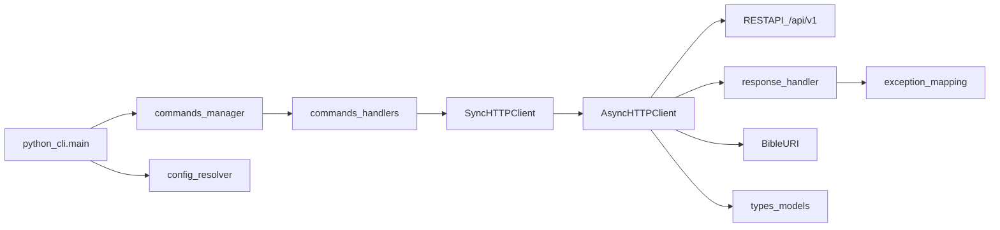

# Bible-CLI 代码框架计划（中文）

## 目标与范围
- 以 [docs/designs/client_part/00-client-overview.md](/home/x61zhang/workspace/BiBLE-Atlas/docs/designs/client_part/00-client-overview.md) 为主约束，先完成“可运行、可扩展、可测试”的 CLI 框架。
- 首阶段优先实现：命令分发骨架、`BaseClient` 协议补齐、`AsyncHTTPClient/SyncHTTPClient` 基础能力、配置解析链、异常映射。
- 暂不深挖鉴权细节（仅预留接口扩展点），符合文档中的优先级说明。

## 现状评估（基于仓库）
- `bible-cli` 目录已有基础抽象：[bible-cli/baseclient.py](/home/x61zhang/workspace/BiBLE-Atlas/bible-cli/baseclient.py)。
- 客户端能力清单已有文字稿：[bible-cli/client-design.md](/home/x61zhang/workspace/BiBLE-Atlas/bible-cli/client-design.md)。
- 项目已有配置加载基础可复用：`bible/config/*` 与 `tests/test_config_loader.py`。

## 目标架构（代码框架）

## 分阶段实施

### Phase 1: 包结构与最小可运行骨架
- 在 `bible-cli` 下明确分层目录：
  - `python_cli.py`（入口）
  - `commands/`（命令解析与分发）
  - `client/`（`base.py`、`async_http.py`、`sync_http.py`）
  - `utils/`（配置、URI、异步桥接）
  - `types/`（请求/响应与领域对象）
  - `exceptions.py`（统一异常体系）
- `pyproject.toml` 对齐入口命令（`bs` / `biblesearch`）并保证 `uv run` 可直接执行 CLI。
- 产出：`--help` 可运行，命令树可展示，空实现命令返回明确“未实现”错误码。

### Phase 2: 客户端协议与 HTTP 主链路
- 扩展 `BaseClient`：将 `client-design.md` 的关键能力整理为清晰接口分组（knowledge/session/relation/system）。
- 实现 `AsyncHTTPClient` 基础能力：
  - endpoint 调用封装（统一方法、超时、重试策略占位）
  - `_handle_response()` 统一 `{status,result,error}` 解包
  - `_raise_exception()` 将服务端错误码映射到本地异常
- 实现 `SyncHTTPClient`：只做异步桥接，不重复业务逻辑。
- 产出：最小 API（health、knowledge list/search）可通。

### Phase 3: 配置链路与运行时上下文
- 实现 `resolve_config_path()`，优先级遵循文档：显式路径 -> 环境变量 -> 用户目录 -> 系统目录。
- 将服务地址、超时、日志级别、profile 等归一为 `ClientConfig`。
- CLI 启动时统一装配：读取配置 -> 构造 client -> 注入 command handlers。
- 产出：支持“零参数启动 + 环境覆盖 + 显式配置覆盖”。

### Phase 4: 命令面分层落地
- 将命令拆分为可维护 Handler：`SystemCommands`、`KnowledgeCommands`、`MemoryCommands`、`SkillsCommands`。
- 每个 handler 只做参数校验与输出格式化，业务调用全部下沉 client。
- 输出层统一：表格/JSON/简版文本三种模式（先实现 JSON + 文本）。
- 产出：主命令可闭环（增/查 knowledge、session 基础查询、health）。

### Phase 5: 文件上传桥接与 URI 规范
- 落地远端场景：目录/文件参数先临时上传，再提交正式创建请求。
- 实现 `BibleURI`（规范化、拼接、父节点、scope 校验）并在 client 内强制统一入口。
- 产出：本地路径与远程路径两种输入都可稳定处理。

### Phase 6: 测试与质量门禁
- 单测：
  - 配置解析优先级
  - 响应解包与异常映射
  - 命令参数校验与路由
- 集成测试：mock `/api/v1/*` 覆盖 `Sync -> Async -> HTTP` 主链路。
- 质量流程对齐 README：`uv run format`、`uv run check --fix`、`uv run mypy`。
- 产出：框架层达到可持续迭代状态。

## 关键设计约束
- 入口层不承载业务逻辑，仅调度。
- 同步/异步 API 语义保持一致，避免“双套实现漂移”。
- 异常必须强类型化（`BibleError` 及子类），命令层不直接处理裸 HTTP 错误。
- 配置解析行为可测试、可解释（打印实际生效配置来源）。

## 建议优先级（两周节奏）
- 第 1 周：Phase 1~3（框架骨架 + 主链路可跑通）
- 第 2 周：Phase 4~6（命令扩展 + 上传桥接 + 测试完善）

## 交付验收标准
- `bs --help`、`bs system health`、`bs knowledge search` 可执行并返回结构化输出。
- 至少一条“远端上传后创建资源”的成功链路可复现。
- 关键错误码可映射为本地异常并在 CLI 层给出可读信息。
- 核心模块具备单测与类型检查覆盖，满足仓库既有检查流程。
