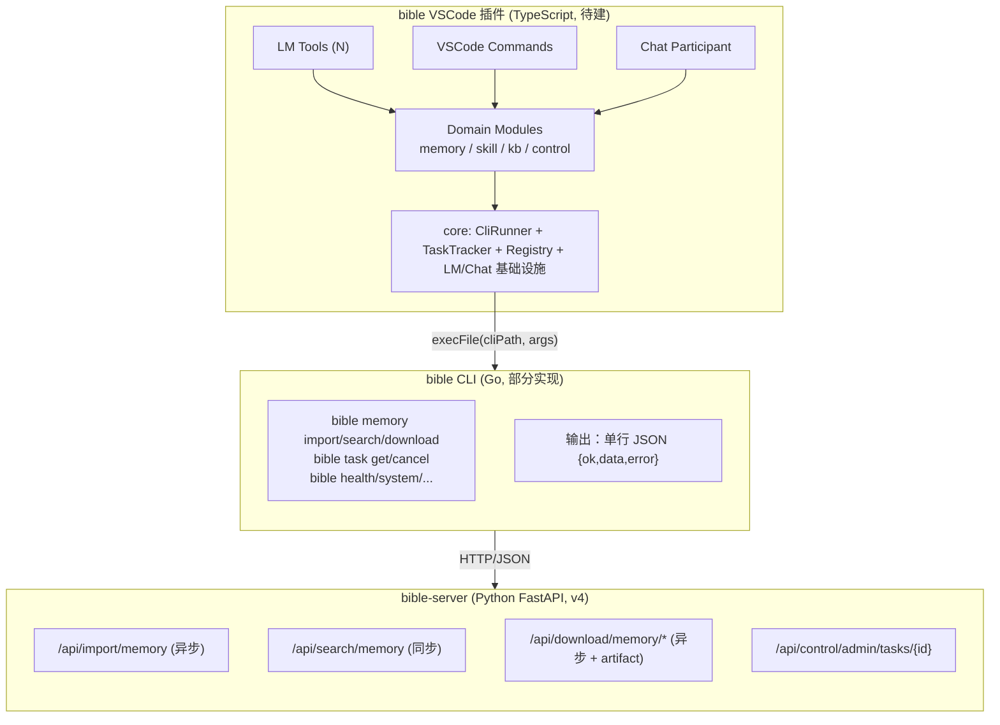
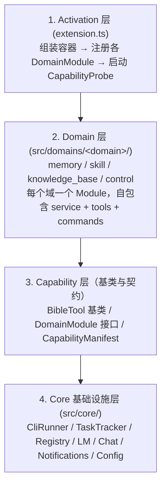
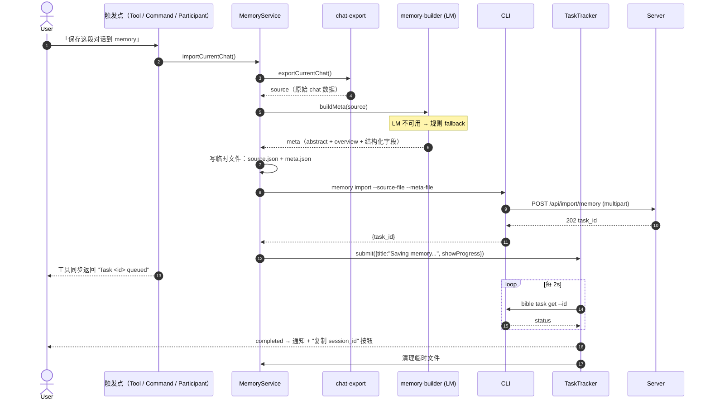
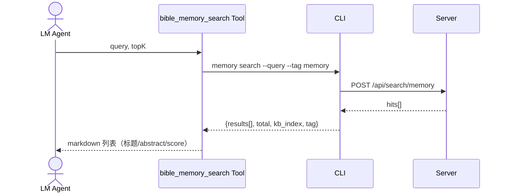

# Bible VSCode Extension — 框架设计（v4 对齐版）

> 本文档是面向 **VSCode 插件实现** 的框架设计稿，与 server v4 设计（`docs/designs/server_part/v4/*`）和 CLI 契约（`docs/manual/cli-contract-v1.md`）对齐。
>
> 核心定位：**先做完 memory 域闭环，但框架必须能无侵入扩展到 skill / knowledge_base 等其他域。**
>
> 读者：插件开发者、AI 实现者、架构评审。
>
> 文档边界：**只描述 What 与 Why**，不写实现代码。涉及对外契约处保留方法名 / 字段名 / 参数名 / 返回结构，不写函数体。

---

## 文档关系与定位

本文件与既有 client_part 文档的关系：

| 文档 | 作用 | 与本文关系 |
|---|---|---|
| `01-bible-vscode-extension-design.md` | 架构 Why（目标、边界、组件职责） | 仍生效；本文是它在 server v4 之后的**框架级补丁**，进一步细化分层与扩展点 |
| `02-bible-vscode-extension-spec.md` | 早期 How（基于 v3 `/api/v1/sessions` 的工具骨架） | **部分过时**：`bible_session_*` 系列工具与旧 API 路径需按 v4 重做；JSON 协议、execFile 封装、Tool/Command 双轨等思路保留 |
| `03-vscode-extension-framework-v4.md`（本文） | 框架 What（分层、抽象、目录、扩展点） | 与 01 同层，是落地 memory 域之前的"骨架契约" |
| 后续 `04-vscode-extension-memory-spec-v4.md`（待写） | Memory 域 How（Tool/Command/CLI 命令的精确契约） | 在本文之后落地，替代 02 中过时的 session 部分 |
| `docs/manual/cli-contract-v1.md` | CLI 输出协议、错误码、退出码冻结契约 | **强约束**：本文所有 CLI 调用都遵守此契约 |
| `docs/designs/server_part/v4/*` | Server v4 设计（API、异步任务、解析） | **强约束**：本文按 v4 三域、异步任务模型设计 |

冲突时优先级：`cli-contract-v1.md` > `server_part/v4/02_API接口文档.md` > 本文 > `01` > `02`。

---

## 一、设计目标与原则

### 1.1 目标

1. 围绕 **MEMORY 域**完成端到端能力（save / search / download）。
2. 提供 **可扩展骨架**：未来加入 skill 完整闭环、knowledge_base 自定义解析能力、control 类管理功能时，只新增"域模块"，不动 core。
3. 所有 server 通信走 **CLI**；插件不直连 server，不感知 HTTP/鉴权细节。
4. v4 异步任务模型（`POST → 202 + task_id → 轮询 → completed → 拉 artifact`）成为基础设施一等公民。
5. 与 CLI 实现进度解耦：CLI 缺命令时，插件不崩，自动降级。
6. **保存到 memory 的内容是"双产物"**：
   - `source`：原始 chat 导出（不可丢的真实对话原貌，作为 artifact 落盘，下载时可以拉回）
   - `meta.json`：LM 提炼的结构化记忆（驱动检索召回与上下文注入）
   - 二者一并提交给 CLI，server 端两份都存：`source` 作为 artifact，`meta` 解析为 chunks 入索引。

### 1.2 设计原则

| 原则 | 含义 |
|---|---|
| CLI 是唯一业务入口 | 插件代码内绝不出现 `http`、`fetch`、server URL；所有动作都翻译成 `bible <cmd> [args]` |
| 业务域优先组织 | 一级模块按 `memory/skill/knowledge_base/control` 分；能力（search/import/download）在域内组合，避免"按能力切一刀，所有域都改一遍" |
| Tool 与 Command 双轨同源 | 同一份 Domain Service 同时被 LM Tool 与 VSCode Command 复用 |
| 异步任务统一抽象 | 所有 import/download 走同一套 `TaskTracker`，不允许每个工具各写一套轮询 |
| 面向契约编程 | 域模块、CliRunner、TaskTracker 都先定义接口，再写实现 |
| 渐进可用 | CLI 命令缺失通过 `CapabilityManifest` 探测后自动禁用对应 Tool/Command，不影响其他域 |
| 原文必须可还原 | 任何"结构化提取"都不替代原文；source 永远跟随 meta 一起入库，下载可拉回 |

---

## 二、上下文与边界

### 2.1 三方协同视图



### 2.2 与 server v4 的对齐要点

| Server v4 设计 | 对插件的影响 |
|---|---|
| 三域命名：`KNOWLEDGE_BASE/SKILL/MEMORY`（v3 `SESSION` → v4 `MEMORY`） | 插件命名空间统一为 `bible_memory_*`、`bible_skill_*`、`bible_kb_*`，废弃 `bible_session_*` |
| API 按"能力 + 业务域"双维拆分 | 插件域模块结构与 API 一一对应；不再用"按能力一刀切" |
| Import / Download **强制异步**：返回 `202 + task_id` | 插件 import/download 工具立即返回 task_id，不阻塞 LM；进度通过通知反馈 |
| Download 二步走：`task → artifact_id → GET artifact` | TaskTracker 完成后自动触发 artifact 拉取，落盘到工作区或用户指定目录 |
| `tag`：MEMORY 固定 `memory`，SKILL 固定 `skill`，KB 由调用方提供 | 插件配置默认 `tag`，KB 域允许命令/工具显式指定 |
| `kb_index` 是物理索引，首次绑定不可改 | 插件提供 `bible.memory.defaultKbIndex` 设置；冲突错误 (`INDEX_BINDING_CONFLICT`) 给运维向导提示 |
| Memory 入库需提交 `source` + `meta.json` 双文件 | CLI `bible memory import` 同时接收 `--source-file` 与 `--meta-file`；download 默认拉回的是 `source` |
| `KNOWLEDGE_BASE` 不支持 download | KB 域不暴露 download Tool/Command |

### 2.3 与现有 CLI 的对齐要点

当前 `bible_cli_go` 状态：

- **已实现**：`health`、`search`、`system status/info`、`knowledge list`、`knowledge search`
- **占位（`CLI_NOT_IMPLEMENTED`，exit=3）**：`memory show`、`skills list`
- **未实现**：所有 v4 三域的 import/download 命令、task 通用查询命令

插件分阶段开发的前置条件（CLI 侧需要补齐，详见第八章）：

1. `bible memory search` / `bible memory import` / `bible memory download file|batch` / `bible memory artifact fetch`
2. `bible task get` / `bible task cancel`（封装 `/api/control/admin/tasks/*`）
3. 大入参（messages JSON、source 与 meta 文件）通过 `--input-file` / `--source-file` / `--meta-file` 等显式文件参数传入，避免命令行长度上限。

---

## 三、整体分层架构



约束：

- 单向依赖：上层只依赖下层接口，不引用具体实现。
- Domain 之间**不互相依赖**；横切类操作（如任务查询）只能在 control 域。
- core 层不感知任何业务域命名（只认 `CliInvocation` / `TaskRecord` 等中性结构）。

---

## 四、目录结构

```
bible-vscode/
├── package.json                           # contributes 由脚本从 manifest 自动生成
├── tsconfig.json
├── esbuild.js
├── scripts/
│   └── gen-contributes.ts                 # 读 src/manifest/*.ts → 重写 package.json
└── src/
    ├── extension.ts                       # 激活入口
    │
    ├── core/                              # 业务无关基础设施
    │   ├── cli/
    │   │   ├── cli-runner.ts              # execFile + JSON 解析
    │   │   ├── cli-error.ts               # BibleCliError + 错误码枚举
    │   │   └── cli-detector.ts            # CLI 是否可用 + 版本探测
    │   ├── task/
    │   │   ├── task-tracker.ts            # 提交/轮询/取消/进度通知
    │   │   ├── task-types.ts              # TaskRecord / TaskStatus / Artifact
    │   │   └── task-store.ts              # ExtensionContext 持久化未完成任务
    │   ├── registry/
    │   │   ├── tool-registry.ts           # LM Tool 动态注册/注销
    │   │   ├── command-registry.ts        # VSCode Command 注册
    │   │   └── capability.ts              # CapabilityManifest 类型 + 比对器
    │   ├── tool/
    │   │   └── bible-tool.ts              # BibleTool / AsyncBibleTool 基类
    │   ├── lm/
    │   │   ├── model-selector.ts          # 偏好模型列表 + fallback 选择
    │   │   └── budget.ts                  # 字符预算与截断
    │   ├── chat/
    │   │   └── chat-export.ts             # 双策略 Copilot Chat 导出
    │   ├── ui/
    │   │   ├── notifications.ts           # showInfo / showError / withProgress 封装
    │   │   ├── quick-pick.ts              # 通用 0/1/N 选择 helper
    │   │   └── output-channel.ts          # 统一日志通道
    │   └── config/
    │       └── extension-config.ts        # bible.* 配置读取与监听
    │
    ├── domains/                           # 业务域
    │   ├── memory/                        # ★ 本期重点
    │   │   ├── memory-module.ts           # 装配入口（实现 DomainModule）
    │   │   ├── memory-service.ts          # 对 CLI 的薄封装
    │   │   ├── memory-types.ts            # MemoryHit / MemorySearchResult / MemoryMeta ...
    │   │   ├── memory-builder.ts          # LM 提取 + 规则 fallback，产出 meta.json
    │   │   ├── memory-format.ts           # search 结果 → LM 注入文本格式化
    │   │   ├── tools/
    │   │   │   ├── memory-search.tool.ts
    │   │   │   ├── memory-import.tool.ts
    │   │   │   └── memory-download.tool.ts
    │   │   ├── commands/
    │   │   │   ├── search-memory.command.ts
    │   │   │   ├── save-chat.command.ts
    │   │   │   └── download-memory.command.ts
    │   │   └── participant/
    │   │       └── memory-participant.ts  # @bible-memory：/save /search /load /help
    │   │
    │   ├── skill/                         # 框架就绪、最小占位
    │   │   ├── skill-module.ts
    │   │   └── tools/skill-search.tool.ts
    │   │
    │   ├── knowledge_base/                # 框架就绪、只读最小占位
    │   │   ├── knowledge-base-module.ts
    │   │   └── tools/knowledge-search.tool.ts
    │   │
    │   └── control/                       # 任务/系统类
    │       ├── control-module.ts
    │       ├── task-service.ts
    │       └── tools/task-status.tool.ts
    │
    └── manifest/
        ├── tools.manifest.ts              # 所有 LM Tool 的 schema 集中声明
        └── commands.manifest.ts           # 所有 VSCode Command 的元数据集中声明
```

---

## 五、核心抽象（接口契约）

> 本章只列接口签名与字段名作为契约；具体实现由 `04-spec` 文档与代码负责。

### 5.1 `CliRunner`

职责：

- 唯一负责 `execFile` + `JSON.parse(stdout)` + 错误归一。
- 处理 `ENOENT`（CLI 未安装）/ 非 JSON 输出 / 超时 / 退出码 3（`CLI_NOT_IMPLEMENTED`）。
- 大入参支持 stdin 或 `--input-file <tmp>`（含 `--source-file` / `--meta-file` 等 memory 域专用参数），不在命令行直接拼超长 JSON。

接口签名：

```typescript
interface CliInvocation {
  args: string[];
  stdinPayload?: string;
  timeoutMs?: number;
}

interface CliEnvelope<T = unknown> {
  ok: boolean;
  data?: T;
  error?: { code: string; message: string };
}

interface CliRunner {
  run<T>(call: CliInvocation): Promise<T>;          // 解包后返回 data；失败抛 BibleCliError
  runRaw<T>(call: CliInvocation): Promise<CliEnvelope<T>>;
}
```

错误码枚举（`BibleCliErrorCode`）至少需覆盖：

| 类别 | 枚举值 |
|---|---|
| 进程层 | `CLI_NOT_FOUND`、`CLI_NOT_IMPLEMENTED`、`TIMEOUT`、`UNAVAILABLE`、`INTERNAL`、`UNKNOWN` |
| 通用业务 | `INVALID_ARGS`、`NOT_FOUND`、`CONFLICT`、`FAILED_PRECONDITION`、`UNAUTHENTICATED`、`PERMISSION_DENIED`、`RESOURCE_EXHAUSTED`、`SEV_NOT_IMPLEMENTED` |
| v4 业务码透传 | `INDEX_BINDING_CONFLICT`、`INDEX_NOT_BOUND`、`PARSER_SCRIPT_RISK`、`PARSER_SCRIPT_TIMEOUT`、`PARSER_SCRIPT_RUNTIME_ERROR`、`PARSE_RESULT_SCHEMA_INVALID`、`VECTOR_MODEL_CONFLICT`、`FILE_REGISTRY_NOT_FOUND`、`FILE_NOT_FOUND`、`DOWNLOAD_LIMIT_EXCEEDED`、`ZIP_BUILD_FAILED`、`DOWNLOAD_ARTIFACT_NOT_FOUND`、`DOWNLOAD_ARTIFACT_EXPIRED`、`CLI_ERROR` |

### 5.2 `TaskTracker`（异步任务统一编排）

接口签名：

```typescript
type TaskStatus =
  | 'queued' | 'running' | 'retrying'
  | 'completed' | 'failed' | 'cancelled';

interface TaskRecord<R = unknown> {
  taskId: string;
  taskType: string;                            // 例：'import.memory' / 'download.memory'
  domain: 'memory' | 'skill' | 'knowledge_base';
  status: TaskStatus;
  result?: R;
  error?: { code: string; message: string };
  submittedAt: number;
  updatedAt: number;
}

interface DownloadArtifact {
  artifact_id: string;
  artifact_name: string;
  content_type: string;
  size_bytes: number;
  expires_at: string;
}

interface TaskHandle<R = unknown> {
  taskId: string;
  onUpdate(listener: (record: TaskRecord<R>) => void): vscode.Disposable;
  promise: Promise<TaskRecord<R>>;             // 终态 resolve；用户取消 reject
}

interface SubmitOptions {
  taskType: string;
  domain: TaskRecord['domain'];
  title: string;                               // 通知文案，例 "Saving memory..."
  submit: () => Promise<{ task_id: string }>;  // 通常 = cliRunner.run<{task_id:string}>(...)
  showProgress?: boolean;
  onCompleted?: (record: TaskRecord) => Promise<void>;  // 例：download 完成后自动 fetch artifact
}

interface TaskTracker {
  submit<R = unknown>(opts: SubmitOptions): Promise<TaskHandle<R>>;
  watch<R = unknown>(taskId: string): TaskHandle<R>;
  cancel(taskId: string): Promise<void>;
}
```

实现要点：

- 默认 2s 轮询（`bible.task.pollIntervalMs`），最大等待 600s（`bible.task.maxWaitMs`），超时不算失败但暂停轮询并提示用户去 `Bible: Show Task Status` 查询。
- 对 `bible task get` 调用做指数退避（连续 3 次 `UNAVAILABLE` 后退避到 5s）。
- 进度通过 `vscode.window.withProgress(Notification, cancellable=true)`；用户取消 → 调 `bible task cancel`。
- 未完成任务持久化到 `vscode.ExtensionContext.workspaceState`；激活时自动续看。
- `LanguageModelToolResult` 给 LM 的同步返回只携带 `task_id` + 当前状态，**绝不阻塞 LM 等任务完成**。

### 5.3 `DomainModule`（业务域契约）

接口签名：

```typescript
interface CapabilityManifest {
  required: Array<{ command: string[]; minVersion?: string }>;        // 缺失则整个域禁用
  optional: Array<{ command: string[]; featureFlag: string }>;        // 缺失则只禁用对应 feature
}

interface DomainModule {
  readonly id: 'memory' | 'skill' | 'knowledge_base' | 'control';
  capabilities(): CapabilityManifest;
  register(ctx: vscode.ExtensionContext, deps: ModuleDeps): vscode.Disposable[];
}

interface ModuleDeps {
  cli: CliRunner;
  tasks: TaskTracker;
  toolRegistry: ToolRegistry;
  commandRegistry: CommandRegistry;
  notify: Notifications;
  output: OutputChannel;
  config: ExtensionConfig;
}
```

新增一个域的工作量：

1. 新建 `src/domains/<x>/<x>-module.ts`，实现 `DomainModule`。
2. 写 `service` + 若干 `tools` / `commands`。
3. 在 `src/manifest/tools.manifest.ts` 加该域的 schema。
4. `extension.ts` 里 `modules.push(new XModule())`。
5. `npm run gen:contributes` 重生成 `package.json`。

### 5.4 `BibleTool` 与 `AsyncBibleTool`（消除工具模板）

两个抽象基类，覆盖"同步 CLI 调用 → 格式化文本"与"异步 CLI 任务 → 立即返回 task_id"两类工具。

接口契约：

| 抽象方法 | 子类实现意图 |
|---|---|
| `buildArgs(input): CliInvocation` | 把 LM 入参翻译成 CLI 参数 |
| `format(data, input): LanguageModelToolResult` | 把 CLI 返回的 data 翻译成 LM 友好的文本（仅同步类） |
| `confirmation(input)?` | 写操作返回 `LanguageModelToolConfirmationMessages`，由 VSCode 弹原生确认 UI |
| `taskType(): string` | 异步类工具：声明任务类型，例 `'import.memory'` |
| `domain(): TaskRecord['domain']` | 异步类工具：声明所属域 |
| `titleFor(input): string` | 异步类工具：进度通知文案 |
| `onCompleted(input, record)?` | 异步类工具：终态后续动作（如 download 完成自动 fetch artifact） |

`prepareInvocation` 由基类实现：从 manifest 取 `busyText`、合并 `confirmation()` 的结果。

`invoke` 由基类实现：

- `BibleTool`：`cli.run(buildArgs(input)) → format(data, input)`。
- `AsyncBibleTool`：`tasks.submit({ submit: () => cli.run(buildArgs(input)), ... })`，立即返回包含 `task_id` 的文本结果，不等终态。

### 5.5 Registry（动态启停）

接口签名：

```typescript
interface ToolRegistry {
  register(name: string, tool: vscode.LanguageModelTool<any>): vscode.Disposable;
  disable(name: string, reason: string): void;
  isActive(name: string): boolean;
}

interface CommandRegistry {
  register(id: string, handler: (...args: any[]) => any): vscode.Disposable;
  disable(id: string, reason: string): void;
  isActive(id: string): boolean;
}
```

`CapabilityProbe` 在激活后异步运行（不阻塞 activate），按域调用对应 `bible <cmd> --help`（或预定义探测命令），把不可用的命令对应的 Tool/Command 从 Registry 中下线。

### 5.6 配置层

`ExtensionConfig` 提供类型安全访问 + `onDidChange` 事件。框架级默认配置项：

| 配置 key | 默认值 | 说明 |
|---|---|---|
| `bible.cliPath` | `"bible"` | CLI 可执行路径或别名 |
| `bible.cli.timeoutMs` | `30000` | 单次 CLI 调用超时 |
| `bible.task.pollIntervalMs` | `2000` | TaskTracker 轮询间隔 |
| `bible.task.maxWaitMs` | `600000` | 单任务最大等待时长（超时仅暂停轮询，不算失败） |
| `bible.task.persistOnReload` | `true` | 重启后续看未完成任务 |
| `bible.memory.defaultKbIndex` | `"memory_main"` | Memory 默认 kb_index |
| `bible.memory.defaultVectorModel` | `""` | 空 = 跟随索引绑定模型 |
| `bible.memory.downloadDir` | `"${workspaceFolder}/.bible/memory"` | Memory 下载文件落盘目录 |
| `bible.skill.defaultKbIndex` | `"skill_main"` | Skill 域 kb_index |
| `bible.knowledgeBase.defaultTag` | `"design"` | KB 域默认 tag |
| `bible.tools.disabled` | `[]` | 用户黑名单：禁用某些 LM Tool |

Memory 域专用配置见 6.6。

---

## 六、Memory 域的具体落地

### 6.1 能力矩阵

| 能力 | Tool | Command | CLI 期望命令 | 同/异步 | 写操作 |
|---|---|---|---|---|---|
| 检索 memory | `bible_memory_search` | `Bible: Search Memory` | `bible memory search --query Q --tag memory [--top-k N] [--search-type ...]` | 同步 | 否 |
| 保存对话 / 笔记 | `bible_memory_import` | `Bible: Save Current Chat as Memory` | `bible memory import --tag memory --kb-index <X> --source-file <S> --meta-file <M>` | 异步 | 是（需确认） |
| 单文件下载（拉源文件）—— *仅 LM Tool* | `bible_memory_download` | — | `bible memory download file --tag memory --storage-path <P>` | 异步 | 是 |
| 拉取 artifact（内部） | — | — | `bible memory artifact fetch --id <id> --out <path>` | 同步流 | — |
| 任务查询（通用） | `bible_task_status`（control 域） | `Bible: Show Task Status` | `bible task get --id <id>` | 同步 | 否 |

> **核心约定**：
> 1. `bible_memory_import` 必须同时携带 `source` 与 `meta`；server 两份都存，`source` 为 artifact、`meta` 为 chunks。`bible_memory_download` 默认拉回的是 `source` 原文，不是 meta。
> 2. **没有面向用户的"下载"命令**。`storage_path` 是 server 内部字段，用户既拿不到也不会想手输。下载逻辑被 `MemoryService.ensureLocalSource` 隐式化——`Bible: Search Memory` 的 `Load` 动作触发它，缓存命中 0 网络、未命中走完整 `download file → task wait → artifact fetch` 流程。LM Tool `bible_memory_download` 仍保留：agent 从 `bible_memory_search` 拿到合法 `storage_path` 后才会调，与"用户手动输入"无关。
> 3. **Preview 与 Load 解耦**。Preview 只渲染 hit 已有字段（abstract / snippet / hit_field / storage_path + 本地缓存状态）的 markdown，**不触发下载**——避免源文件可能很大、避免 IDE 通知阻塞 QuickPick 主线程。只有 Load 才会 ensureLocalSource。
> 4. **Search 命令是可往返的交互式选取**。单实例 `createQuickPick` 在两种 state 切换：`hits` 显示候选列表（带 `cached` / `viewed` 标记），选中一条后切到 `actions` 显示 2 项动作 + `Back to list`。预览 markdown 用 `preserveFocus: true` + `ignoreFocusOut: true`，QuickPick 在编辑器旁保持可见，用户预览完后自动回到该 hit 的动作菜单 → 直接选 `Load` 或选 `Back` 比较其他候选；命令生命周期内可反复浏览。
> 5. **Debug 命令隐藏**。`bible.debug.toggleDryRun` / `bible.debug.openMockProfile` / `bible.memory.showLastImportFiles` 只在代码层 `commandRegistry.register`，**不**在 `package.json` 的 `commands` 数组里暴露，因此命令面板看不到。开发者按需绑 keybinding 或用 `vscode.commands.executeCommand(...)` 调。

### 6.2 Memory 三个核心用户故事

#### 故事 A：保存当前对话为 memory（核心闭环）

入库双产物模型：

- `source.json`：Copilot Chat 原始导出，**完整保留**对话原貌
- `meta.json`：LM 提炼的结构化记忆（`abstract` / `overview` / 各结构化字段）



要点：

- LM Tool 入口（`bible_memory_import` 含 messages 参数）：LM 自己提供 messages，Service 跳过 `chat-export`，直接走 `buildMeta` + 双文件提交。
- Command / Participant 入口：Service 自己 `chat-export` 再 `buildMeta`，**不消耗 LM token**。
- 三种入口最终都进同一段"双文件提交 + TaskTracker"逻辑。

#### 故事 B：被动检索（agent 自动调用）



并存两条检索路径，按用途使用：

- `bible_knowledge_search --enable-hit --hit-types memory`：知识库主检索，附带命中 memory（CLI 已实现）
- `bible_memory_search`：纯 memory 检索（待 CLI 实现）

#### 故事 C：取一条 memory 的 source（查询自动下载 + 缓存复用）

下载在新设计里 **不是一个独立动作**，而是 search/Load/Download 三个入口共享的 `MemoryService.ensureLocalSource(hit)` 管线：

```mermaid
sequenceDiagram
    actor User
    participant Entry as 入口（任一）<br/>① Bible: Search Memory + Load to @bible-memory<br/>② @bible-memory /load &lt;query&gt;<br/>③ LM Tool bible_memory_download (LM-only)
    participant Svc as MemoryService
    participant FS as 本地文件系统
    participant Tk as TaskTracker
    participant CLI
    participant Srv as Server

    User->>Entry: 触发（已选定一条 hit 或手动输 storage_path）
    Entry->>Svc: ensureLocalSource({ hit })
    Svc->>FS: stat ${downloadDir}/<key>.json<br/>key = sanitize(session_id ?? storage_path)
    alt cache hit (文件存在且 size>0)
        FS-->>Svc: { exists }
        Svc-->>Entry: { path, fromCache: true, sizeBytes }
    else cache miss
        Svc->>Tk: submit(taskType=download.memory, showProgress=true)
        Tk->>CLI: memory download file --storage-path
        CLI->>Srv: POST /api/download/memory/file
        Srv-->>CLI: 202 {task_id}
        Tk-->>Tk: 轮询直到 completed
        Tk-->>Svc: record.result.artifact_id
        Svc->>CLI: memory artifact fetch --id --out <localPath>
        CLI-->>Svc: { path, size_bytes, content_type }
        Svc-->>Entry: { path, fromCache: false, sizeBytes }
    end
    Entry->>User: 通知（Load 路径继续走 loadToContext + chat.open + participant /load）
```

**核心契约**：

| 维度 | 设计 |
| --- | --- |
| 缓存目录 | `bible.memory.downloadDir` 默认 `${workspaceFolder}/.bible/memory/` |
| 缓存 key | `sanitize(hit.session_id ?? hit.storage_path)` |
| 缓存粒度 | 单文件（只缓存 source 原文；server-side 的 expires_at 在 v1 不参与失效判断）|
| 失效方式 | 当前版本：手动 `rm`；未来：加 manifest 元数据 + TTL |
| 取消 | 若 ensureLocalSource 调用方传 `cancellationToken`，自动 `tasks.cancel(task_id)` |
| 失败降级 | 调用方根据场景决定——Load 路径允许"无 source 仅 summary"；LM Tool 路径直接报错 |

> 用户路径上**没有独立的"下载"命令**——下载只在 `Bible: Search Memory + Load` 时隐式发生。LM Tool `bible_memory_download` 保留：agent 自己负责先调 `bible_memory_search` 拿合法 `storage_path`，所以"用户手输 storage_path"这种不存在的场景不会出现。

下载到本地的是**原始 source 文件**，用户可以重读完整对话；如果需要的是结构化摘要，那是 search → 注入 `meta.overview` 的事，不走 download。

### 6.3 Memory 域 LM Tool 契约

> 完整 JSON Schema 见 04-spec；这里只列**对外契约**。

| Tool name | displayName | 触发时机（modelDescription 要点） | 入参字段 | 写? | 异步? |
|---|---|---|---|---|---|
| `bible_memory_search` | Search Memory | 用户提到"上次/我们之前/曾经讨论过…"等历史引用，或当前问题可能在以往保存的对话中有答案 | `query` (string, 必填)、`topK` (number)、`searchType` (`keyword`/`title`/`text`/`vector`/`hybrid`) | 否 | 否 |
| `bible_memory_import` | Save to Memory | **仅当**用户显式请求"保存/归档/记住" | `messages` (array, 必填，role+content)、`title` (string, 可选) | 是 | 是 |
| `bible_memory_download` | Download Memory | 用户显式请求导出某条已保存的 memory；下载的是**原始对话源文件** | `storagePath` (必填)、`downloadName` (可选)、`outputDir` (可选) | 是 | 是 |

通用约定：

- 工具命名：`bible_<domain>_<verb>`。
- `modelDescription` 必须明确：何时调用 / 期望返回什么 / 限制（异步、需用户授权等）。
- 写工具的 `modelDescription` 必须含 "Call ONLY when the user explicitly asks ..."。
- 异步工具同步返回**只包含 `task_id` 与当前状态**，不阻塞 LM。

### 6.4 MemoryService（域内服务）

```typescript
interface MemoryService {
  // ---- 检索 ----
  search(input: { query: string; topK?: number; searchType?: SearchType }): Promise<MemorySearchResult>;

  // ---- 导出当前 Copilot Chat 为 source ----
  exportCurrentChat(): Promise<ChatSource>;             // 双策略 fallback；详见 14.3

  // ---- 由 source（或 messages）生成 meta ----
  buildMeta(input: {
    source: ChatSource | { messages: Message[]; title?: string };
    sessionId?: string;
    cancellationToken?: vscode.CancellationToken;
  }): Promise<MemoryMeta>;                              // LM 提取 + 规则 fallback；详见 14.2

  // ---- 双文件 import ----
  submitImport(input: {
    sourceFile: string;                                 // 临时文件路径（chat 原文）
    metaFile: string;                                   // 临时文件路径（meta.json）
    kbIndex?: string;
    vectorModel?: string;
  }): Promise<{ task_id: string }>;

  // ---- 一站式封装：导出 → buildMeta → 写临时文件 → submitImport ----
  importCurrentChat(input?: { kbIndex?: string; cancellationToken?: vscode.CancellationToken }):
    Promise<{ task_id: string; sessionId: string }>;

  // ---- 下载（拉源文件） ----
  submitDownloadFile(input: { storagePath: string; downloadName?: string }): Promise<{ task_id: string }>;
  fetchArtifact(input: { artifactId: string; outputPath: string }): Promise<{ path: string; size: number }>;
}
```

数据契约（仅字段，不写实现）：

`ChatSource`（chat-export 产物，原样保留）：

| 字段 | 类型 | 说明 |
|---|---|---|
| `session_id` | string | 优先取 raw `id` / `sessionId` / `requests[0].requestId`；缺则插件生成 |
| `exported_at` | string (ISO) | 导出时间 |
| `messages` | `Array<{ role: 'user'\|'assistant'\|'system'; content: string }>` | 解析后的纯文本 turn 序列 |
| `raw` | object | 原始 chat 导出 JSON（无损保留，供 server 端归档） |

`MemoryMeta`（meta.json 内容；server 端 `parse_memory.py` 解析此结构入索引）：

| 字段 | 类型 | 必填 | 用途 |
|---|---|---|---|
| `session_id` | string | ✓ | 与同时上传的 source 对应；server 端用于 source/meta 关联 |
| `abstract` | string (≤220 字符) | ✓ | 单行检索摘要，主要供召回 |
| `overview` | string (markdown) | ✓ | 多段正文，主要供检索后注入 LM 上下文 |
| `primary_request_intent` | string | ✓ | 用户真实目标（不是文件描述） |
| `key_concepts` | string[] | ✓ | 关键概念关键字 |
| `pending_tasks` | string[] | ✓ | 未完成事项（无则空数组） |
| `session_kind` | enum | 推荐 | `implementation` / `analysis` / `mixed` |
| `code_change_status` | enum | 推荐 | `modified` / `not_modified` / `unknown` |
| `actual_actions` | string[] | 可选 | 实际执行的动作 |
| `final_result` | string | 可选 | 最终结果 |
| `touched_files` | string[] | 可选 | 涉及的文件路径 |
| `touched_symbols` | string[] | 可选 | 涉及的类/函数/模块名 |
| `key_decisions` | string[] | 可选 | 关键决策 |
| `verification_evidence` | string[] | 可选 | 验证证据 |
| `risks_next_steps` | string[] | 可选 | 风险与后续 |

> `meta.json` **不再放 `raw_messages`**：原文已由 source 文件单独承担，避免重复。

域内 Tool / Command / Participant 都通过 `MemoryService` 调 CLI，不直接拼 CLI 参数。这样：

- 命令面板的命令、LM Tool、Chat Participant 共用同一份业务逻辑。
- `buildMeta` / `exportCurrentChat` 单独可测，便于离线调通 LM prompt 与导出 fallback。
- 单元测试可以 mock `CliRunner` 与 `vscode.lm.selectChatModels` 直接测 service。

### 6.5 Chat Participant（第三种触发方式）

除 LM Tool 与 VSCode Command 外，再提供 `@bible-memory` chat participant：

| Slash 命令 | 行为 | 与 Tool 的差异 |
|---|---|---|
| `@bible-memory /save` | `MemoryService.importCurrentChat()` 一站式：导出 source + 生成 meta + 双文件 import | LM Tool 入口要求 LM 把 messages 作为参数传入；participant 自己导出，**不消耗 LM token** |
| `@bible-memory /search <query>` | 检索并把结果以 markdown 流式返回到 Chat | 直接给用户看，受用户控制；不像 Tool 是给 LM 看 |
| `@bible-memory /load` | 复用上一次成功检索的上下文 | 用 `workspaceState` 缓存上次结果 |
| `@bible-memory /load <query>` | 立即检索 + 自动选 top-1 + 注入 context | 非交互场景，0 用户操作 |
| `@bible-memory /help` | 帮助 | — |

注册要点：

- `vscode.chat.createChatParticipant('bible.memoryParticipant', handler)`，icon 用 `$(database)`。
- handler 内按 `request.command` 分发到 `MemoryService` 对应方法。
- 用 `stream.progress(...)` 推进度文案，最终 `stream.markdown(...)` 给结果。
- 取消：把 handler 收到的 `token` 转发到 `MemoryService` 调用。

为什么需要 participant 而不止 Tool：

- LM Tool 的 input 必须由 LM 提供 messages；participant 可以自己 `chat-export`，绕过 LM token 消耗。
- participant 可以流式 markdown 输出，对"加载历史 memory 注入上下文"这种长文本场景更合适。
- participant 在 Chat 面板有独立入口图标，用户发现成本低。

### 6.6 Memory 域专用配置项

| 配置 key | 默认值 | 说明 |
|---|---|---|
| `bible.memory.lmModelPriority` | `["copilot/gpt-4.1", "copilot/gpt-4o", "copilot/claude-sonnet-4-5", "copilot/claude-sonnet-4", "copilot/gemini-2.5-pro"]` | LM 模型偏好顺序，全部失败后 fallback 到任意 copilot 模型 |
| `bible.memory.lmConvMaxChars` | `80000` | 单次 LM 输入字符预算（详见 14.5） |
| `bible.memory.lmTurnMaxChars` | `3000` | 单 turn 截断长度 |
| `bible.memory.copySessionIdOnSave` | `true` | 保存成功后弹按钮"复制 session_id" |
| `bible.memory.sourceFormat` | `"chat-export-json"` | source 文件格式标识；未来支持 markdown / messages-only 时扩展枚举 |

---

## 七、扩展性验证：新增域的步骤

### 7.1 接入 Skill 完整闭环（举例）

按以下顺序完成，**不涉及修改 core**：

1. 在 `src/domains/skill/skill-module.ts` 实现 `DomainModule`：
   - `id = 'skill'`
   - `capabilities()` 返回：required = `['skill', 'search']`；optional = `['skill', 'import']` 与 `['skill', 'download']`，分别挂 featureFlag `skill.write` / `skill.download`
   - `register()` 内创建 `SkillService`，按 capability 决定要注册哪些 Tool / Command
2. 在 `src/manifest/tools.manifest.ts` 加 `bible_skill_*` 工具 schema。
3. `extension.ts` 增加一行 `modules.push(new SkillModule())`。
4. `npm run gen:contributes` 重生成 `package.json`。
5. CLI 侧补 `bible skill *` 命令（独立节奏）。

### 7.2 接入 Knowledge_base（KB 自定义解析能力）

差异点：

- KB **没有 download**；只暴露 search / import。
- `tag` 由用户/工具显式提供；import 时可上传自定义 `parser_script`（额外文件参数）。
- 预期工具：`bible_kb_search`、`bible_kb_import`（高级功能，命令面板优先；LM 工具默认禁用，避免误触发解析脚本上传）。

框架本身**无需任何改动**。

### 7.3 接入 Control 域

`bible_task_status` / `bible_task_cancel` / `bible_health` / `bible_system_info` 等横切类工具放在 `domains/control/`。Memory / Skill 域内不重复实现任务查询。

---

## 八、与 CLI 的契约约束

> 以下命令是插件框架对 CLI 的预期，CLI 实现进度可独立推进；插件用 Capability Manifest 探测，缺失即降级。建议固化为新增 `cli-contract-v2` 或扩展 `v1`。

### 8.1 Memory 域命令

| 命令 | 关键入参 | 输出 data | Server 映射 |
|---|---|---|---|
| `bible memory search --query Q --tag memory [--top-k N] [--search-type T] [--vector-model M]` | — | `{ results: MemoryHit[], total: number, kb_index: string, tag: string }` | `POST /api/search/memory` |
| `bible memory import --tag memory --kb-index X --source-file <S> --meta-file <M> [--vector-model M] [--parser-script p]` | `--source-file`：原始 chat 文件（content-type 由 CLI 嗅探）<br>`--meta-file`：本地 `meta.json`（结构见 6.4） | `{ task_id: string, status: 'queued', kb_index: string, tag: 'memory', session_id: string }` | `POST /api/import/memory`（multipart，两份文件） |
| `bible memory download file --tag memory --storage-path P [--download-name N]` | 拉回**原始 source 文件** | `{ task_id, status: 'queued' }` | `POST /api/download/memory/file` |
| `bible memory download batch --tag memory --paths-file P [--package-name N] [--include-metadata]` | `--paths-file` 指向 JSON 字符串数组；`--include-metadata=true` 时打包内同时附带 `meta.json` | `{ task_id, status: 'queued' }` | `POST /api/download/memory/batch` |
| `bible memory artifact fetch --id ARTIFACT_ID --out PATH` | — | `{ path: string, size_bytes: number, content_type: string }` | `GET /api/download/memory/artifact/{id}` |

### 8.2 任务通用命令

| 命令 | 输出 data | Server 映射 |
|---|---|---|
| `bible task get --id TASK_ID` | `{ task_id, task_type, status, result?, error?, created_at, updated_at }` | `GET /api/control/admin/tasks/{id}` |
| `bible task cancel --id TASK_ID` | `{ task_id, status: 'cancelled' }` | `DELETE /api/control/admin/tasks/{id}` |

### 8.3 大入参 / 文件入参约定

- Memory `import` 使用 `--source-file` + `--meta-file`，**两个独立文件**；CLI 内部用 multipart 同时上传。
- 其它 messages / paths 等可能 >8KB 的入参，**必须**走 `--input-file <path>` 或 stdin，不允许命令行直接拼。
- 临时文件路径建议 `os.tmpdir()/bible-vscode/<uuid>/{source.json,meta.json}`；任务终态后清理；失败时保留 24h 用于排障。

### 8.4 错误码透传

CLI 必须把 server v4 业务错误码（如 `INDEX_BINDING_CONFLICT`、`PARSER_SCRIPT_RISK`、`DOWNLOAD_ARTIFACT_EXPIRED`）原样透传到 `error.code`，不要聚合成 `INTERNAL`。这样插件能给针对性提示。

---

## 九、错误处理统一表

| 来源 / Code | 用户感知 | 插件动作 |
|---|---|---|
| `CLI_NOT_FOUND` (ENOENT) | 一次性 toast：未找到 bible CLI | 弹"安装指南 / 设置路径"按钮 |
| `CLI_NOT_IMPLEMENTED` (exit=3) | 静默 | Tool 自动从 LM 注销；Command 触发时提示"该能力需要更新 CLI" |
| `SEV_NOT_IMPLEMENTED` (501) | LM 工具结果中明示"服务端能力未上线" | 不视为崩溃；Command 给出"稍后重试"提示 |
| `INVALID_ARGS` | LM 工具内 throw → LM 自我纠正 | Command 弹错误并保留输入 |
| `UNAUTHENTICATED` / `PERMISSION_DENIED` | 弹"鉴权失败，请检查 CLI 配置" | 引导打开 `~/.bible/config.json` |
| `INDEX_BINDING_CONFLICT` | "索引已绑定不同 parser/profile，需删索引重建" | 通知带"打开运维文档"按钮 |
| `INDEX_NOT_BOUND` | "尚未导入过该 tag 对应索引" | 提示先做一次 import |
| `VECTOR_MODEL_CONFLICT` | "传入的 vector_model 与索引绑定模型不一致" | 提示去掉 `--vector-model` 或换索引 |
| `DOWNLOAD_ARTIFACT_EXPIRED` | "产物已过期" | 自动重新提交一次下载任务（仅一次） |
| `TIMEOUT` / `UNAVAILABLE` | "服务暂不可用" | 仅幂等 (search) 自动重试一次；其他报错 |
| Task `failed` | "任务失败：&lt;code&gt; &lt;msg&gt;" | 通知带"查看详情"→打开 OutputChannel |
| Task 用户取消 | "已取消" | 发 `task cancel`；本地状态置 cancelled |

---

## 十、与 LM Agent 的交互约束

| 场景 | 设计 |
|---|---|
| 写操作必须确认 | 通过 `prepareInvocation.confirmationMessages` 由 VSCode 原生 UI 处理；插件不实现自定义对话框 |
| 异步工具的同步返回 | 只携带 `task_id` + 当前状态；**不阻塞 LM 等任务完成**，否则会卡住 agent 推理 |
| 进度反馈给用户 | 走 VSCode 通知/进度条，不走 LM 工具结果 |
| 工具自描述 | `modelDescription` 必须明确：何时调用 / 期望得到什么 / 限制（异步、需用户授权等） |
| 工具命名 | 域前缀：`bible_<domain>_<verb>`，例 `bible_memory_search` |
| 不要"贪心"自动调用写工具 | `import` / `download` 工具 modelDescription 显式写 "Call ONLY when the user explicitly asks ..." |

---

## 十一、可观测性

### 11.1 OutputChannel "Bible"

记录：

- 每次 CLI 调用的 args（敏感字段截断）+ 返回 envelope
- 每次任务状态变化
- 异常堆栈
- Memory 域三类专项事件（详见 14.9）：chat export 走的策略 / LM 调用模型与耗时 / Task 状态终态完整 result

### 11.2 Status Bar 项（可选 P1）

`$(book) Bible · 2 active tasks` 点击 → QuickPick 展示当前 TaskTracker 跟踪的任务列表，可取消。

### 11.3 健康自检命令

`Bible: Run Self-Check`：

- CLI 可执行 + 版本
- `bible health` 调用是否成功
- 各域 capability 探测结果
- Token / config 是否就绪
- Copilot Chat 导出能力是否就绪（干跑一次 chat-export）

---

## 十二、风险与待澄清事项

| # | 项 | 现状 | 处理建议 |
|---|---|---|---|
| R1 | 旧 02 文档 `bible_session_*` 与新 `bible_memory_*` 共存？ | 02 全篇基于 v3 | 在 02 顶部加 deprecate 段；新写 04-memory-spec-v4 |
| R2 | `kb_index` 由谁决定 | 未定 | 配置默认 `memory_main`；命令面板可覆盖；agent 工具走默认 |
| R3 | source 文件格式（chat export JSON / Markdown / messages-only） | 第一版固定 chat-export-json | 由 `bible.memory.sourceFormat` 控制；server 端 parser 按 mimetype 路由 |
| R4 | LM Tool 是否需要等任务完成 | — | **不等**。返回 task_id 即可；进度走 VSCode 通知 |
| R5 | 多工作区下 task 持久化作用域 | — | 用 `globalState`（跨工作区可见），key 带 cliPath 哈希避免冲突 |
| R6 | 鉴权 | v4 文档未强调 | 视 server 落地决定；插件保持中立，所有鉴权细节在 CLI 内 |
| R7 | `tag` 是否允许多值 | server v4：MEMORY 固定 `memory` | 插件硬编码 `memory`；KB 域才暴露 `tag` 输入 |
| R8 | 批量下载入口 | — | LM 工具暂不开放，避免 LM 误触发大文件下载；命令面板提供 |
| R9 | 失败任务的清理周期 | — | TaskTracker 终态 24h 后自动清理记录；OutputChannel 保留 |
| R10 | `meta.json` 与 `source` 的版本关联 | 未定 | 通过 `meta.session_id` 与 source 一一对应；server 端按 session_id 关联 artifact 与 chunks |

---

## 十三、推荐里程碑

| 阶段 | 目标 | 验收 | 依赖 CLI 命令 |
|---|---|---|---|
| **F0 框架地基** | `core/*` 全部 + `extension.ts` 装配 + control 域 `bible_health` 可用 | Copilot agent 调用 `bible_health` 返回 JSON；OutputChannel 有日志 | `bible health`（已就绪） |
| **F0.5 LM 与 Chat 基础设施** | `core/lm/` + `core/chat/` + `core/ui/quick-pick.ts` 落地 | 单元测试：导出当前 chat 成功；模型 fallback 选到 copilot；0/1/N 命中都能正确选 | — |
| **F1 Memory 检索闭环** | `bible_memory_search` Tool + `Bible: Search Memory` Command + `memory-format.ts` 注入文本 | agent / 命令面板都能拿到 memory 结果 | `bible memory search`（待实现）；过渡可用 `bible search --enable-hit --hit-types memory` |
| **F2 Memory 导入闭环（核心）** | `bible_memory_import` Tool + `Bible: Save Current Chat as Memory` Command + `memory-builder.ts` LM 提取 + 双文件提交 + TaskTracker | "保存对话"端到端通；source 与 meta 双文件均落到 server；session_id 可一键复制；LM 失败可降级到规则提取 | `bible memory import`（双文件）、`bible task get`、`bible task cancel` |
| **F2.5 Chat Participant** | `@bible-memory /save /search /load /help` 全可用 | 在 Copilot Chat 输入 `@bible-memory /save` 能保存当前对话；`/load <q>` 自动选 top-1 注入 | — |
| **F3 Memory 下载/缓存闭环** | `MemoryService.ensureLocalSource` + Search Load 自动下载 + `bible_memory_download` LM Tool + `artifact fetch` 自动化 | Search 选完 Load → 自动下载（首次）/ 缓存命中（再次）；LM Tool 与 Search Load 共享缓存；下载到的是 source 原文；**用户路径不再有独立 Download 命令** | `bible memory download file`、`bible memory artifact fetch` |
| **F4 扩展性验证：Skill 域** | 新增 SkillModule（不改 core），暴露 `bible_skill_search` / `bible_skill_get` | 证明开放-封闭原则 | `bible skill search`、`bible skill get` |
| **F5 治理 & 体验** | `bible_task_status` Tool + 状态栏 + 自检命令 + 错误向导 | 任意 task_id 可查；用户能看到所有进行中任务 | `bible task get` |
| **F6（可选）** | KB 域只读、批量 download、统计命令 | — | KB 与 control 类命令 |

---

## 十四、关键设计要点详解

> 本章细化 Memory 域几个重要决策的 Why 与 How，作为后续 04-memory-spec-v4 编写依据。

### 14.1 入库双产物：source + meta

**决策**：保存 memory 时，同时提交两份文件给 CLI，二者**都入库**：

| 产物 | 来源 | server 端处理 | 用途 |
|---|---|---|---|
| `source`（原始 chat） | `chat-export.ts` 的双策略导出，或 LM Tool 入参的 `messages` 序列化 | 作为 **artifact** 落盘；可被 `bible memory download file` 拉回 | 还原真实对话原貌（不可压缩、不可摘要替代） |
| `meta.json` | `memory-builder.ts` 用 LM 提取（fallback 规则） | 由 `parse_memory.py` 解析为 chunks 入索引 | 驱动检索召回与上下文注入 |

**为什么必须两份**：

- 摘要≠原文：LM 抽取的 `meta` 永远是有损压缩，下游用户/agent 早晚会问"原话怎么说的？"，没有 source 就无法回答。
- 关注点分离：source 不参与索引（避免运行时片段污染检索）；meta 不承担存档职责（避免冗余原文）。
- 下载语义清晰：`bible memory download file` 拉回的是 source；要"看摘要"则走 search → 命中后注入 `meta.overview`。
- 服务端解析简单：`parse_memory.py` 只需要解析 meta；source 只是 artifact 落盘，无需结构化处理。

**两份文件的关联约束**：

- `meta.session_id` 必须与同时上传的 source 对应；server 端按 `session_id` 关联 artifact 与 chunks。
- 批量下载 `--include-metadata=true` 时，server 端把同 session 的 source 与 meta 一并打入 zip。

`meta.json` 字段 schema 见 6.4 表格；`source` 的字段约定见 `ChatSource` 表格。

**与 server `search_profile` 的字段建议映射**（最终由 server 端 `parse_memory.py` 与对应 `search_profile` 决定）：

| meta 字段 | server 索引字段 | search_profile 中位置 |
|---|---|---|
| `abstract` | `abstract` | `keyword.term_fields` + `text.fields`（高权重） |
| `overview` | `content`（按 markdown 段落切 chunk） | `text.fields` + `vector` |
| `primary_request_intent` | `intent` | `text.fields`（中权重） |
| `key_concepts` | `concepts` | `keyword.term_fields` |
| `session_kind` / `code_change_status` | 同名 keyword 字段 | 仅展示与过滤，不参与召回 |
| `touched_files` / `touched_symbols` | 同名 keyword 字段 | 过滤；可选作为 keyword 候选 |

### 14.2 LM 提取 + 规则 fallback 双轨

**决策**：保存对话时不直接用原始 messages 入库做 chunks，而是先用 LM 把对话提炼成 `meta.json`；LM 不可用或失败时降级到规则提取（关键词 + 启发式分类）。

**为什么**：

- **检索质量**：LM 提取出来的 `abstract` 远比"截取前 200 字符"靠谱；`session_kind` / `code_change_status` 等语义字段无法用规则可靠产出。
- **token 占用与噪音**：原始 chat export 经常包含 `kind="thinking"` / `toolInvocationSerialized` 等运行时片段，直接当 chunks 索引会污染检索（注意：原片段并未丢失，存在 source 文件里）。
- **稳定可用性**：用户可能没有 Copilot quota / 网络受限；规则 fallback 保证 `bible memory import` 始终能产出"可用但更粗"的 meta。

**Prompt 关键约束**（实现时要满足，不绑定具体文案）：

1. 输出格式必须可机器解析（建议用 JSON 直接输出，或固定分隔符 + 严格 schema）。
2. 显式禁止把"只读分析"伪装成"已实现/已修复/已完成开发"。
3. 必须填的字段要明确写"无"或"未验证"，禁止留空。
4. `session_kind` 与 `code_change_status` 必须从枚举集合中取值。
5. 文件、函数、模块名能提取就尽量提取，避免"只写抽象描述"。

**规则 fallback 的最低产出要求**：

| 字段 | 规则 fallback 产出方式 |
|---|---|
| `abstract` | 取首条 user 消息的首句，截断到 220 字符 |
| `overview` | 模板拼接：用户目标（首条 user）→ 关键动作（assistant 中含动词的段）→ 最终结果（最后一条 assistant） |
| `key_concepts` | TF 频次 + 停用词过滤抽取 top-N |
| `session_kind` | 关键词匹配启发式：含"已修改/已实现"→ `implementation`；含"分析/解释"→ `analysis`；混合 → `mixed` |
| `code_change_status` | 同上：含"已写入/已提交"→ `modified`；明确未改 → `not_modified`；不确定 → `unknown` |
| 其它枚举字段 | 缺失即不写 |

### 14.3 Copilot Chat 导出策略

**决策**：导出当前 Chat 采用双策略 fallback；首选 `chat.exportSession`，失败时用 `workbench.action.chat.export` 写到临时文件再读。

**为什么**：

- `chat.exportSession` 直接返回数据，最理想；但**部分 VSCode 版本不存在该命令**。
- `workbench.action.chat.export` 几乎所有版本都有，但是写文件 + 异步、需要 `outputPath` 参数避免弹"另存为"对话框。
- 导出能力是 `/save` 与 `bible_memory_import`（无 messages 输入时）的前置；不能假设永远可用。

**实现注意**：

| 项 | 处理 |
|---|---|
| `chat.exportSession` 不存在 | 抛错信息含 `not found` / `command` 关键字时视为不可用，进 fallback；其它错误直接抛出 |
| `workbench.action.chat.export` 异步写文件 | 调用后短延迟 + 文件存在性检查双保险，确认文件已写完 |
| 导出文件残留 | 解析后清理临时文件，失败不抛 |
| 导出可用性探测 | `Bible: Run Self-Check` 启动时干跑一次（用临时空目录），不可用则禁用 `/save` 与依赖导出的 Tool/Command |

**Chat export 的 turn 解析约定**（产出 `messages: [{role, content}]`，作为 source 的 `messages` 字段；同时把原始 export JSON 放到 `source.raw`）：

- 用户 turn：取 `requests[].message.text`
- 助手 turn：取 `requests[].response[]` 中**没有 `kind` 字段且 `value` 为 string** 的项；带 `kind: "thinking"` / `"toolInvocationSerialized"` / `"prepareToolInvocation"` 等的项跳过
- 多个助手 value 用 `\n` 拼接成一条 turn

> `source.raw` 保留是为了后续 server 端如果想做更精细的归档（比如恢复 thinking 步骤）有数据可用。

### 14.4 LM 模型选择与 fallback

**决策**：核心域功能（如 memory 提取）依赖 LM 时，必须用 fallback 列表选择模型，不绑定特定模型。

**默认偏好顺序**（可由 `bible.memory.lmModelPriority` 覆盖）：

1. `copilot/gpt-4.1`
2. `copilot/gpt-4o`
3. `copilot/claude-sonnet-4-5`
4. `copilot/claude-sonnet-4`
5. `copilot/gemini-2.5-pro`
6. fallback：`vendor: copilot`（任意可用 copilot 模型）

**实现要点**：

- 每个 selector 用 `vscode.lm.selectChatModels()` 试一次，第一个非空返回即用。
- 全部失败 → `selectPreferredModel()` 返回 undefined → 调用方决定降级（`memory-builder` 走规则 fallback）。
- 不要 throw，让上层有机会降级。

### 14.5 LM 输入预算与截断

**决策**：传给 LM 的对话长度有上限，超出按"整句截断 + 末尾标记"的方式处理，不允许直接把超长 prompt 传过去。

**默认配置**：

- `bible.memory.lmConvMaxChars: 80000` —— 单次提取的总字符预算
- `bible.memory.lmTurnMaxChars: 3000` —— 每个 turn 单独截断长度

**截断策略**：

1. 按时间顺序遍历 turns，每个 turn 内容超过 `lmTurnMaxChars` 截断到该长度，加 `…(截断)` 标记。
2. 累计字符超过 `lmConvMaxChars` 时停止，并在 prompt 末尾补一行 `...（对话过长，已截断）`。
3. 优先保留首尾 turn（首条 user 是目标；末条 assistant 是结果）；中间过长则均匀采样。
4. 截断只影响 LM 输入；**source 文件保留完整原文**，不受预算限制。

### 14.6 多结果 0 / 1 / N 选择策略（通用 helper）

**决策**：所有"检索 → 选择 → 后续动作"链路统一用同一个 helper，避免每个 Tool/Command 自己写一套。

| 命中数 | 交互场景（命令面板）| 非交互场景（LM Tool / 自动化）|
|---|---|---|
| 0 | 提示 "无结果"，不缓存 | 同左 |
| 1 | 直接返回该项 | 直接返回该项 |
| N | QuickPick 让用户选；可取消 → 返回 cancelled | 直接返回 top-1（带 `selectionMode='top1'` 标记）|

接口签名：

```typescript
type SelectionMode = 'single' | 'top1' | 'quick-pick' | 'no-results' | 'cancelled';

function selectOneOrTop<T>(items: T[], opts: {
  interactive: boolean;
  toQuickPickItem: (t: T) => vscode.QuickPickItem;
  title?: string;
  placeholder?: string;
}): Promise<{ selected?: T; mode: SelectionMode }>;
```

### 14.7 进度通知 + Cancellation Token 联动

**决策**：所有耗时 ≥1s 的操作（LM 调用、CLI 任务提交、TaskTracker 轮询）必须用 `vscode.window.withProgress(Notification, cancellable=true)`，并把进度面板的 `token` **转发**给底层调用，让用户可中止。

适用范围：

- `memory-builder.buildMeta` 的 LM 调用
- `TaskTracker` 的轮询循环
- `chat-export` 不需要（同步 + 短超时）

约束：

- 必须把 progress 的 `cancellationToken` 传到所有它所发起的下游异步调用（LM `sendRequest`、CLI `run` 内部子进程）。
- 用户取消进度 → TaskTracker 自动调用 `bible task cancel`。

### 14.8 Memory 保存成功后的 UX

**决策**：`bible memory import` 任务终态为 `completed` 时，通知必须包含：

- 文案："Memory saved (kb_index=..., session_id=...)"
- 按钮："**复制 session_id**"（点击 → 写剪贴板）
- 按钮："**Show in OutputChannel**"（点击 → 切到 Bible 输出通道，看完整 server 响应）

理由：session_id 是用户后续问 agent "上次那个 NPE 修复在哪？" 时唯一可靠的锚；放剪贴板按钮成本最低。

### 14.9 Chat 导出 / LM / Memory 状态的可观测性

**决策**：以下三类事件必须写到 `OutputChannel("Bible")`：

1. Chat export 走的是哪条策略（`exportSession` 还是 fallback），以及 source 文件大小。
2. LM 调用：用了哪个模型、字符预算余量、耗时；如果走了规则 fallback 写明原因。
3. Task 状态变化：每次轮询的 status；终态时 result/error 的完整 JSON（含 session_id、artifact_id 等）。

理由：memory 这条链路涉及 VSCode API + LM API + CLI + Server 四层，问题排查必须有一处汇总。

---

## 十五、一句话总结

> **以 `MEMORY` 为第一个域跑通"CLI 驱动 + 异步任务 + LM Tool / Command / Chat Participant 三轨"框架；入库提交 source（原始 chat） + meta.json（结构化提取）双产物，server 端 source 落 artifact、meta 入索引；core 抽象只做一次，新域只新增模块文件即可。**
