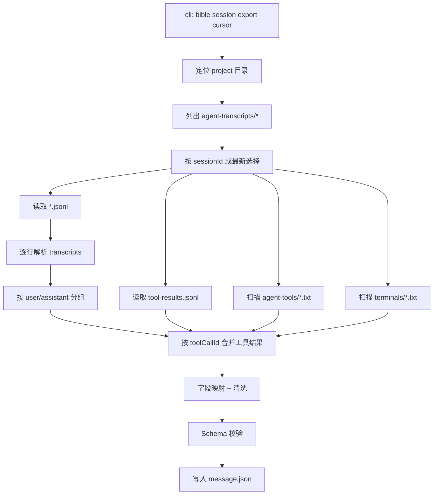
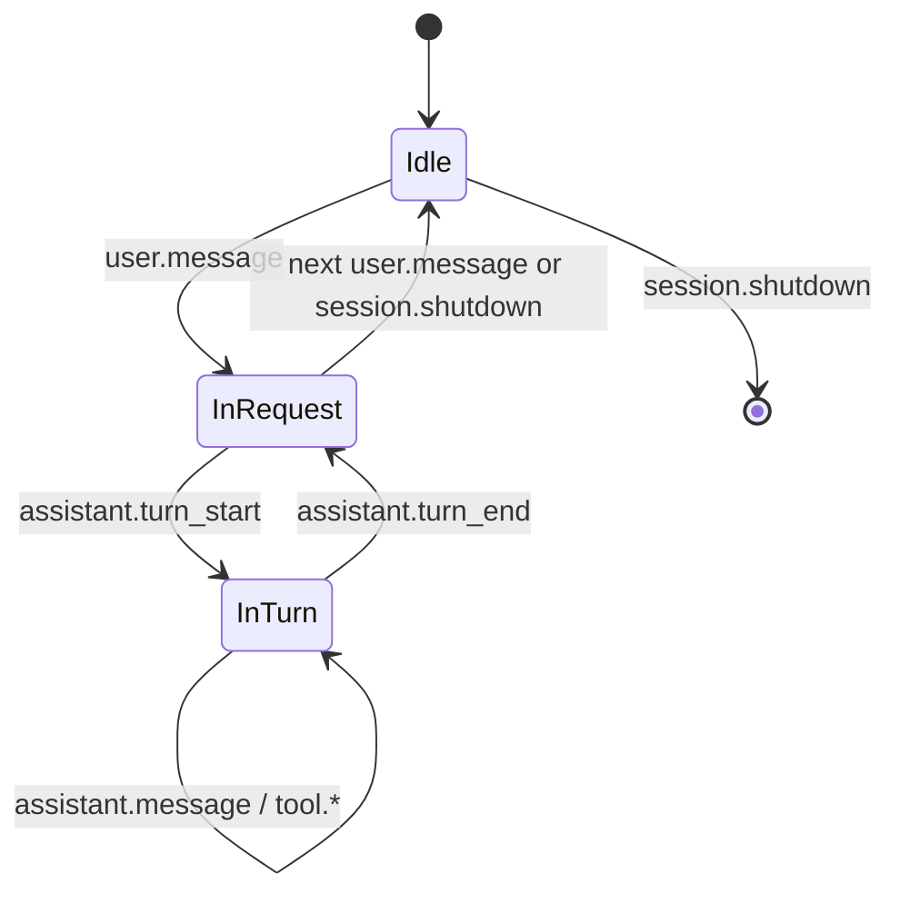
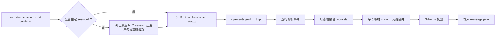
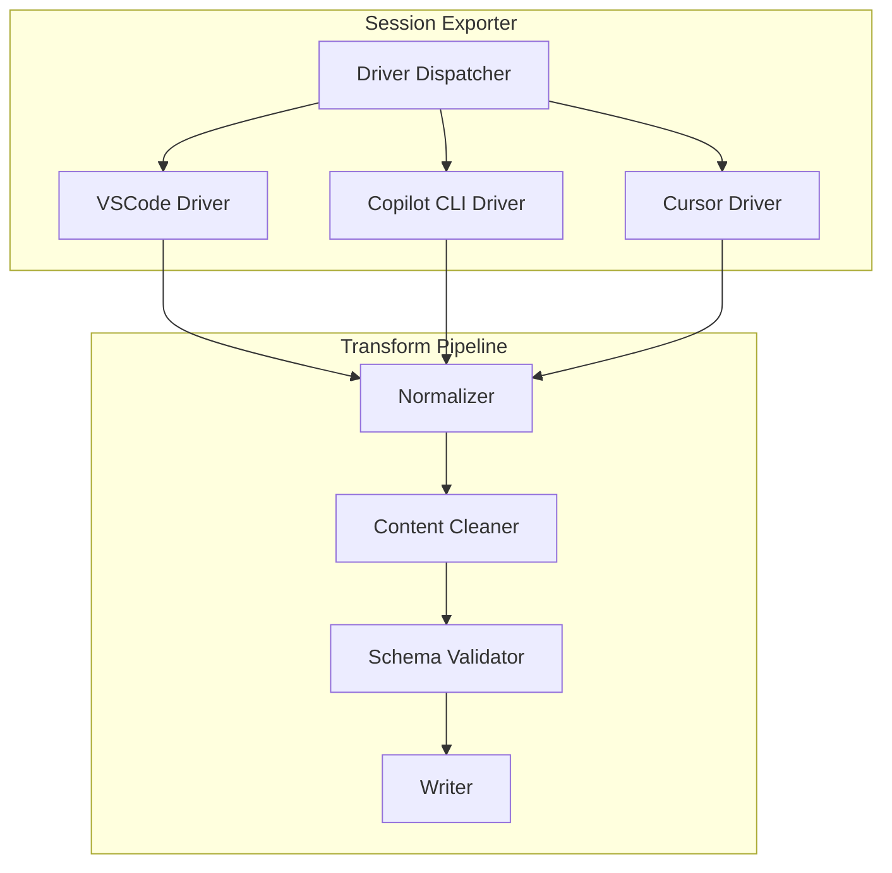

# message.json 获取细化设计

> 版本：v2.0
> 状态：设计阶段
> 关联文档：
> - [`02_API接口文档.md`](../server_part/v4/02_API接口文档.md) — MEMORY API 契约（**权威**）
> - [`import_implementations/memory_import_implementation.md`](../server_part/v4/import_implementations/memory_import_implementation.md) — MEMORY Import 实现
> - [`import_implementations/memory_meta_parser_implementation.md`](../server_part/v4/import_implementations/memory_meta_parser_implementation.md) — `parse_memory.py` 与 `meta.json` 字段约束（**权威**）
> - [`03-memory-upload-client-design.md`](./03-memory-upload-client-design.md) — Memory 上传客户端设计，含 `meta.json` 构造规范
> 适用对象：插件开发、CLI 工具开发、算法平台

---

## 1. 背景与目标

`message.json` 属于 MEMORY 域文件集合。它是原始对话事实源，用于 import 关联附件落盘、download 回放与审计。

**职责划分**：`meta.json` 由 **client 端在上传前构造**（包含 `memory_id`、`title`、`abstract`、`overview`、`task_ids`、标签字段等），作为服务端 `parse_memory.py` 的必须主文件输入。`message.json` 为可选附件，不参与检索 chunk 生成，仅通过 `local_file_storage_plan` 落盘到文件系统。

本文档针对 **如何从不同客户端采集并产出符合约定的 `message.json`（及 `meta.json`）** 展开细化设计。

> **与 `03-memory-upload-client-design.md` 的分工**：本文档聚焦采集与格式转换；`meta.json` 的完整字段定义、构造策略与上传 API 协议见 [`03-memory-upload-client-design.md`](./03-memory-upload-client-design.md)。

### 1.1 目标

- 统一三个场景产出的 `message.json` 结构（schema）；
- 明确每个场景的采集路径、触发方式、转换规则、降级策略；
- 让下游 Upload Service（`POST /api/import/memory`）对来源无感知；
- 在 session 导出完成后，提供从 `message.json` 自动构造约定格式 `meta.json` 的标准流程。

### 1.2 场景一览

| # | 场景 | 采集方式 | 原始格式 | 处理动作 |
|---|---|---|---|---|
| 1 | VS Code Copilot Chat | 插件通过 chat session API 导出 | 已是 `message.json` 格式 | 直接使用，**本文档不展开** |
| 2 | Copilot CLI | 读取 `~/.copilot/session-state/<id>/events.jsonl` | 事件流 JSONL | 转换为 `message.json` |
| 3 | Cursor Agent Chat | 读取 `~/.cursor/projects/<slug>/agent-transcripts/<id>/<id>.jsonl` + 附属工具结果 | 轮次 JSONL + 附属资产 | 转换为 `message.json` |

### 1.3 参考产物

- VS Code 场景样例：`/var/fpwork/linpan/gnb/.claude/skills/pronto-deep-dive/chat.json`（历史命名，统一后应改名为 `message.json`）
- 本文档对齐的目标 schema = 该样例的结构（下文 §2）。

> 命名约定：全链路一律使用 `message.json`，不再混用 `chat.json`。历史样例文件可保留但需要做一次重命名。

---

## 2. 统一 `message.json` 目标 Schema

以 VS Code 插件导出的 `message.json` 为权威样例，抽象出以下最小公共结构（Subset Schema）。三个场景都向该结构收敛。

### 2.1 顶层结构

```jsonc
{
  "schema_version": "1.0",               // 必填：便于服务端识别与演进校验
  "session_id": "<uuid>",                // 必填：采集器生成或来自文件名 UUID，服务端以此作为 document_key
  "responderUsername": "GitHub Copilot" | "Cursor Agent" | "Copilot CLI",
  "initialLocation": "panel" | "terminal" | "editor",
  "sourceClient": {                       // 扩展字段，标识采集来源
    "kind": "vscode" | "copilot-cli" | "cursor",
    "version": "string",
    "sessionId": "string",
    "exportedAt": "ISO8601",
    "workspace": { "cwd": "string", "gitRoot": "string", "branch": "string" }
  },
  "requests": [ /* Request[] */ ]
}
```

> **与服务端 schema 的关系**：`schema_version` 和 `session_id` 是客户端构造 `meta.json` 时的基础来源字段。`session_id` 由客户端用于生成 `memory_id`（格式 `mem_<session_id>`），该 `memory_id` 将作为服务端 MEMORY 文档的稳定幂等键，并通过 `parse_memory.py` 映射到 OpenSearch 的 `document_key`。`message.json` 本身作为附件随 multipart 上传，由服务端 `local_file_storage_plan` 落盘，但不直接参与检索 chunk 构建。

### 2.2 Request 结构

```jsonc
{
  "requestId": "request_<uuid>",
  "message": {
    "text": "用户原始 prompt",
    "parts": [
      { "kind": "text", "text": "..." }
    ]
  },
  "variableData": {                       // 可选：附件/上下文引用
    "variables": [ /* file / prompt / tool refs */ ]
  },
  "response": [ /* ResponsePart[] */ ]
}
```

### 2.3 ResponsePart 结构

规范化为以下 `kind`，便于下游统一消费：

| kind | 含义 | 关键字段 |
|---|---|---|
| `thinking` | 模型推理/内心独白 | `value`, `id` |
| `textPart` | 模型文本输出 | `value` |
| `toolInvocationSerialized` | 工具调用 | `toolId`, `toolCallId`, `invocationMessage`, `toolInput`, `toolResult`, `isConfirmed`, `isComplete` |
| `codeblockUri` | 引用的代码片段 | `uri`, `startLine`, `endLine` |
| `markdown` | Markdown 片段 | `value` |

### 2.4 Schema 校验

- 使用 JSON Schema 校验（`schemas/message.schema.json`）；
- 三个采集器产出后必须跑 `validate(message.json)`；
- 校验失败则走降级策略：保留原始文件 + 标记 `conversion_warning`。

### 2.5 与服务端 MEMORY 文件集合的衔接

MEMORY import 的核心文件集合由 **`meta.json`（必须，client 端构造）** 和 `message.json`（可选附件）组成。服务端 `parse_memory.py` 以 `meta.json` 作为主入口生成 chunks 与 search_profile，`message.json` 仅通过 `local_file_storage_plan` 落盘到文件系统，不参与检索索引。

#### 2.5.1 MEMORY 文件集合定位

| 文件 | 字段/内容 | 生成责任方 | 采集器关系 |
|---|---|---|---|
| `meta.json` | 结构化元数据（`memory_id`、`title`、`abstract`、`overview`、`task_ids`、标签字段等） | **客户端必须构造**（详见 `03-memory-upload-client-design.md` §3） | 采集器在 `finalize-session.sh` 中调用 `build_meta_from_message_json` 生成；**上传前必须存在** |
| `meta.json` → `memory_id` | MEMORY 文档的全局幂等键（`mem_<session_id>` 格式） | 客户端 | 由采集器从 `message.json`.`session_id` 派生 |
| `meta.json` → `abstract` | 一句话摘要（≤500 字符，须符合服务端校验） | **客户端**从首条 user message 提取 | 实现可取首条文本前约 300 字为草稿，再整体截断至 500 字以内；`overview` 可先留空（`""`），待人工或后续任务补充 |
| `meta.json` → `overview` | 段落级总结 | **客户端可选填写**，默认为 `""` | 服务端不覆盖，原样存入索引 |
| `message.json` | 原始对话事实（requests、responses、tool calls） | **采集器产出**（本文档范围） | 必须满足 §2.1–§2.3 schema；作为可选附件随 multipart 上传 |

**采集器职责**：须产出**高质量 `message.json`（原始事实）与约定格式的 `meta.json`（结构化元数据）**。`meta.json` 由采集器在 session 导出完成后（`stop` hook 触发时）自动构造，或由 CLI `bible memory upload` 命令在检测到 `meta.json` 缺失时自动调用 `build_meta_from_message_json` 补充生成。

#### 2.5.2 meta.json 缺失 / 字段不完整的处理策略

当前约定下，`meta.json` 是服务端 `parse_memory.py` 的**必须主文件**（`filename == "meta.json"`），缺失会导致 parse 失败。因此客户端必须确保 `meta.json` 在上传前已构造并通过本地 schema 校验。

| 情况 | 客户端行为 | 影响 |
|---|---|---|
| `meta.json` 不存在，`message.json` 可用 | 自动调用 `build_meta_from_message_json` 生成 `meta.json`，写本地缓存 | 正常上传，`abstract` 从首条 user message 截取 |
| `meta.json` 存在，通过 schema 校验 | 直接使用，合并命令行传入的额外标签 | 正常上传 |
| `meta.json` 存在，校验失败（缺 `memory_id`/`title`/`abstract`） | 终止上传，报错提示缺失字段，不进入 API 请求 | 不产生服务端任务 |
| `message.json` 采集失败 / schema 不合法 | 仍可上传（`message.json` 为可选附件）；`meta.json` 中 `abstract` 等字段须由用户手动补填，或使用 `--abstract` 参数传入 | 上传可成功；download/审计能力受限（缺原始对话） |
| `message.json` 部分字段缺失但结构可用 | 正常上传，采集器在 `message.convert.log` 标记 `partial_parse` | 服务端落盘；`meta.json` 质量取决于客户端提取质量 |

> **`POST /api/import/memory` 请求体**不包含 `validation_mode` 等旁路开关；客户端不应传入。上传时服务端对 `meta.json` 格式校验失败会直接返回同步错误。

#### 2.5.3 采集器输出目录建议

与服务端 MEMORY 逻辑存储目录对齐，采集器的本地输出应使用：

```text
<output_base>/
└── <session_id>/
    ├── meta.json                 # 必须（client 端构造）：memory_id/title/abstract/overview/标签等
    ├── message.json              # 必须（采集器主要产出）：原始对话事实源
    ├── message.source.json.gz    # 可选：原始 JSONL 的 gzip 快照，用于回溯
    └── message.convert.log       # 可选：转换告警、丢弃行、tool 不闭合等
```

> **注**：`meta.json` 的完整字段定义（`memory_id`、`title`、`abstract`、`overview`、`task_ids`、`feature_tags`、`domain_tags`、`component_tags`、`source_client`、`language`、`created_at`）及构造规范详见 [`03-memory-upload-client-design.md`](./03-memory-upload-client-design.md) §3。采集器负责生成"基础质量"的 `meta.json`，用户可在上传前手动补充 `overview` 等字段。

`session_id` 由采集器按来源生成：
- VS Code：取 `sourceClient.sessionId`；
- Cursor：取 `agent-transcripts/` 下的文件夹 UUID；
- Copilot CLI：取 `session.start.data.sessionId`。

---

## 3. 场景 #3：Cursor Agent Chat → `message.json`

### 3.1 可行性验证结论

✅ **可行**。已验证：

```text
~/.cursor/projects/<slug>/
├── agent-transcripts/              ← 会话消息流（user / assistant）
│   ├── 1a60c804-.../
│   │   └── 1a60c804-....jsonl
│   └── ...
├── agent-tools/                    ← 大型工具输出的溢写文件（⭐ 工具结果来源 1）
│   └── <result-uuid>.txt
├── terminals/                      ← 持久化终端状态（⭐ 工具结果来源 2）
│   └── <terminal-id>.txt
├── canvases/                       ← Canvas 画布数据（目前采集器暂不使用）
└── mcps/                           ← MCP 服务器工具描述符（工具 schema 参考来源）
    └── cursor-ide-browser/
```

> **实测注意**：`agent-tools/` 和 `terminals/` 目录**按需创建**——workspace 从未触发大输出或后台终端时可能不存在。采集器扫描前须先检查目录是否存在。`terminals/` 目录存在但为空，代表没有活跃后台终端。

- 每个 workspace 对应一个 project 目录（路径做 slugify 处理，例如 `/var/fpwork/linpan/gnb` → `var-fpwork-linpan-gnb`）；
- 每个 session 一个 UUID 子目录（放在 `agent-transcripts/`）；
- 目录内只含一个与子目录**同名**的 `<uuid>.jsonl`，一行一条消息。

### 3.2 原始 JSONL 结构

观测到的事实格式：

```jsonc
// Line N: user（用户消息，包裹在 <user_query> 标签内）
{
  "role": "user",
  "message": {
    "content": [
      { "type": "text", "text": "<user_query>...</user_query>" }
    ]
  }
}

// Line N+1: assistant（工具调用前的分析文本 + 一次或多次工具调用）
{
  "role": "assistant",
  "message": {
    "content": [
      { "type": "text", "text": "模型回答文本" },
      { "type": "tool_use", "name": "Read", "input": { "path": "..." } },
      { "type": "tool_use", "name": "Shell", "input": { "command": "..." } }
    ]
  }
}

// Line N+2: assistant（工具执行后，模型继续输出——无 user 条目插入）
{
  "role": "assistant",
  "message": {
    "content": [
      { "type": "text", "text": "Now let me search for the matching files..." },
      { "type": "tool_use", "name": "Glob", "input": { "glob_pattern": "..." } }
    ]
  }
}
```

> **关键观察 0（实测确认）**：**assistant 的 `message.content[]` 数组即为 agent 的完整 response**，文本输出（`type: text`）和工具调用请求（`type: tool_use`）均直接混排在同一 `content[]` 中，不存在单独的"response"包装层。`text` 类型字段包含模型的真实输出内容（规划文字、分析推理、回答正文等），采集器**无需从外部获取响应文本本身**，只需在此基础上补齐工具调用结果（`toolResult`，见 §3.3）。
>
> **关键观察 1**：Cursor 的 `agent-transcripts/*.jsonl` **本身不包含工具执行结果（`tool_result`）**，只记录工具调用请求。工具结果须通过下文 §3.3 的多源补齐策略获取。
>
> **关键观察 2**：一个 Request 内会出现**多条连续的 `assistant` 条目**（工具调用循环的每一步），中间不插入 `user` 条目。分组逻辑以"新的 `user` 条目"为 Request 边界，而非 `assistant` 条目。

### 3.3 工具执行结果获取（核心补齐机制）

#### 3.3.1 数据源全景图

Cursor 在"transcripts 之外"存在 **多条独立的工具结果来源**。采集器需要把它们聚合到同一个 `toolCallId` 上：

| # | 数据源 | 位置 | 覆盖面 | 时效性 | 获取方式 |
|---|---|---|---|---|---|
| A | **Agent Tools 溢写文件** | `~/.cursor/projects/<slug>/agent-tools/<uuid>.txt` | 大型工具输出（shell 长输出、长文件读取、批量结果等） | 与 session 共存，持久化 | 被动读盘 |
| B | **Terminals 持久文件** | `~/.cursor/projects/<slug>/terminals/<terminal-id>.txt` | 持久终端（dev server / watcher / 长跑进程）的全量输出 | 实时写入，含 metadata 头 | 被动读盘 |
| C | **Cursor Hooks** | `~/.cursor/hooks.json` + 脚本 | **所有**工具的执行结果（含小输出） | 实时 | 主动注册，推荐 ⭐ |
| D | **确定性重放** | — | 只读工具（`Read`/`Glob`/`Grep`） | 事后回放 | 重新执行幂等工具 |

> **推荐组合**：以 C（Hooks）为主路径做"写入时捕获"，A/B 作为被动兜底，D 仅在无 hook、无溢写文件、且工具是只读幂等时使用。

#### 3.3.2 数据源 A — agent-tools 溢写文件

**触发条件**：当某次工具调用（如 `Shell` 执行 `git show` 返回 700+ 行）输出超过上下文阈值时，Cursor 自动把结果写入 `agent-tools/<uuid>.txt`，并在下一条 assistant 消息里通过 `Read` 工具调用引用该路径。

**证据**（已验证样例）：

```jsonc
// Line 11：Shell 触发长输出
{"role":"assistant","message":{"content":[{"type":"tool_use","name":"Shell","input":{
  "command":"cd /var/fpwork/linpan/gnb && git show f2da68d3... 2>&1",
  "description":"Get full diff for commit f2da68d3"
}}]}}

// Line 12：Cursor 自动让 agent 用 Read 把结果读回
{"role":"assistant","message":{"content":[{"type":"tool_use","name":"Read","input":{
  "path":"/home/linpan/.cursor/projects/var-fpwork-linpan-gnb/agent-tools/e6280a47-a64d-4628-9404-4e9fcad64b11.txt"
}}]}}
```

**关联算法**：对 `agent-tools/<X>.txt` 这种 `Read.input.path`，向前回溯最近一次非 `Read` 工具调用（`Shell` / `Glob` / `Grep` / ...），把该 `.txt` 文件内容绑定为前一条工具的 `toolResult`。

```python
# 伪代码
for assistant_turn in transcripts:
    for tool_use in assistant_turn.content:
        if tool_use.name == "Read" and is_agent_tools_path(tool_use.input.path):
            prev = find_previous_non_read_tool(assistant_turn)
            prev.tool_result = read_file(tool_use.input.path)
            mark_as_spillover(prev)
            drop(tool_use)   # 这条 Read 仅是 Cursor 内部桥接，不写入 message.json
```

#### 3.3.3 数据源 B — terminals 持久文件

**触发条件**：使用持久终端（background shell、`block_until_ms=0` 的长跑进程、dev server）时，Cursor 会把该终端的 stdout/stderr 镜像到 `terminals/<terminal-id>.txt`，带 YAML 元数据头：

```text
---
pid: 68861
cwd: /Users/me/proj
last_command: sleep 5
last_exit_code: 1
---
(...terminal output...)
```

**关联算法**：

- `Shell` 工具 `input` 里若出现 `terminal_id`、`block_until_ms=0`、`run_in_background` 等标志，即视为持久终端调用；
- 在 `transcripts` 该行时间戳附近，读取对应 `terminals/<terminal-id>.txt` 内容的增量区间（需维护上一次读取偏移）作为 `toolResult`。

#### 3.3.4 数据源 C — Cursor Hooks（⭐ 推荐主路径）

**原理**：Cursor 支持在 `~/.cursor/hooks.json`（用户级）或 `.cursor/hooks.json`（项目级）注册事件钩子。钩子脚本通过 stdin 接收 JSON 事件载荷，通过 stdout 返回 JSON 响应（不返回或返回 `{}` 代表 fail-open，不阻断工具执行）。

以下是当前 Cursor 支持的**完整事件列表**（参考 Cursor Hook SKILL 文档）中，与采集 `message.json` 相关的事件：

| 事件 | 触发时机 | 采集用途 |
|---|---|---|
| `sessionStart` | Agent session 启动 | ⭐ 初始化 sidecar 文件，记录 sessionId / workspace 元数据 |
| `postToolUse` | 任意工具调用成功后 | ⭐ 捕获所有工具的输入/输出（含 Read/Glob/Grep/Write/Task 等） |
| `postToolUseFailure` | 任意工具调用失败后 | 记录失败的工具调用（结果为 null，含错误信息） |
| `afterShellExecution` | Shell 命令执行后 | 补充 shell 专有字段（exitCode、durationMs）；与 `postToolUse` 互补 |
| `afterMCPExecution` | MCP 工具调用后 | 捕获 MCP 工具结果 |
| `stop` | Agent 完成（停止）时 | 触发 session 最终导出 / 生成 `message.json` |

> **注意**：`postToolUse` 已覆盖所有工具（含 Shell/MCP），注册 `afterShellExecution` 和 `afterMCPExecution` 是为了获取这两类工具的附加字段（如 shell exitCode、MCP tool 名称等），并非重复捕获。实现时应在 sidecar 中对同一 `toolCallId` 做去重合并。

**Hooks 配置示例**（`~/.cursor/hooks.json`）：

```json
{
  "version": 1,
  "hooks": {
    "sessionStart": [
      { "command": "hooks/capture-session-start.sh" }
    ],
    "postToolUse": [
      { "command": "hooks/capture-tool-result.sh" }
    ],
    "postToolUseFailure": [
      { "command": "hooks/capture-tool-result.sh" }
    ],
    "afterShellExecution": [
      { "command": "hooks/capture-shell-result.sh" }
    ],
    "afterMCPExecution": [
      { "command": "hooks/capture-mcp-result.sh" }
    ],
    "stop": [
      { "command": "hooks/finalize-session.sh" }
    ]
  }
}
```

> **路径约定**（重要）：用户级 hooks.json 放在 `~/.cursor/hooks.json`，路径相对于 `~/.cursor/` 解析，所以脚本路径写 `hooks/xxx.sh` 而非绝对路径。项目级同理，路径相对于项目根目录。

**Hook 脚本职责**：

`capture-session-start.sh`（⭐ 新增，优先实现）：

```bash
#!/usr/bin/env bash
# stdin: { "sessionId": "<uuid>", "workspacePath": "...", ... }
# postToolUse 的 payload 不一定携带 sessionId；sessionStart 是可靠的来源。
payload=$(cat)
session_id=$(echo "$payload" | jq -r '.sessionId // empty')
workspace=$(echo "$payload" | jq -r '.workspacePath // empty')
# slugify: 去掉首部 '/'，将剩余 '/' 替换为 '-'
slug=$(echo "$workspace" | sed 's|^/||; s|/|-|g')
out_dir="$HOME/.cursor/projects/$slug/agent-transcripts/$session_id"
mkdir -p "$out_dir"
# 将 session 元数据写入 sidecar 初始化文件
echo "$payload" > "$out_dir/session-meta.json"
echo '{}'
```

`capture-tool-result.sh`（所有工具结果，含失败）：

```bash
#!/usr/bin/env bash
# stdin: Cursor 传入的 JSON，含 sessionId、toolCallId、toolName、input、output、exitCode、durationMs 等
# 注意：payload 中各字段名需实测确认（Cursor 版本可能影响字段命名）
payload=$(cat)
session_id=$(echo "$payload" | jq -r '.sessionId // empty')
slug=$(echo "$payload" | jq -r '.projectSlug // empty')
if [ -z "$session_id" ] && [ -f "$HOME/.cursor/.current-session" ]; then
  # fallback: 从 sessionStart 写入的持久化文件读取
  session_id=$(cat "$HOME/.cursor/.current-session")
fi
out_dir="$HOME/.cursor/projects/$slug/agent-transcripts/$session_id"
mkdir -p "$out_dir"
echo "$payload" >> "$out_dir/tool-results.jsonl"
# postToolUse 支持返回 additional_context 字段，可向 agent 注入补充信息（可选扩展）
echo '{}'
```

`finalize-session.sh`（⭐ 新增，触发导出 + meta.json 构造）：

```bash
#!/usr/bin/env bash
# stdin: { "sessionId": "...", ... }
payload=$(cat)
session_id=$(echo "$payload" | jq -r '.sessionId // empty')
slug=$(echo "$payload" | jq -r '.projectSlug // empty')
out_dir="$HOME/.cursor/projects/$slug/agent-transcripts/$session_id"
mkdir -p "$out_dir"

# 异步生成 message.json 并构造 meta.json（避免阻塞 Cursor）
nohup bash -c "
  bible session export cursor \
    --session-id '$session_id' \
    --project-slug '$slug' \
    --output '$out_dir/message.json' \
    >> '$HOME/.cursor/hooks/finalize.log' 2>&1

  # message.json 生成后，自动构造约定格式 meta.json（如不存在）
  if [ ! -f '$out_dir/meta.json' ]; then
    bible memory build-meta \
      --session-dir '$out_dir' \
      --output '$out_dir/meta.json' \
      >> '$HOME/.cursor/hooks/finalize.log' 2>&1
  fi
" >> "$HOME/.cursor/hooks/finalize.log" 2>&1 &

echo '{}'
```

> **`bible memory build-meta`** 对应 `build_meta_from_message_json` 逻辑（详见 `03-memory-upload-client-design.md` §5），从 `message.json` 首条 user 消息提取 `title`/`abstract`，生成约定格式 `meta.json`。若 `meta.json` 已存在则跳过（幂等）。上传须由用户手动执行 `bible memory upload <session_dir>` 触发。

**产出**：`~/.cursor/projects/<slug>/agent-transcripts/<session-id>/tool-results.jsonl`（⭐ 每行一个工具结果）

**schema**（建议）：

```jsonc
{
  "ts": "ISO8601",
  "sessionId": "<uuid>",
  "toolCallId": "<uuid>",
  "toolName": "Shell | Read | Grep | ...",
  "failed": false,                          // postToolUseFailure 时为 true
  "input": { /* 原始入参 */ },
  "output": {
    "stdout": "string",
    "stderr": "string",
    "exitCode": 0,
    "truncated": false,
    "spilloverFile": "/path/to/agent-tools/<uuid>.txt"   // 若 Cursor 同时做了溢写
  },
  "durationMs": 1234
}
```

> **payload 字段说明**：Cursor hook 传入的 JSON 字段名（如 `sessionId`、`projectSlug`、`toolCallId`）未在官方文档中明确规定，应在首次安装 hook 后用 `capture-tool-result.sh` 把完整 payload 写到日志文件，实测确认字段名再做解析。`sessionStart` 事件提供最可靠的 sessionId 来源，应以 `session-meta.json` 作为兜底查找依据。

**`postToolUse` 的 `additional_context` 返回值（可选扩展）**：`postToolUse` 事件支持在响应中返回 `{"additional_context": "..."}` 字段，Cursor 会将该内容注入到 agent 的下一轮上下文中。未来可利用此机制向 agent 实时反馈"工具结果已记录"，或注入历史相似工具调用的摘要。

**与 transcripts 的关联**：hook 里必须把 `toolCallId` 带上；采集器在转换阶段按 `toolCallId` 左连接 transcripts 的 `tool_use` 与 `tool-results.jsonl` 的记录。

#### 3.3.5 数据源 D — 幂等工具重放（兜底）

仅在数据源 A/B/C 都缺失、且工具属于下列白名单时启用：

| 工具 | 重放策略 | 风险 |
|---|---|---|
| `Read` | 直接以原 `input.path` 再读一次 | 文件已变更会不一致，需记录 `replayed_at` |
| `Glob` | 重新执行 glob | 文件列表可能漂移 |
| `Grep` | 重新执行搜索 | 同上 |
| `Shell` | **禁止**默认重放（可能有副作用） | 只有用户显式白名单 `git diff` / `cat` / `ls` 等命令才允许 |

重放结果标记 `"resultSource": "replay"`，让下游 Summary 明白其可信度。

#### 3.3.6 多源合并优先级

对同一个 `toolCallId`，按优先级合并，高优先级覆盖低优先级：

```text
1. Hook 捕获（C，最权威）
2. 溢写文件（A，原始输出）
3. 终端镜像（B，适用 terminal_id 匹配）
4. 幂等重放（D，仅兜底）
5. 无结果 → toolResult = null + resultSource = "unavailable"
```

---

### 3.4 转换规则（Cursor JSONL + 工具结果 → message.json）

#### 3.4.1 分组：按 user/assistant 交替切分 Request

- 一个 `user` 条目 + 紧随其后的连续若干个 `assistant` 条目 = 1 个 `Request`；
- 若文件以 `assistant` 开头（极少见、预填场景），则创建一个空 user request 兜底，`message.text = ""`。

#### 3.4.2 字段映射

| 目标字段 | 来源 | 备注 |
|---|---|---|
| `responderUsername` | 固定 `"Cursor Agent"` | |
| `initialLocation` | 固定 `"editor"` | |
| `sourceClient.kind` | `"cursor"` | |
| `sourceClient.sessionId` | 文件名 UUID | |
| `sourceClient.workspace.cwd` | 从 project 目录名反向 unslugify | 例 `var-fpwork-linpan-rrmBIBLE` → `/var/fpwork/linpan/rrmBIBLE` |
| `requests[].requestId` | `request_<uuidv4()>` | 生成，与原无对应字段 |
| `requests[].message.text` | `content[].text`（type=text）拼接 | 若包含 `<user_query>…</user_query>`，剥离标签只保留内部 |
| `requests[].message.parts[]` | 按 text 段逐段生成 `{kind:"text", text}` | |
| `requests[].response[]` | assistant 消息的 `content[]` 按 type 映射 + 合并工具结果 | 见下表 |

#### 3.4.3 content.type → response.kind 映射

> **前提（关键观察 0 确认）**：assistant 的整个 `content[]` 即为 agent response，文本输出（`type: text`）与工具调用（`type: tool_use`）混排，一一按下表映射。`text` 字段中的内容是模型的真实输出，不存在平台级占位字符串，直接作为 `textPart.value` 使用。

| cursor `type` | 目标 `kind` | 字段转换 |
|---|---|---|
| `text` | `textPart` | `value = content.text`（包含规划、推理、回答等所有模型文本输出） |
| `tool_use` | `toolInvocationSerialized` | 见下文完整结构；`toolResult` 由 §3.3 补齐 |
| `tool_use`（仅作为 agent-tools 桥接 `Read`） | *drop* | §3.3.2 中被折叠进上一条工具调用的 `toolResult`，不写入 `response[]` |

**`toolInvocationSerialized` 结构（合并后）**：

```jsonc
{
  "kind": "toolInvocationSerialized",
  "toolCallId": "<hook 提供 || cursor_<name>_<seq> 兜底>",
  "toolId": "<content.name>",
  "invocationMessage": "Running <name>",
  "toolInput": <content.input>,
  "toolResult": {
    "success": true,
    "content": "<stdout / 文件内容 / grep matches>",
    "stderr": "string",
    "exitCode": 0,
    "truncated": false,
    "resultSource": "hook" | "spillover" | "terminal" | "replay" | "unavailable",
    "spilloverPath": "/.../agent-tools/<uuid>.txt",     // 如有
    "terminalPath":  "/.../terminals/<id>.txt"          // 如有
  },
  "durationMs": 1234,
  "isConfirmed": true,
  "isComplete": true
}
```

#### 3.4.4 清洗规则

- 去除用户消息中自动注入的 `<system_reminder>`、`<attached_files>`、`<open_and_recently_viewed_files>` 等系统标签块（可配置白名单）；
- 保留 `<user_query>` 内部真实文本；
- 对 `toolResult.content` 超过阈值（默认 64KB）时，主体内容改成"引用"：`{"type":"ref", "path":"<spilloverPath>"}`，保留首尾预览；
- 去除 `reasoningOpaque` 类加密字段（Cursor transcripts 不含，保留钩子）。

### 3.5 采集流程



### 3.6 一次性部署 Hook 指令（随采集器安装）

```bash
bible session init cursor-hooks           # 自动写入 ~/.cursor/hooks.json + 脚本
bible session init cursor-hooks --verify  # 幂等校验
```

安装内容：

- `~/.cursor/hooks.json`：注册 `sessionStart` / `postToolUse` / `postToolUseFailure` / `afterShellExecution` / `afterMCPExecution` / `stop`；
- `~/.cursor/hooks/capture-session-start.sh`：初始化 sidecar 文件，记录 sessionId；
- `~/.cursor/hooks/capture-tool-result.sh`（+ `.py` 版本作为跨平台兜底）；
- `~/.cursor/hooks/capture-shell-result.sh`：shell 专有字段补充；
- `~/.cursor/hooks/capture-mcp-result.sh`：MCP 工具结果补充；
- `~/.cursor/hooks/finalize-session.sh`：`stop` 时触发 `message.json` 导出 → 自动调用 `bible memory build-meta` 构造约定格式 `meta.json`（**仅本地写盘，不上传**）；
- 首次安装后，Cursor 会自动 reload（`hooks.json` 变更时热重载）；若 hook 未生效，提示用户重启 Cursor。
- 安装后建议手动执行一次 `bible session init cursor-hooks --verify` 验证各 hook 脚本均可被调用。

### 3.7 CLI 接口建议

```bash
# 用法
bible session export cursor \
    --session-id <uuid> \
    --workspace /var/fpwork/linpan/rrmBIBLE \
    --include-tool-results \     # 默认 true
    --output ./session/<id>/message.json

# 仅 transcripts、不合并工具结果（快速模式）
bible session export cursor --no-tool-results

# 默认行为（workspace = cwd，session = 最新一条，tool-results 尽力合并）
bible session export cursor
```

### 3.8 降级与边界

| 情况 | 处理 |
|---|---|
| project 目录不存在 | 报错提示用户 `cwd` 与 workspace 是否匹配 |
| JSONL 被 Cursor 进程锁定写入中 | 复制到 tmp 再读，禁止直接读原文件 |
| 行 JSON 解析失败 | 丢弃该行，累计 `skipped_lines`，写入 `conversion_warning` |
| 文件为空 | 输出 `requests: []`，返回非零退出码但不 panic |
| hook 未安装、无溢写文件 | 对只读工具启用 §3.3.5 重放，其他工具 `toolResult = null` + `resultSource="unavailable"` |
| hook 脚本崩溃 | Cursor 默认 fail-open（工具仍会执行），采集器在产出里标记 `hook_degraded: true` |
| 溢写文件已被 Cursor 清理 | 标 `resultSource="spillover_gc"`，保留 `toolCallId` 可供人工回溯 |
| `agent-tools/` 或 `terminals/` 目录不存在 | 目录按需创建；采集器扫描前先用 `os.path.isdir()` 判断，不存在时跳过该来源，不报错 |
| `sessionStart` hook 未触发（极早期 Cursor 版本） | 从 `tool-results.jsonl` 第一条记录的 `sessionId` 字段推断，或从 transcripts 文件名 UUID 兜底 |
| schema 校验失败（缺 `schema_version`、`session_id` 或 `requests`） | 在 `message.convert.log` 中记录缺失字段；`message.json` 仍可作为附件上传（可选）；但 `meta.json` 中 `abstract` 等字段须手动补填，否则 `build_meta_from_message_json` 可能产出质量较低的元数据 |
| 采集完全失败（目录不可读、进程权限不足等） | 不产出 `message.json`；`meta.json` 需用户手动创建或通过 `bible memory upload --abstract "..." --title "..."` 参数补充关键字段后再上传（请求体不传 `validation_mode`） |

---

## 4. 场景 #2：Copilot CLI → `message.json`

### 4.1 可行性验证结论

✅ **可行**，且路径比 `/session info` 更直接。已验证：

```text
~/.copilot/session-state/
├── 0669985e-5a41-493e-8575-7c743be45eff/
│   ├── events.jsonl           ← 主要数据源
│   ├── checkpoints/
│   ├── files/
│   ├── research/
│   ├── workspace.yaml         ← 包含 cwd/git 等元数据
│   ├── vscode.metadata.json
│   └── vscode.requests.metadata.json
└── <other-session-id>/
```

- 交互模式下使用 `/session info` 可查看 **当前** sessionId；
- 但对 **已结束** 的 session，直接读 `~/.copilot/session-state/` 目录即可，无需依赖 CLI 进程；
- `events.jsonl` 是结构最完整、信息最丰富的事件流（比 `/share` 导出的 md 更完整，因为含 reasoning 与 tool 细节）。

### 4.2 原始 events.jsonl 结构

每行一个事件：

```jsonc
{
  "type": "<event_type>",
  "data": { /* 事件类型相关 payload */ },
  "id": "<event_uuid>",
  "timestamp": "ISO8601",
  "parentId": "<event_uuid> | null"
}
```

观测到的事件类型清单：

| type | 用途 | 关键字段 |
|---|---|---|
| `session.start` | 会话起始元数据 | `sessionId`, `copilotVersion`, `selectedModel`, `context{cwd,gitRoot,branch,headCommit,baseCommit}`, `startTime` |
| `user.message` | 用户输入 | `content`, `transformedContent`, `attachments`, `agentMode`, `interactionId` |
| `assistant.turn_start` | 一个 agent turn 开始 | `turnId`, `interactionId` |
| `assistant.message` | 模型输出 | `messageId`, `content`, `toolRequests[]`, `reasoningOpaque`, `reasoningText`, `outputTokens` |
| `tool.execution_start` | 工具调用开始 | `toolCallId`, `toolName`, `arguments` |
| `tool.execution_complete` | 工具调用完成 | `toolCallId`, `success`, `result{content,detailedContent}`, `toolTelemetry` |
| `assistant.turn_end` | 一个 agent turn 结束 | `turnId` |
| `session.shutdown` | 会话结束指标 | `totalPremiumRequests`, `codeChanges`, `modelMetrics`, `tokens` |

### 4.3 转换规则（events.jsonl → message.json）

#### 4.3.1 状态机分组

按 `interactionId` 或 **连续的 `user.message` → `assistant.turn_*` 序列** 聚合为 1 个 `Request`：



#### 4.3.2 字段映射

| 目标字段 | 来源事件 | 备注 |
|---|---|---|
| `responderUsername` | 固定 `"Copilot CLI"` | |
| `initialLocation` | 固定 `"terminal"` | |
| `sourceClient.kind` | `"copilot-cli"` | |
| `sourceClient.version` | `session.start.data.copilotVersion` | |
| `sourceClient.sessionId` | `session.start.data.sessionId` | |
| `sourceClient.workspace.*` | `session.start.data.context.*` | |
| `sourceClient.exportedAt` | 转换时 `now()` | |
| `requests[].requestId` | `request_<user.message.id>` | 保证可追溯 |
| `requests[].message.text` | `user.message.data.content` | **不**使用 `transformedContent`（含 system reminder 污染） |
| `requests[].message.parts[]` | 单段 `{kind:"text", text}` | |
| `requests[].variableData.variables[]` | `user.message.data.attachments` 映射 | |
| `requests[].response[]` | 该 request 区间内事件聚合 | 见下表 |

#### 4.3.3 事件 → response.kind 映射

| 事件 | 目标 `kind` | 字段转换 |
|---|---|---|
| `assistant.message`.`reasoningText` | `thinking` | `value = reasoningText`，`id = messageId + "_reasoning"` |
| `assistant.message`.`content` | `textPart` | `value = content`；`content` 为空且只有 tool 时跳过 |
| `assistant.message`.`toolRequests[i]` + `tool.execution_start` + `tool.execution_complete`（按 `toolCallId` 连接） | `toolInvocationSerialized` | 见下文合并规则 |
| `assistant.turn_start` / `assistant.turn_end` | *drop* | 不保留（控制流事件） |

Tool 合并规则（三元组 → 一个 `toolInvocationSerialized`）：

```jsonc
{
  "kind": "toolInvocationSerialized",
  "toolCallId": "<toolCallId>",
  "toolId": "<toolName>",
  "invocationMessage": "<tool title or 'Running <toolName>'>",
  "toolInput": <arguments>,
  "toolResult": {
    "success": <bool>,
    "content": <result.content>,
    "detailedContent": <result.detailedContent>
  },
  "isConfirmed": true,
  "isComplete": <true if tool.execution_complete seen else false>
}
```

#### 4.3.4 可选元数据

将 `session.shutdown` 的指标提取到 `message.json` 顶层扩展字段：

```jsonc
"sessionMetrics": {
  "totalPremiumRequests": 1,
  "modelMetrics": { ... },
  "codeChanges": { "linesAdded": 0, "linesRemoved": 0, "filesModified": [] }
}
```

供后续 summary 与质量打分使用。

### 4.4 采集流程



### 4.5 CLI 接口建议

```bash
# 显式指定
bible session export copilot-cli \
    --session-id 0669985e-5a41-493e-8575-7c743be45eff \
    --output ./session/<id>/message.json

# 默认：当前 cwd 匹配 session.start.context.cwd 的最新一条
bible session export copilot-cli

# 列出候选
bible session list copilot-cli
```

### 4.6 `/session info` 路径（交互模式兜底）

当用户**正在** Copilot CLI 会话中，推荐流程：

1. 用户输入 `/session info`，记录打印出来的 `sessionId`；
2. 在 VS Code 或另一个终端中：
   ```bash
   bible session export copilot-cli --session-id <sessionId>
   ```
3. 插件未来可做：通过 `/share` 或触发 `copilot -p "…"` 完成后自动发现新 sessionId。

### 4.7 降级与边界

| 情况 | 处理 |
|---|---|
| events.jsonl 正在被写入（session 运行中） | 复制到 tmp，记录 `sourceState: "active-session"` |
| tool 三元组缺失 `tool.execution_complete` | 输出 `isComplete: false`，`toolResult: null` |
| 相同 `toolCallId` 出现多次 | 取最后一次 `tool.execution_complete` |
| `reasoningOpaque` 存在但无 `reasoningText` | 跳过 thinking 片段，记录 `thinking_encrypted: true` |
| `user.message.content` 为 slash command (如 `/pronto`) | 照实保留，不做语义展开 |
| schema 校验失败（缺 `schema_version`、`session_id` 等必填字段） | 在 `message.convert.log` 中记录缺失字段；`message.json` 可作为附件上传（可选），`meta.json` 关键字段须手动补填（请求体不传 `validation_mode`） |
| events.jsonl 完全无法读取（权限、损坏等） | 不产出 `message.json`；`meta.json` 须手动创建或通过 CLI 参数补充 `title`/`abstract` 后再上传；当前 import 契约不定义 `has_raw_json` 等服务端感知字段 |

---

## 5. 统一采集器模块设计

### 5.1 模块划分



### 5.2 Driver 接口（伪代码）

```python
class SessionDriver(Protocol):
    kind: Literal["vscode", "copilot-cli", "cursor"]

    def discover(self, hint: DiscoverHint) -> list[SessionRef]:
        """列出可用 session。"""

    def load_raw(self, ref: SessionRef) -> RawSession:
        """读取原始 JSONL / message.json。"""

    def to_message_json(self, raw: RawSession) -> MessageJson:
        """转换为统一 schema。"""
```

三个 driver：

- `VSCodeDriver`：基本 passthrough，只补 `sourceClient` 元数据；
- `CopilotCliDriver`：实现 §4 规则；
- `CursorDriver`：实现 §3 规则。

### 5.3 输出约定

- 文件名：`message.json`（对话事实）、`meta.json`（结构化元数据）
- 编码：UTF-8，无 BOM
- 格式：pretty-printed JSON（2-space indent），便于 diff
- **输出目录结构**（与服务端 MEMORY 文件存储目录对齐）：

  ```text
  <output_base>/
  └── <session_id>/
      ├── meta.json                 # 必须（client 端构造）：服务端 parse_memory.py 主入口
      ├── message.json              # 必须（采集器主要产出）：原始对话事实源
      ├── message.source.json.gz    # 可选：原始 JSONL 的 gzip 快照，用于回溯
      └── message.convert.log       # 可选：转换告警、丢弃行、tool 不闭合等
  ```

- `meta.json`（采集器在 session 导出后自动构造）完整字段示例：

  ```json
  {
    "memory_id": "mem_<session_id>",
    "title": "<从首条 user message 或 generatedTitle 推断，≤200 字符>",
    "abstract": "<由首条 user message 生成，总长 ≤500 字符；实现可先取约 300 字再截断校验，不可为空>",
    "overview": "",
    "created_at": "<ISO8601，从 session.start 时间戳或文件 mtime 提取>",
    "task_ids": [],
    "feature_tags": [],
    "domain_tags": [],
    "component_tags": [],
    "source_client": "<kind>",
    "language": "zh"
  }
  ```

  > **字段说明**：
  > - `memory_id`：必填，格式 `mem_<session_id>`，由客户端生成，用于服务端幂等去重；
  > - `title` / `abstract`：必填，由 `build_meta_from_message_json` 从 `message.json` 首条 user message 自动提取；
  > - `overview`：可选，默认 `""`，后续可由人工或自动化任务补充；
  > - `task_ids` / `feature_tags` 等标签字段：可选，可通过 CLI `--task-id` / `--feature-tag` 参数追加；
  > - **不含** `has_raw_json`、`summary_source`、`validation_mode` 等与 MEMORY import 无关的扩展字段；`parse_memory.py` 仅消费约定内的 meta 字段。
  >
  > 完整字段约束及构造逻辑见 [`03-memory-upload-client-design.md`](./03-memory-upload-client-design.md) §3 和 `memory_meta_parser_implementation.md`。

---

## 6. 测试与验证

### 6.1 Schema 测试

- 为每个 driver 维护至少 3 条 fixture：
  - 单轮对话；
  - 多轮 + 多工具调用；
  - 含异常（被截断、工具未返回、slash command）；
- 所有 fixture 转换结果必须通过 `message.schema.json`。

### 6.2 等价性测试

- 从同一段任务分别用 VS Code / CLI / Cursor 复刻；
- 转换为 `message.json` 后抽取 L0/L1；
- 抽取结果语义一致率 ≥ 预期阈值（建议 ≥ 0.8 余弦相似度）。

### 6.3 回归测试

- Cursor 或 Copilot CLI 升级导致 JSONL 字段变更时，fixture 会失败，强制触发 schema 适配；
- 新字段允许进入 `sourceClient.raw` 透传，不阻塞主链路。

---

## 7. 风险与后续演进

| 风险 | 缓解 |
|---|---|
| Cursor transcripts 本体无 tool 结果 | 通过 §3.3 四源聚合（Hook / 溢写 / 终端 / 重放）补齐；优先推用户安装 Hook |
| 用户未安装 Cursor Hook | 首次采集提示安装 `bible session init cursor-hooks`；未装时降级到被动兜底 |
| Hook 脚本影响 Cursor 性能 | 脚本内做尾部异步追加写盘；Cursor hooks 超时自动 fail-open |
| Copilot CLI 版本升级改事件 schema | Driver 内置版本分支；`session.start.copilotVersion` 作为路由键 |
| 用户本地未开启 transcripts / session-state | 采集前做一次 `preflight` 检查并报可执行的开启步骤 |
| 大文件（长会话 events.jsonl）内存吃紧 | 采用流式解析，避免一次性 `json.loads` 全文件 |
| agent-tools 溢写文件被 GC | 先快照复制到 session 输出目录，再做合并 |
| Hook payload 字段名与预期不符（Cursor 版本升级） | 安装后用 `capture-tool-result.sh` 把原始 payload 输出到 `~/.cursor/hooks/debug.jsonl`，实测确认字段；`sessionStart` 优先提供 sessionId |
| `agent-tools/`/`terminals/` 目录不存在 | 采集器对每个数据源目录做 `isdir()` 检查；不存在视为"该来源数据为空"，不抛出异常 |

### 后续演进方向

1. **IDE 插件直连**：Cursor/Copilot CLI 插件内直接调 Driver，无需命令行；
2. **实时追踪**：tail -f events.jsonl + 增量上传；
3. **多 session 合并**：同一任务跨客户端交叉会话的合并（共享 taskId / requirement）；
4. **Driver 注册表**：支持 Claude Code、Codex CLI 等其他 agent 客户端。

---

## 8. 实现建议顺序

1. 定义 `message.schema.json` 与公共数据结构（含 `toolResult.resultSource` 枚举）；
2. 实现 Cursor Hooks 脚本 + `bible session init cursor-hooks` 安装器：
   - 优先实现 `sessionStart`（初始化）、`postToolUse`（结果捕获）、`stop`（导出触发 + `meta.json` 本地构造）三个核心 hook；
   - 追加 `postToolUseFailure`、`afterShellExecution`、`afterMCPExecution` 补充细节；
   - 安装后实测确认 hook payload 字段名，更新脚本中的 `jq` 解析路径；
3. 实现 `CursorDriver`：transcripts 解析 + 四源合并（hook / spillover / terminal / replay）；
4. 实现 `CopilotCliDriver`（含状态机，工具三元组合并）；
5. 补 `VSCodeDriver` passthrough（仅补 `sourceClient` 元数据）；
6. 接 CLI `bible session export <kind>` 与 `bible session list <kind>`；
7. 实现 `bible memory build-meta` 子命令（`build_meta_from_message_json` 逻辑）：
   - 输入：`message.json`（会话目录）+ 可选 CLI 参数（`--title`、`--abstract`、`--task-id`、`--feature-tag` 等）；
   - 输出：约定格式 `meta.json`（`memory_id`、`title`、`abstract`、标签字段）；
   - 幂等：若 `meta.json` 已存在则跳过，`--force` 参数覆盖；
   - 详见 [`03-memory-upload-client-design.md`](./03-memory-upload-client-design.md) §5 的 `build_meta_from_message_json` 伪代码；
8. 打通与服务端 `POST /api/import/memory` 的集成（详见 [`02_API接口文档.md`](../server_part/v4/02_API接口文档.md)），确保采集器产出的 `meta.json`（必须）和 `message.json`（附件）能被服务端 `parse_memory.py` 正确消费：
   - `meta.json` 通过 schema 校验（`memory_id`/`title`/`abstract` 必填）；
   - multipart 上传含 `kb_index`、`tag=memory` 字段；
   - 异步任务状态通过 `GET /api/control/admin/tasks/{task_id}` 轮询。

---

**文档结束**
