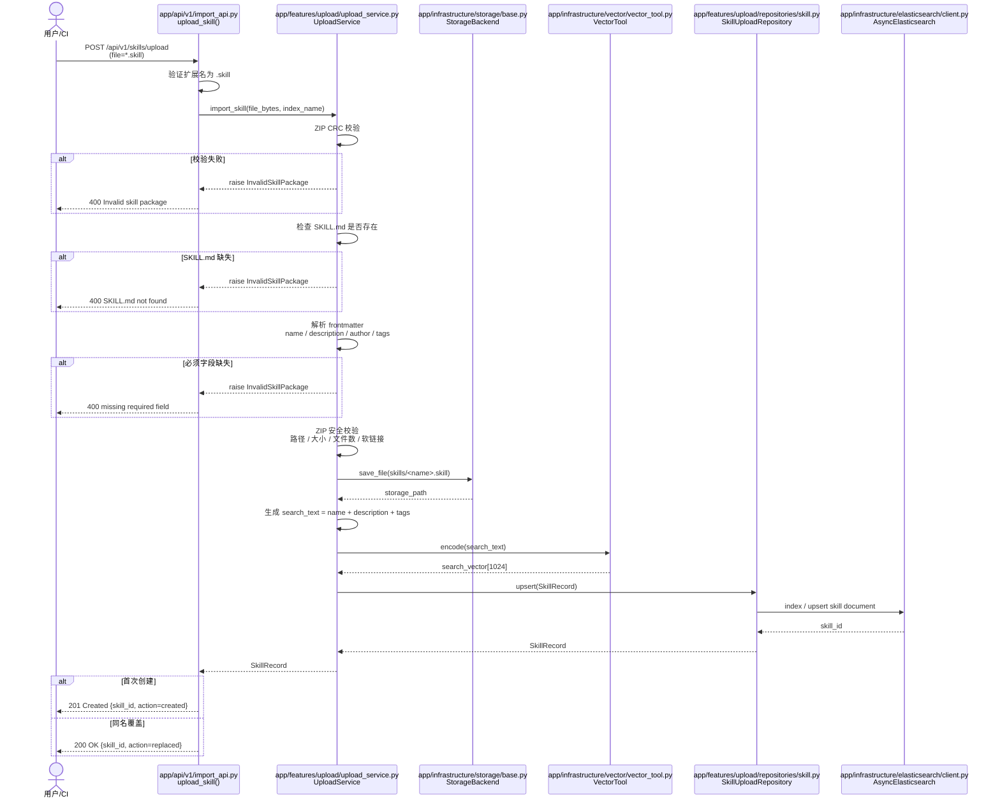
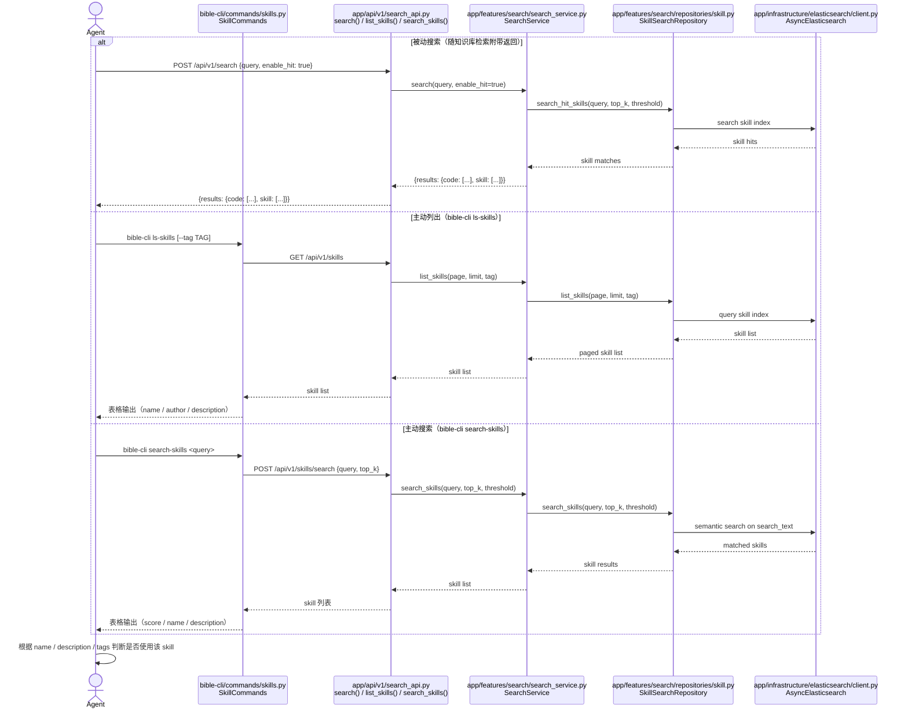
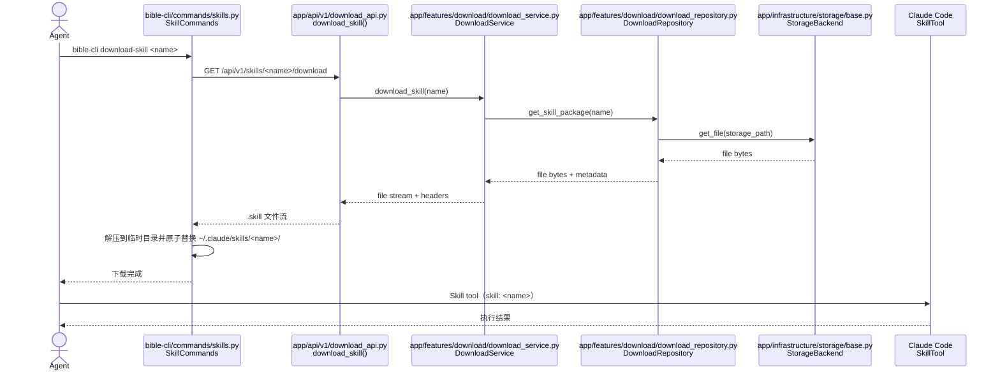
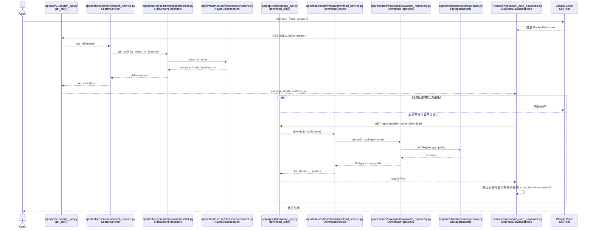

# Skill 导入与搜索流程详细设计

本文档描述 BiBLE-Atlas 平台中 Skill 的导入、存储、搜索和使用全流程设计。

---

## 概述

Skill 在 BiBLE-Atlas 中作为可复用的能力单元，需要标准化的打包格式以确保完整性和可验证性。本设计覆盖以下场景：

1. **导入**：将 `.skill` 包上传至服务端并建立索引
2. **被动搜索**：在知识库检索时自动关联并返回相关 skill
3. **主动搜索**：通过 CLI 主动列出或搜索 skill
4. **使用**：agent 获取并调用 skill 的两种路径

---

## 一、Skill 包格式

### 1.1 .skill 文件结构

`.skill` 文件由 `skill-creator` 技能中的 `package_skill.py` 脚本生成，本质是一个标准化的 ZIP 归档，固定扩展名 `.skill`。

```
my_skill.skill  (ZIP 归档)
├── SKILL.md               # 必须：skill 元数据声明 + 主入口文档
├── *.py / *.sh / *.json   # 可选：skill 依赖的辅助脚本和配置
└── assets/                # 可选：图片、模板等静态资源
```

> **设计原则**：`SKILL.md` 同时承担两种职责：
> 1. 作为服务端导入时解析的元数据来源
> 2. 作为 skill 在本地目录中的主入口文档

### 1.2 SKILL.md 标准字段

服务端解析以下必须字段，其余字段仅存档不建索引：

```markdown
---
name: skill_name_in_snake_case        # 必须：唯一标识符
description: 一句话描述这个 skill 做什么  # 必须：向量索引字段
author: username                       # 可选：作者
tags: [tag1, tag2]                     # 可选：分类标签
---

# Skill 标题

...正文内容（不参与全文索引）...
```

> **设计原则**：
> - skill 的唯一键是 `name`
> - 搜索仅基于轻量元数据 `name + description + tags`，不索引 `SKILL.md` 正文全文
> - 同名 skill 导入时默认直接覆盖，不做版本管理 (暂时)

---

## 二、导入流程

### 2.1 流程总览

```
用户/CI
  │
  │  POST /api/v1/skills/upload  (multipart, file=*.skill)
  ▼
API 层 (import_api.py)
  │  验证文件扩展名为 .skill
  │  读取文件内容并交给服务层
  ▼
UploadService
  │  验证 ZIP 完整性（CRC 校验）
  │  验证 SKILL.md 存在且字段完整
  │  解析 name / description / author / tags
  │  执行 ZIP 安全校验（路径、大小、文件数等）
  ▼
SkillUploadRepository
  │  计算 package_hash
  │  存储原始 .skill 文件到 Storage（local/MinIO/S3）
  │  构建 search_text = name + description + tags
  │  向量化 search_text
  │  写入 ES 索引（skill 索引）
  │  以 name 为唯一键更新元数据记录
  ▼
返回 200 OK / 201 Created（同步完成）
```

### 2.2 API 端点

```
POST /api/v1/skills/upload
Content-Type: multipart/form-data

参数：
  file        file    必须   .skill 包文件
  index_name  string  可选   目标知识库（默认写入全局 skill 索引）
```

**成功响应 (`200 OK` 或 `201 Created`)**：
```json
{
  "success": true,
  "skill_id": "skill-abc123",
  "skill_name": "my_skill_name",
  "action": "created",
  "status": "ready",
  "package_hash": "sha256:8d4e...",
  "message": "Skill imported successfully"
}
```

说明：
- 首次导入返回 `201 Created`
- 同名覆盖返回 `200 OK`
- `action` 取值为 `created` 或 `replaced`

**错误响应示例**：
```json
{
  "error": "Invalid skill package: SKILL.md missing required field 'description'",
  "detail": "..."
}
```

### 2.3 服务端解析逻辑（伪代码）

```python
class UploadService:
    async def import_skill(self, skill_file: bytes) -> SkillRecord:
        # 1. 验证 ZIP 完整性
        with zipfile.ZipFile(io.BytesIO(skill_file)) as zf:
            zf.testzip()  # CRC 校验
            names = zf.namelist()

        # 2. 验证 SKILL.md 存在
        if "SKILL.md" not in names:
            raise InvalidSkillPackage("SKILL.md not found in .skill package")

        # 3. 解析 SKILL.md frontmatter
        skill_md = zf.read("SKILL.md").decode("utf-8")
        meta = parse_frontmatter(skill_md)  # 解析 YAML frontmatter

        required_fields = ["name", "description"]
        for field in required_fields:
            if field not in meta:
                raise InvalidSkillPackage(f"SKILL.md missing required field '{field}'")

        # 4. ZIP 安全校验
        validate_zip_security(
            zf,
            max_file_count=200,
            max_uncompressed_size=50 * 1024 * 1024,
            block_absolute_paths=True,
            block_path_traversal=True,
            block_symlinks=True,
        )

        # 5. 计算哈希并构建搜索文本
        package_hash = sha256(skill_file).hexdigest()
        search_text = " ".join([
            meta["name"],
            meta["description"],
            *meta.get("tags", []),
        ])

        # 6. 存储原始包文件（同名 skill 直接覆盖）
        storage_path = await self.storage.save_file(
            path=f"skills/{meta['name']}.skill",
            content=skill_file
        )

        # 7. 向量化轻量搜索文本并写入索引
        vector = await self.vector_tool.encode(search_text)
        return await self.skill_upload_repo.upsert(SkillRecord(
            name=meta["name"],
            description=meta["description"],
            author=meta.get("author"),
            tags=meta.get("tags", []),
            storage_path=storage_path,
            package_hash=package_hash,
            search_text=search_text,
            search_vector=vector
        ))
```

### 2.4 ZIP 安全校验规则

除 CRC 校验外，服务端还应执行以下安全校验：

1. 禁止 ZIP 条目使用绝对路径
2. 禁止 `../` 等路径穿越
3. 禁止软链接或其他非常规文件类型
4. 限制单个 `.skill` 包的文件总数
5. 限制解压后的总大小，防止 zip bomb
6. 解压仅允许在服务端临时目录中进行，校验通过后才可进入正式存储流程

### 2.5 ES 索引映射（skill 索引）

```json
{
  "mappings": {
    "properties": {
      "skill_id":    { "type": "keyword" },
      "name":        { "type": "keyword" },
      "search_text": { "type": "text", "analyzer": "ik_max_word" },
      "description": { "type": "text", "analyzer": "ik_max_word" },
      "search_vector": {
        "type": "dense_vector",
        "dims": 1024
      },
      "author":      { "type": "keyword" },
      "tags":        { "type": "keyword" },
      "storage_path":{ "type": "keyword", "index": false },
      "package_hash":{ "type": "keyword", "index": false },
      "created_at":  { "type": "date" },
      "updated_at":  { "type": "date" }
    }
  }
}
```

> **说明**：
> - `name` 用于精确查找、去重和下载
> - `search_text` 用于关键字搜索
> - `search_vector` 用于语义搜索，其内容来源为 `name + description + tags`
> - skill 内容正文不参与全文索引

### 2.6 按目录结构落到文件的设计

基于 `01_架构总览.md` 中的目录结构规范，Skill 相关能力建议落到以下文件。

**服务端目录落点**：

```text
app/
├── api/v1/
│   ├── import_api.py
│   ├── search_api.py
│   └── download_api.py
├── features/upload/
│   ├── upload_service.py
│   ├── repositories/skill.py
│   └── schemas.py
├── features/search/
│   ├── search_service.py
│   ├── repositories/skill.py
│   └── schemas.py
├── features/download/
│   ├── download_service.py
│   ├── download_repository.py
│   └── schemas.py
├── infrastructure/
│   ├── elasticsearch/client.py
│   ├── storage/base.py
│   ├── storage/local.py
│   └── vector/vector_tool.py
├── common/exceptions.py
└── config/dynamic_config.yaml
```

**文件级职责设计**：

| 文件 | 核心类 / 函数 | 关键职责 |
|------|------|------|
| `app/api/v1/import_api.py` | `upload_skill()` | 暴露 `POST /api/v1/skills/upload`，校验扩展名和 multipart 参数，调用 `UploadService.import_skill()` |
| `app/api/v1/search_api.py` | `search()` / `list_skills()` / `search_skills()` / `get_skill()` | 处理主检索附带 skill 命中、列出 skill、主动搜索 skill、查询 skill 元数据 |
| `app/api/v1/download_api.py` | `download_skill()` | 暴露 `GET /api/v1/skills/{skill_name_or_id}/download`，返回 `.skill` 文件流及 hash 相关响应头 |
| `app/features/upload/upload_service.py` | `UploadService` | 编排 skill 导入主流程：解析 `SKILL.md`、执行 ZIP 安全校验、生成 `package_hash`、构建 `search_text`、调用存储/向量/仓储 |
| `app/features/upload/repositories/skill.py` | `SkillUploadRepository` | 负责以 `name` 为唯一键执行 skill 元数据写入与 ES upsert |
| `app/features/upload/schemas.py` | `SkillUploadResponse` / `SkillRecord` | 定义上传响应、导入后的内部记录结构 |
| `app/features/search/search_service.py` | `SearchService` | 负责主检索时附加 `results.skill`、以及主动 `list/search/get` 三类 skill 查询编排 |
| `app/features/search/repositories/skill.py` | `SkillSearchRepository` | 执行 skill 索引查询，提供 `search_skills()`、`list_skills()`、`get_skill_by_name_or_id()` |
| `app/features/search/schemas.py` | `SkillSearchRequest` / `SkillSearchResult` / `SkillMetadataResponse` | 定义主动搜索、被动命中、skill 元数据接口的模型 |
| `app/features/download/download_service.py` | `DownloadService` | 根据 skill 名称查询元数据、构建下载响应头、组织文件流输出 |
| `app/features/download/download_repository.py` | `DownloadRepository` | 根据 `skill_name_or_id` 查找存储路径并读取原始 `.skill` 文件 |
| `app/features/download/schemas.py` | `SkillDownloadHeaders` | 定义下载接口涉及的头字段语义，如 `X-Skill-Hash`、`X-Skill-Updated-At` |
| `app/infrastructure/storage/base.py` | `StorageBackend` | 定义 `save_file()`、`get_file()`、`delete_file()` 等统一存储接口 |
| `app/infrastructure/storage/local.py` | `LocalStorageBackend` | 本地文件系统实现，开发环境默认使用 |
| `app/infrastructure/vector/vector_tool.py` | `VectorTool` | 对 `search_text` 生成向量，不直接处理 skill 正文全文 |
| `app/infrastructure/elasticsearch/client.py` | `AsyncElasticsearch` | skill 索引的底层客户端，供 `SkillUploadRepository` 与 `SkillSearchRepository` 使用 |
| `app/common/exceptions.py` | `InvalidSkillPackage` / `SkillNotFound` / `SkillDownloadFailed` | 统一定义 skill 导入、搜索、下载相关异常 |
| `app/config/dynamic_config.yaml` | `skill.*` 配置段 | 管理 skill 包大小限制、ZIP 安全阈值、被动搜索 top_k/threshold、下载响应头开关等配置 |

**建议的配置落点**：

```yaml
skill:
  package:
    max_file_count: 200
    max_uncompressed_size: 52428800
  search:
    passive_top_k: 3
    passive_threshold: 0.6
    active_top_k: 10
  download:
    expose_hash_header: true
```

**客户端对接文件**：

| 文件 | 核心类 / 脚本 | 关键职责 |
|------|------|------|
| `bible-cli/commands/skills.py` | `SkillCommands` | 实现 `ls-skills`、`search-skills`、`download-skill` 三个 CLI 指令 |
| `~/.claude/hooks/skill_auto_download.py` | `SkillAutoDownloadHook` | 在 Skill tool 调用前检查本地缓存 freshness，并按需自动下载覆盖 |

---

## 三、被动搜索：随知识库检索自动关联 Skill

### 3.1 触发条件

当搜索请求中 `enable_hit: true` 且 `hit_list` 中包含 `SKILL`（或默认包含）时，服务端在返回主检索结果的同时，附加关联的 skill 结果。

为避免 skill 检索影响主检索稳定性，建议采用以下规则：

1. skill 检索失败不影响主检索结果返回
2. `results.skill` 单独设置 `top_k` 和 `threshold`
3. 主检索结果和 skill 结果分别统计，不混排

### 3.2 响应格式

关联的 skill 结果附加在响应的 `results.skill` 字段中，格式如下：

```json
{
  "success": true,
  "results": {
    "code": [ ... ],
    "skill": [
      {
        "skill_id": "skill-abc123",
        "name": "memory_leak_checker",
        "description": "检查 C++ 代码中的内存泄漏，生成分析报告",
        "author": "xiapei",
        "tags": ["cpp", "memory", "analysis"],
        "score": 0.87,
      }
    ]
  },
  "total": 1
}
```

**字段说明**：

| 字段 | 类型 | 说明 |
|------|------|------|
| `skill_id` | string | skill 唯一标识 |
| `name` | string | skill 名称（用于 CLI 下载和 Skill tool 调用） |
| `description` | string | skill 描述（帮助 agent 判断是否使用） |
| `score` | float | 与查询的语义相似度分数（0-1） |

### 3.3 Agent 使用建议

Agent 收到 skill 结果后，应基于 `name`、`description` 和 `tags` 综合判断是否需要使用该 skill。

---

## 四、主动搜索：bible-cli 指令

### 4.1 指令列表

```bash
# 列出所有可用 skill（分页）
bible-cli ls-skills [--page N] [--limit N] [--tag TAG]

# 搜索 skill（轻量元数据语义搜索）
bible-cli search-skills <query> [--top-k N] [--threshold FLOAT]

# 下载 skill 到本地（路径 A）
bible-cli download-skill <skill_name_or_id> [--output DIR]
```

### 4.2 ls-skills

列出服务端所有已注册的 skill，按 `updated_at` 倒序排列。

**输出示例**：
```
NAME                        AUTHOR   TAGS                  DESCRIPTION
memory_leak_checker         xiapei   cpp,memory,analysis   检查 C++ 代码中的内存泄漏
commit_message_generator    feng     git,workflow          根据 diff 自动生成规范的 commit message
unit_test_helper            wang     testing,cpp           为函数生成单元测试框架代码
...
```

**对应 API**：
```
GET /api/v1/skills?page=1&limit=20&tag=cpp
```

### 4.3 search-skills

对 `name + description + tags` 组成的轻量元数据做语义搜索，返回匹配的 skill 列表。

```bash
bible-cli search-skills "分析内存分配问题"
```

**输出示例**：
```
SCORE  NAME                   DESCRIPTION
0.94   memory_leak_checker    检查 C++ 代码中的内存泄漏，生成分析报告
0.81   heap_profiler          对堆内存分配进行性能分析
0.72   valgrind_wrapper       封装 valgrind 常用检测命令
```

**对应 API**：
```
POST /api/v1/skills/search
{
  "query": "分析内存分配问题",
  "top_k": 10,
  "threshold": 0.6
}
```

### 4.4 search-skills API

```
POST /api/v1/skills/search

请求体：
{
  "query":     string   必须   搜索文本
  "top_k":     int      可选   返回数量（默认 10，最大 50）
  "threshold": float    可选   最低相似度过滤（默认 0.0，不过滤）
  "tags":      string[] 可选   按标签过滤
}

响应：
{
  "success": true,
  "results": [
    {
      "skill_id": "skill-abc123",
      "name": "memory_leak_checker",
      "description": "...",
      "author": "xiapei",
      "tags": ["cpp", "memory"],
      "score": 0.94,
      "download_url": "/api/v1/skills/skill-abc123/download"
    }
  ],
  "total": 3
}
```

### 4.5 获取 skill 元数据

用于下载前检查或本地缓存 freshness 判断。

```
GET /api/v1/skills/{skill_name_or_id}

响应：
{
  "success": true,
  "skill": {
    "skill_id": "skill-abc123",
    "name": "memory_leak_checker",
    "description": "检查 C++ 代码中的内存泄漏，生成分析报告",
    "author": "xiapei",
    "tags": ["cpp", "memory"],
    "package_hash": "sha256:8d4e...",
    "updated_at": "2026-04-15T10:30:45Z",
    "download_url": "/api/v1/skills/memory_leak_checker/download"
  }
}
```

---

## 五、Skill 使用路径

搜索到 skill 后，agent 有两种路径获取并使用 skill：

### 路径 A：手动下载后常规调用（bible-cli download-skill）

```
Agent 发现搜索结果中的 skill
  │
  │  bible-cli download-skill memory_leak_checker
  ▼
bible-cli
  │  调用 GET /api/v1/skills/memory_leak_checker/download
  │  下载 .skill 文件到本地
  │  解压到临时目录并原子替换 ~/.claude/skills/memory_leak_checker/
  ▼
本地 .skill 解压后目录结构
  ~/.claude/skills/memory_leak_checker/
  ├── SKILL.md
  ├── .bible-skill-cache.json   ← 本地缓存元数据（hash / updated_at）
  └── *.py / *.sh
  │
  ▼
Agent 通过 Skill tool 调用（标准流程）
  skill: "memory_leak_checker"
```

**下载 API**：
```
GET /api/v1/skills/{skill_name_or_id}/download

响应：
  Content-Type: application/octet-stream
  Content-Disposition: attachment; filename="memory_leak_checker.skill"
  X-Skill-Name: memory_leak_checker
  X-Skill-Hash: sha256:8d4e...
  X-Skill-Updated-At: 2026-04-15T10:30:45Z
```

**适用场景**：agent 需要精细控制下载时机，或需要先检查 skill 内容再决定是否使用。

---

### 路径 B：通过 pre-hook 自动下载（透明调用）

Agent 直接以标准方式调用 Skill tool，当 skill 在本地不存在或本地缓存已过期时，由 pre-hook 脚本自动从服务端拉取。

```
Agent 调用 Skill tool
  skill: "memory_leak_checker"
  │
  ▼
Claude Code 执行 pre-tool-use hook（settings.json 配置）
  hooks/skill_auto_download.py
  │  检查本地路径 ~/.claude/skills/memory_leak_checker/ 是否存在
  │  若存在则比较本地 cache hash 与服务端 package_hash
  │
  ├─ 存在且为最新 → 直接放行，Skill tool 正常执行
  │
  └─ 不存在或已过期
       │  调用 GET /api/v1/skills/memory_leak_checker
       │  比较 package_hash / updated_at
       │  调用 GET /api/v1/skills/memory_leak_checker/download
       │  下载到临时目录、校验并原子替换 ~/.claude/skills/memory_leak_checker/
       ▼
     放行，Skill tool 正常执行
```

**hook 配置（settings.json）**：
```json
{
  "hooks": {
    "PreToolUse": [
      {
        "matcher": "Skill",
        "hooks": [
          {
            "type": "command",
            "command": "python ~/.claude/hooks/skill_auto_download.py"
          }
        ]
      }
    ]
  }
}
```

**hook 脚本逻辑（伪代码）**：
```python
# skill_auto_download.py
# 接收 stdin: {"tool_name": "Skill", "tool_input": {"skill": "memory_leak_checker"}}

import json, sys, os, requests, zipfile, io, tempfile, shutil

hook_input = json.load(sys.stdin)
skill_name = hook_input["tool_input"]["skill"]
skill_dir = os.path.expanduser(f"~/.claude/skills/{skill_name}")
cache_file = os.path.join(skill_dir, ".bible-skill-cache.json")

server_url = os.environ.get("BIBLE_SERVER_URL", "http://localhost:8000")
meta_resp = requests.get(f"{server_url}/api/v1/skills/{skill_name}")

if meta_resp.status_code == 200:
    remote_meta = meta_resp.json()["skill"]
    local_hash = None
    if os.path.exists(cache_file):
        with open(cache_file, "r", encoding="utf-8") as f:
            local_hash = json.load(f).get("package_hash")

    if (not os.path.exists(skill_dir)) or (local_hash != remote_meta["package_hash"]):
        resp = requests.get(f"{server_url}/api/v1/skills/{skill_name}/download")
        if resp.status_code == 200:
            with tempfile.TemporaryDirectory() as tmp_dir:
                extract_dir = os.path.join(tmp_dir, skill_name)
                with zipfile.ZipFile(io.BytesIO(resp.content)) as zf:
                    validate_zip_security(zf)
                    os.makedirs(extract_dir, exist_ok=True)
                    zf.extractall(extract_dir)

                with open(os.path.join(extract_dir, ".bible-skill-cache.json"), "w", encoding="utf-8") as f:
                    json.dump(
                        {
                            "name": skill_name,
                            "package_hash": resp.headers["X-Skill-Hash"],
                            "updated_at": resp.headers["X-Skill-Updated-At"],
                        },
                        f,
                    )

                backup_dir = skill_dir + ".bak"
                if os.path.exists(backup_dir):
                    shutil.rmtree(backup_dir)
                if os.path.exists(skill_dir):
                    os.replace(skill_dir, backup_dir)
                os.replace(extract_dir, skill_dir)
                if os.path.exists(backup_dir):
                    shutil.rmtree(backup_dir)

# 下载失败或元数据查询失败不阻断调用，但应记录日志
sys.exit(0)
```

**适用场景**：agent 无需感知 skill 是否已在本地，一律以标准 Skill tool 调用，框架层透明处理下发。

---

## 六、路径对比

| 维度 | 路径 A（手动下载） | 路径 B（pre-hook 自动下载） |
|------|------|------|
| **agent 感知** | 需要显式执行下载指令 | 无感知，与调用本地 skill 一致 |
| **复杂度** | 低，流程透明 | 需配置 hook，存在隐式副作用 |
| **缓存更新** | 可在下载前主动检查 hash/更新时间 | hook 可自动检查 freshness 并更新 |
| **网络失败处理** | 明确报错，agent 可重试 | hook 应记录失败原因，Skill tool 后续可感知缺失 |
| **适合场景** | 首次探索性使用 | 固定工作流中的稳定 skill |
| **离线支持** | 下载后可离线使用 | 与 A 相同（下载后缓存本地） |

---

## 七、API 汇总

```
Skill 导入：
  POST /api/v1/skills/upload                    # 上传 .skill 包

Skill 管理：
  GET    /api/v1/skills                         # 列出所有 skill（ls-skills）
  POST   /api/v1/skills/search                  # 语义搜索 skill（search-skills）
  GET    /api/v1/skills/{skill_name_or_id}      # 获取 skill 详情
  DELETE /api/v1/skills/{skill_id}              # 删除 skill

Skill 下载（路径 A / 路径 B hook 使用）：
  GET    /api/v1/skills/{skill_name_or_id}/download  # 下载 .skill 包
```

---

## 八、暂不考虑的设计

### 外链 Skill

从外部平台（如 Skill Hub 等）直接引用 skill URL，当前阶段不实现，原因：

- 数据量大、质量参差不齐，难以保证安全性和稳定性
- 外链 skill 内容可能发生变化，存在一致性风险
- 网络依赖会降低离线/内网环境的可用性

后续如有需要，可在导入流程前增加"外链抓取+本地化存储"步骤，不影响现有设计。

---

**相关文档**：
- [01_架构总览.md](./01_架构总览.md) — 整体目录结构和分层职责
- [04_API接口文档.md](./04_API接口文档.md) — 完整 API 参数和响应格式
- [05_存储方案选型与大文档处理.md](./05_存储方案选型与大文档处理.md) — .skill 文件存储后端选型

---

## 附录：完整时序图

### 图一：Skill 导入时序



---

### 图二：Skill 搜索时序



---

### 图三：Skill 获取与使用时序（路径 A：手动下载）



---

### 图四：Skill 获取与使用时序（路径 B：pre-hook 透明下载）


