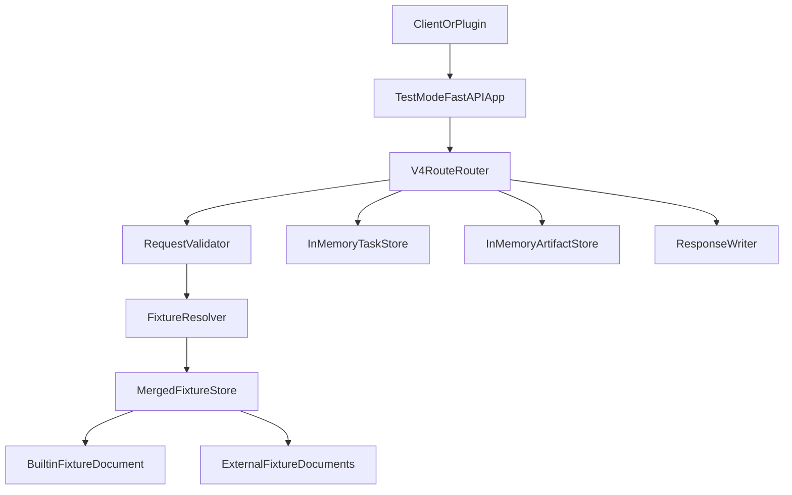

# Test Mode 详细设计（v4）

> 本文档细化 `meditation/biblep-test-mode-requirements.md` 中的 Test Mode 概要设计。  
> Test Mode 只以 Server v4 HTTP API 为契约基准，不以 CLI stdout 契约或历史 mock-cli 命令词汇作为设计输入。

---

## 1. 设计目标

Test Mode 是 v4 HTTP API 的服务端替身。它在不启动真实 DB、OpenSearch、向量模型、文件归档和 Celery Worker 的情况下，提供稳定、可配置、可回归的 HTTP 行为。

核心目标：

1. 覆盖 v4 API 文档定义的 `Import`、`Search`、`Download`、`Control`、`Health` 路由。
2. 通过内置 fixture 支持最小 happy path。
3. 通过外部 JSON fixture 文件或目录覆盖、追加测试场景。
4. 对请求层参数进行轻量契约校验。
5. 用内存任务仓库模拟 import/download 异步链路。
6. 用内存 artifact 仓库模拟二进制下载。
7. 将响应形状固定在 v4 HTTP API 契约上，避免被 legacy 信封反向驱动。

非目标：

1. 不执行真实解析脚本、向量化、搜索、排序、入库和文件打包。
2. 不执行真实 import，但允许复用真实 import 前置校验代码，对客户端计划上传的文件、包结构和参数做 preflight validation。
3. 不模拟真实 OpenSearch 查询语义。
4. 不设计 CLI `ok/data/error` 输出。
5. 不支持递归 fixture 目录、分层 fixture 目录或跨目录合并。
6. 不实现多进程任务持久化。

---

## 2. 契约基准

Test Mode 的请求和响应优先级如下：

1. `02_API接口文档.md` 中定义的 v4 路由、字段和异步语义。
2. 当前需求文档 `meditation/biblep-test-mode-requirements.md` 对 Test Mode 的职责边界补充。
3. 真实 FastAPI 实现中的请求层行为，仅作为校验细节参考。

以下内容不是默认契约：

1. Go CLI 的 `{"ok":true,"data":...}` / `{"ok":false,"error":...}`。
2. legacy `{"status":"ok","result":...}` / `{"status":"error","error":...}`。
3. `bible_vscode/mock-cli` 的历史命令词汇。

如未来需要 legacy 响应兼容，必须通过显式兼容开关实现，且不得改变默认 v4 响应。

---

## 3. 运行方式

### 3.1 启动命令

建议提供独立入口：

```bash
python -m bible.test_mode.server --addr 127.0.0.1:5555
python -m bible.test_mode.server --addr 127.0.0.1:5555 --fixture ./fixture.json
```

### 3.2 启动参数

| 参数 | 默认值 | 说明 |
|---|---|---|
| `--mode` | `server` | 第一版只完整定义 `server` |
| `--addr` | `127.0.0.1:5555` | HTTP 监听地址 |
| `--fixture` | 空 | 外部 JSON fixture 文件，或只包含一级 `*.json` 的 fixture 目录 |
| `--strict` | `true` | fixture schema 错误或冲突时启动失败 |

`--addr` 推荐使用 `host:port`，当前实现也接受只传 `host`，此时端口回退为 `5555`。

第一版不提供 `--task-policy`。Download 以及外部 fixture 声明为 `queued` 的 Import 任务采用 delayed 策略，避免真实时间带来的测试不稳定；内置 Import fixture 直接返回 `completed`。当 `--fixture` 指向目录时，当前实现只加载该目录下一级 `*.json` 文件，并按文件名排序。

### 3.3 与真实服务入口的关系

Test Mode 不复用 `bible.main:create_app()` 的生产 app 生命周期。生产 app 会初始化 import container、向量预加载等真实依赖，不符合 Test Mode 的解耦目标。

建议新增独立 app factory：

```text
bible/test_mode/
├── __init__.py
├── server.py
├── app.py
├── routes.py
├── schemas.py
├── validators.py
├── fixture_store.py
├── resolver.py
├── task_store.py
├── artifact_store.py
├── responses.py
└── fixtures/
    └── builtin.json
```

---

## 4. 总体架构



### 4.1 组件职责

| 组件 | 职责 |
|---|---|
| `server.py` | 解析启动参数，加载 app，启动 uvicorn |
| `app.py` | 创建 Test Mode FastAPI app，不触发生产依赖初始化 |
| `routes.py` | 注册 v4 HTTP 路由，并编排校验、fixture、任务、artifact |
| `validators.py` | 做请求层契约校验 |
| `fixture_store.py` | 加载内置和外部 fixture，做 schema 校验，并合并为当前进程使用的 merged fixture store |
| `resolver.py` | 在 merged fixture store 中根据 method/path/domain/selector 选择 route fixture |
| `task_store.py` | 保存 import/download 任务状态 |
| `artifact_store.py` | 保存 artifact metadata 与二进制内容 |
| `responses.py` | 统一写出 JSON、错误和二进制响应 |
| `schemas.py` | 定义 fixture、selector、task、artifact 的 Pydantic model |

### 4.2 Logging 默认要求

Logging 是 Test Mode 辅助客户端工程师调试的默认能力，后续所有阶段实现 Search、Import、Download、Control、Task、Artifact 时都必须同步补齐必要日志。

日志应采用稳定、可 grep 的 `key=value` 风格，并至少覆盖：

1. 启动配置：`host`、`port`、`fixture_path`、`strict`、内置/外部 fixture 加载结果。
2. 请求入口：`method`、`path`、`domain`、必要的请求 selector 摘要。
3. 校验结果：校验失败字段、`error_code`、`status_code`。
4. fixture 匹配：命中的来源（内置/外部）、`route_id` 或可定位的 fixture 标识、冲突候选数量。
5. 任务链路：`task_id`、`operation`、`domain`、状态迁移（如 `queued -> running -> completed`）。
6. artifact 链路：`artifact_id`、`domain`、文件名、media type、下载状态。
7. 错误出口：`method`、`path`、`status_code`、`error_code`、可安全公开的 `details` 摘要。

日志不得输出上传文件完整内容、二进制正文、token、密钥、完整用户隐私文本或大体积 fixture 内容。需要定位请求内容时，只记录字段名、文件名、数量、大小、hash 或截断后的安全摘要。

---

## 5. 路由设计

### 5.1 Health

| 方法 | 路径 | 行为 |
|---|---|---|
| `GET` | `/health` | 返回 Test Mode 健康状态 |

响应示例：

```json
{
  "status": "ok",
  "service": "bible-atlas-test-mode",
  "mode": "server"
}
```

### 5.2 Import

| 方法 | 路径 | 域 | 校验 |
|---|---|---|---|
| `POST` | `/api/import/knowledge-base` | `KNOWLEDGE_BASE` | multipart、`files[]`、`kb_index`、`tag` |
| `POST` | `/api/import/skill` | `SKILL` | multipart、`files[]`、`kb_index`、`tag=skill` |
| `POST` | `/api/import/memory` | `MEMORY` | multipart、`files[]`、`kb_index`、`tag=memory` |

Test Mode 不执行真实 import，但 Import 可以调用真实 import 前置校验代码，对客户端计划上传的内容做 preflight validation。该校验可以读取上传文件的必要 metadata 或包结构，用于提前发现客户端传参、文件类型、包结构等问题；校验通过后才进入 fixture 响应或任务创建流程。

Import 响应由 fixture 来源决定：

1. 内置 fixture 直接返回 `completed`，用于让调用方无需轮询即可跑通最小 happy path。
2. 外部 fixture 按 fixture 中声明的 response 返回，可以是 `queued`、`running`、`completed` 或 `failed`。

这里的 `completed` 指响应体中的任务 `status` 字段。内置 Import fixture 的 HTTP status 仍默认遵循 v4 Import 提交接口语义返回 `202`；外部 fixture 可以通过 `response.status` 显式覆盖 HTTP status。

内置 fixture 响应示例：

```json
{
  "success": true,
  "task_id": "import_memory_000001",
  "domain": "MEMORY",
  "kb_index": "kb_memory_test",
  "tag": "memory",
  "status": "completed",
  "result": {
    "imported": 1,
    "skipped": 0,
    "failed": 0
  }
}
```

### 5.3 Search

| 方法 | 路径 | 域 | 校验 |
|---|---|---|---|
| `POST` | `/api/search/knowledge-base` | `KNOWLEDGE_BASE` | JSON、`query`、`tag` |
| `POST` | `/api/search/skill` | `SKILL` | JSON、`query`、`tag=skill` |
| `POST` | `/api/search/memory` | `MEMORY` | JSON、`query`、`tag=memory` |

可选字段：

- `search_type`：允许 `keyword`、`title`、`text`、`vector`、`hybrid`
- `top_k`：正整数
- `vector_model`：字符串
- `vector_weight`：数字

Search 只返回 fixture 结果，不执行真实检索。响应 shape 必须与 v4 文档一致：

```json
{
  "success": true,
  "domain": "MEMORY",
  "kb_index": "kb_memory_test",
  "tag": "memory",
  "total": 1,
  "results": {
    "memory": [
      {
        "id": "memory_fixture_001",
        "title": "Fixture memory",
        "content": "A stable memory search result.",
        "score": 0.99
      }
    ]
  }
}
```

当前实现中，Search 在请求校验通过但没有命中 fixture 时，不返回错误，而是返回稳定的空结果：

1. HTTP status 为 `200`。
2. `success=true`、`total=0`。
3. `results` 使用域内固定 key：`knowledge_base`、`skill` 或 `memory`。
4. `kb_index` 优先使用请求体中的非空 `kb_index`，否则使用内置默认值 `kb_design_test`、`kb_skill_test` 或 `kb_memory_test`。

内置 Search fixture 的 selector 是精确匹配，不支持通配表达式。当前内置数据包括：

| 域 | selector | 说明 |
|---|---|---|
| `KNOWLEDGE_BASE` | `tag=design` | 任意 query 只要 `tag=design` 即命中内置知识库结果 |
| `SKILL` | `tag=skill, query=skill-standard` | 命中标准 skill 结果 |
| `SKILL` | `tag=skill, query=*` | 只有请求 query 字面量为 `*` 时命中 |
| `MEMORY` | `tag=memory, query=Fixture Memory` | 命中标准 memory 结果 |
| `MEMORY` | `tag=memory, query=*` | 只有请求 query 字面量为 `*` 时命中 |

### 5.4 Download

| 方法 | 路径 | 域 | 校验 |
|---|---|---|---|
| `POST` | `/api/download/skill/file` | `SKILL` | JSON、`tag=skill`、`storage_path` |
| `POST` | `/api/download/skill/batch` | `SKILL` | JSON、`tag=skill`、`storage_paths` |
| `GET` | `/api/download/skill/artifact/{artifact_id}` | `SKILL` | `artifact_id` |
| `POST` | `/api/download/memory/file` | `MEMORY` | JSON、`tag=memory`、`storage_path` |
| `POST` | `/api/download/memory/batch` | `MEMORY` | JSON、`tag=memory`、`storage_paths` |
| `GET` | `/api/download/memory/artifact/{artifact_id}` | `MEMORY` | `artifact_id` |

`KNOWLEDGE_BASE` 不支持 Download。相关未定义路径返回 `404 NOT_FOUND`。

内置 Download fixture 的目标是触发客户端真实下载行为，而不是覆盖完整下载业务逻辑。Test Mode 启动时应初始化一组标准 artifacts，可以来自内置 artifact fixture，也可以指向仓库 `tests` 目录下预先存储的标准 artifact 文件。客户端通过 Download 提交、任务查询、Artifact 拉取，真实执行 HTTP 下载、header 解析、文件写入和内容校验。

复杂场景仍由外部 fixture 提供，例如批量部分失败、artifact 过期、文件名覆盖、metadata 打包、路径不存在和任务失败。

Download 提交响应固定为 `202`：

```json
{
  "success": true,
  "task_id": "download_memory_000001",
  "domain": "MEMORY",
  "tag": "memory",
  "status": "queued"
}
```

当前实现中，Download 提交请求校验通过但没有命中 fixture 时：

1. `POST /api/download/skill/file` 返回 `404 SKILL_NOT_FOUND`，错误消息包含请求的 `storage_path`，并且不会推进内置 `download_skill_builtin` 任务。
2. 其他 Download 路由返回 `404 NOT_FOUND`，message 为 `fixture route not found`。

内置 Download fixture 当前只覆盖单文件 happy path，不覆盖 batch happy path。`SKILL` 单文件 selector 为 `tag=skill, storage_path=skill-standard`；`MEMORY` 单文件 selector 当前为 `tag=memory`，因此 memory 单文件下载在 tag 合法时会命中内置任务。

Artifact 成功响应是二进制流：

| Header | 值 |
|---|---|
| `Content-Type` | 来自 artifact fixture 的 `content_type` |
| `Content-Disposition` | `attachment; filename="<file_name>"` |

### 5.5 Control

| 方法 | 路径 | 行为 |
|---|---|---|
| `GET` | `/api/control/admin/tasks/{task_id}` | 查询任务状态 |
| `DELETE` | `/api/control/admin/tasks/{task_id}` | 取消任务 |
| `GET/PUT/DELETE` | `/api/control/docs/*` | fixture 显式声明后才返回 |
| `GET` | `/api/control/statistics/*` | fixture 显式声明后才返回 |
| `GET/POST` | `/api/control/admin/*` | fixture 显式声明后才返回 |

Control 的非任务子路由在第一版不内置业务语义。未在 fixture 中声明的路径返回 `404 NOT_FOUND`，避免隐式成功掩盖契约缺口。

---

## 6. 请求校验规则

### 6.1 通用校验

所有路由都必须校验：

1. HTTP method 是否匹配。
2. path 是否在 v4 覆盖范围内。
3. `Content-Type` 是否与接口类型匹配。
4. JSON 或 multipart 是否可解析。
5. 必填字段是否存在且非空。
6. 固定 `tag` 是否符合域约束。
7. 枚举值是否在允许范围内。

Test Mode 不校验真实业务状态，例如索引是否真实存在、文件是否已入库、向量模型是否本地可用。这类场景通过 fixture 返回对应错误。

### 6.2 Import 校验

Import 校验分为两层：

1. HTTP 请求层校验：由 Test Mode validator 直接完成，确保 method、content-type、multipart、必填字段和固定 `tag` 合法。
2. Import preflight 校验：优先调用真实 import 前置校验代码，检查客户端计划上传/import 的内容是否满足域内要求。该阶段可以读取上传文件的必要结构，但不得执行解析、向量化、落盘入库或异步任务真实执行。

| 字段 | 规则 |
|---|---|
| `files[]` | 至少 1 个文件字段 |
| `kb_index` | 必填非空字符串 |
| `tag` | KNOWLEDGE_BASE 任意非空；SKILL 固定 `skill`；MEMORY 固定 `memory` |
| `parser_script` | 可选文件字段，可复用真实 preflight 校验文件类型和基础安全约束，但不执行脚本 |
| `vector_model` | 可选非空字符串 |
| `parser_context` | 可选；若存在则必须是合法 JSON 对象字符串 |

不同域的 preflight 校验建议：

| 域 | 可复用真实校验 | 不执行的真实行为 |
|---|---|---|
| KNOWLEDGE_BASE | 文件数量、文件类型、`parser_context` JSON、`parser_script` 类型和 AST 安全检查 | 解析脚本执行、chunk 生成、向量化、写库 |
| SKILL | `.skill` 数量、压缩包结构、单一顶层目录 `<skill-name>/`、`<skill-name>/SKILLS.md` 是否存在、附带文件基础分类 | 技能解析入库、向量化、文件归档 |
| MEMORY | `message.json`、`meta.json` 等输入文件存在性与 JSON schema 基础校验 | 记忆抽取、向量化、写库、归档 |

preflight 校验失败时，应在 Import 提交阶段直接返回错误响应，不创建任务，也不进入 fixture 匹配。preflight 校验成功后：

1. 内置 fixture 直接返回 `completed`。
2. 外部 fixture 按声明返回 `queued`、`running`、`completed` 或 `failed`。

若真实 preflight 代码依赖 DB、OpenSearch、向量模型、文件归档或 Celery，应先抽离出纯校验函数，再由 Test Mode 调用。Test Mode 不应为了校验而启动这些真实依赖。

当前实现的 preflight 返回值会进入内置 Import 的 `result.preflight`：

| 域 | 当前 preflight 返回 |
|---|---|
| `KNOWLEDGE_BASE` | `{"files": <uploaded_file_count>}` |
| `SKILL` | `{"skill_package": "<uploaded .skill file name>"}` |
| `MEMORY` | `{"memory_id": "...", "attachments": <attachment_count>}` |

当前实现还执行以下纯校验：上传文件数量不能超过 2000；`parser_script` 必须以 `.py` 结尾且通过 AST guard；`parser_context` 必须解析为 JSON object。

### 6.3 Search 校验

| 字段 | 规则 |
|---|---|
| `query` | 必填非空字符串 |
| `tag` | KNOWLEDGE_BASE 任意非空；SKILL 固定 `skill`；MEMORY 固定 `memory` |
| `search_type` | 可选，允许 `keyword/title/text/vector/hybrid` |
| `top_k` | 可选，正整数 |
| `vector_model` | 可选非空字符串 |
| `vector_weight` | 可选数字，建议范围 `0.0` 到 `1.0` |

当前实现只强制校验 `query`、`tag`、`search_type` 和 `top_k`。`vector_model`、`vector_weight` 可参与 fixture selector 匹配，但尚未在 validator 中做类型或范围校验。

### 6.4 Download 校验

| 字段 | 规则 |
|---|---|
| `tag` | SKILL 固定 `skill`；MEMORY 固定 `memory` |
| `storage_path` | 单文件下载必填非空字符串 |
| `storage_paths` | 批量下载必填非空字符串数组 |
| `download_name` | 可选非空字符串 |
| `package_name` | 可选非空字符串 |
| `include_metadata` | 可选布尔值 |

当前实现只强制校验 `tag` 以及单文件/批量的 `storage_path`、`storage_paths`。`download_name`、`package_name`、`include_metadata` 可参与 fixture selector 匹配，但尚未在 validator 中做类型校验。

---

## 7. Fixture Schema

### 7.1 顶层结构

外部 fixture 支持单个 JSON 文件，也支持一个只包含一级 `*.json` 的目录：

```json
{
  "version": 1,
  "routes": [],
  "tasks": [],
  "artifacts": []
}
```

字段规则：

| 字段 | 必填 | 说明 |
|---|---|---|
| `version` | 是 | 当前固定为 `1` |
| `routes` | 否 | HTTP route fixture |
| `tasks` | 否 | 预置任务 |
| `artifacts` | 否 | 预置下载产物 |

当前 schema 对未知字段使用 `extra=forbid`。未知顶层字段、route/response/task/artifact 内未知字段都会导致 fixture 加载失败；这类 schema 失败不受 `--strict=false` 放宽。

### 7.2 Route Fixture

```json
{
  "id": "memory_search_default",
  "method": "POST",
  "path": "/api/search/memory",
  "domain": "MEMORY",
  "selector": {
    "tag": "memory",
    "query": "project context"
  },
  "response": {
    "status": 200,
    "headers": {
      "X-Test-Mode-Fixture": "memory_search_default"
    },
    "json": {
      "success": true,
      "domain": "MEMORY",
      "tag": "memory",
      "total": 1,
      "results": {
        "memory": []
      }
    }
  }
}
```

字段规则：

| 字段 | 必填 | 说明 |
|---|---|---|
| `id` | 否 | 便于诊断的 fixture id |
| `method` | 是 | 大写 HTTP method |
| `path` | 是 | v4 路由路径，支持 `{artifact_id}`、`{task_id}` 模板 |
| `domain` | 否 | `KNOWLEDGE_BASE/SKILL/MEMORY`，Health 与部分 Control 可为空 |
| `selector` | 否 | 请求上下文匹配条件 |
| `response` | 是 | 响应定义 |

### 7.3 Response Fixture

JSON 响应：

```json
{
  "status": 400,
  "json": {
    "code": "INVALID_ARGUMENT",
    "message": "query is required",
    "details": {
      "field": "query"
    }
  }
}
```

二进制响应不直接写在 route 中，应通过 artifact fixture 表达。Artifact route 命中后由 `ArtifactStore` 写出二进制响应。

### 7.4 Task Fixture

```json
{
  "task_id": "download_memory_001",
  "task_type": "download.memory.file",
  "domain": "MEMORY",
  "tag": "memory",
  "status": "queued",
  "final_status": "completed",
  "query_count": 0,
  "result": {
    "artifact_id": "artifact_memory_001",
    "artifact_name": "memory-fixture.zip",
    "expires_at": "2099-01-01T00:00:00Z"
  },
  "error": null
}
```

字段规则：

| 字段 | 必填 | 说明 |
|---|---|---|
| `task_id` | 是 | 任务唯一 id |
| `task_type` | 是 | 如 `import.memory`、`download.skill.batch` |
| `domain` | 是 | 任务所属域 |
| `tag` | 否 | 任务 tag |
| `status` | 是 | 初始状态 |
| `final_status` | 否 | delayed 推进后的最终态，默认 `completed` |
| `result` | 否 | completed 时返回 |
| `error` | 否 | failed 时返回 |

### 7.5 Artifact Fixture

```json
{
  "artifact_id": "artifact_memory_001",
  "domain": "MEMORY",
  "content_type": "application/zip",
  "file_name": "memory-fixture.zip",
  "body_base64": "UEsDBAoAAAAAA"
}
```

也可以使用标准 artifact 文件：

```json
{
  "artifact_id": "artifact_memory_standard_zip",
  "domain": "MEMORY",
  "content_type": "application/zip",
  "file_name": "memory-standard.zip",
  "file_path": "tests/fixtures/test_mode/artifacts/memory-standard.zip",
  "sha256": "optional_sha256_hex"
}
```

字段规则：

| 字段 | 必填 | 说明 |
|---|---|---|
| `artifact_id` | 是 | artifact 唯一 id |
| `domain` | 是 | `SKILL` 或 `MEMORY` |
| `content_type` | 是 | HTTP `Content-Type` |
| `file_name` | 是 | `Content-Disposition` 文件名 |
| `body_base64` | 条件必填 | 二进制内容的 base64，与 `file_path` 二选一 |
| `file_path` | 条件必填 | 仓库内标准 artifact 文件路径，与 `body_base64` 二选一 |
| `sha256` | 否 | 标准 artifact 文件 checksum，用于启动自检 |
| `expired` | 否 | 布尔值，当前实现默认为 `false`；为 `true` 时 artifact 拉取返回 `DOWNLOAD_ARTIFACT_EXPIRED` |

---

## 8. Selector 匹配规则

Selector 匹配必须确定、可解释、可诊断。

### 8.1 请求上下文

Test Mode 先把请求归一化为 request context：

```json
{
  "method": "POST",
  "path": "/api/search/memory",
  "domain": "MEMORY",
  "body": {
    "query": "project context",
    "tag": "memory",
    "top_k": 5
  },
  "params": {},
  "path_params": {},
  "multipart": {
    "fields": {},
    "file_names": []
  }
}
```

Selector 中的字段默认从扁平上下文读取。常用字段包括：

- `query`
- `tag`
- `search_type`
- `top_k`
- `vector_model`
- `vector_weight`
- `kb_index`
- `file_names`
- `storage_path`
- `storage_paths`
- `include_metadata`
- `task_id`
- `artifact_id`

### 8.2 匹配语义

1. `method`、`path`、`domain` 先匹配。
2. `selector` 是请求上下文的子集匹配：selector 中声明的每个字段都必须与请求上下文相等。
3. 未在 selector 中声明的请求字段不影响匹配。
4. 字符串大小写敏感。
5. 数字按 JSON 数字语义比较，`5` 与 `5.0` 视为相等。
6. 布尔值必须类型和值都相等。
7. 数组默认顺序敏感。
8. `file_names` 是特例，按上传文件名排序后比较，以避免 multipart 上传顺序造成不稳定。
9. `null` 只匹配显式为 `null` 的请求字段，不匹配缺失字段。

对带资源标识的下载路由，设计上建议内置和外部 fixture 显式声明资源标识 selector：

- 单文件下载建议匹配 `storage_path`。
- 批量下载建议匹配 `storage_paths`，或使用专门的外部 fixture 覆盖。
- 不建议只用 `tag=skill` / `tag=memory` 作为下载 happy path 的通配 selector，否则客户端请求未知资源时会错误命中内置 artifact。

当前实现中，`SKILL` 内置单文件下载已按 `storage_path=skill-standard` 精确匹配；`MEMORY` 内置单文件下载仍为 `tag=memory` 匹配。若客户端需要验证 memory 未知资源，应通过外部 fixture 显式覆盖，或在后续实现中收紧内置 selector。

例如内置 SKILL happy path 只应匹配实际存在的 skill：

```json
{
  "path": "/api/download/skill/file",
  "domain": "SKILL",
  "selector": {
    "tag": "skill",
    "storage_path": "skill-standard"
  }
}
```

### 8.3 多命中优先级

同一 store 内多个 route 命中时，按以下规则选择：

1. selector 字段数量更多者优先。
2. 字段数量相同且只有一个命中，选择该 route。
3. 字段数量相同且多个命中，在 `--strict=true` 时启动阶段应拒绝这组冲突 fixture。

当前实现会先把内置 fixture 与外部 fixture 合并成单个 merged store，再在 merged store 中做 selector 匹配。合并规则见第 13 节：

1. 外部 route 与内置 route 同 `id` 时覆盖内置 route。
2. 无同 `id` 时，按 `method + path + domain + selector` 判断是否覆盖同一个 route。
3. 不构成覆盖时追加为新 route。
4. 匹配阶段只在 merged store 内按 selector 字段数量选择最具体 route。
5. 没有命中后由具体路由决定默认行为：Search 返回空结果，Download/Control 多数返回 `NOT_FOUND`，Skill 单文件下载返回 `SKILL_NOT_FOUND`。

默认 route 指 selector 为空对象或缺省 selector。

---

## 9. 异步任务状态机

### 9.1 状态集合

| 状态 | 含义 |
|---|---|
| `queued` | 已提交，尚未开始 |
| `running` | 模拟执行中 |
| `completed` | 已完成，可读取 result |
| `failed` | 已失败，可读取 error |
| `cancelled` | 已取消 |

### 9.2 Import 内置 fixture 完成策略

内置 Import fixture 不进入 delayed 推进流程。提交接口在请求校验通过后直接返回 `completed`，并在响应体中携带最小 `result`。

该策略只适用于内置 Import fixture，原因是 Import 的内置场景定位为最小可用数据注入验证，不需要客户端测试轮询。需要验证 `queued`、`running`、`failed`、取消等异步交互时，应使用外部 fixture 显式声明。

外部 Import fixture 的响应完全以 fixture 为准：

1. route response 可以直接返回 `completed`。
2. route response 可以返回 `queued` 并写入 `TaskStore`，后续由任务查询推进。
3. route response 可以返回 `failed`，用于测试导入失败处理。

### 9.3 Delayed 推进策略

第一版固定使用 query-count delayed 策略：

1. Download 提交后，任务初始状态默认为 `queued`。
2. 外部 Import fixture 若声明 `status=queued`，任务初始状态为 `queued`。
3. 第一次 `GET /api/control/admin/tasks/{task_id}` 返回 `running`。
4. 第二次及后续查询返回 `final_status`。
5. `final_status` 未声明时默认为 `completed`。
6. `final_status=failed` 时必须提供 `error`。
7. `final_status=completed` 且 download 任务必须提供或生成 `artifact_id`。

### 9.4 任务创建规则

提交接口创建任务时：

1. 如果 fixture route response 中显式给出 `task_id`，使用该值。
2. 如果该 `task_id` 已由 fixture `tasks` 预置，提交接口不覆盖预置任务，后续轮询使用预置任务的 `final_status`、`result` 和 `error`。
3. 如果 route response 给出 `task_id` 但没有预置任务，当前实现会按 response 中的 `status`、`result`、`error` 创建任务，并将 `final_status` 默认为 `completed`。
4. 内置 Import 不走内置 fixture 文件，而是在 preflight 通过后创建 deterministic completed 任务，`task_id` 为 `import_{domain.lower()}_builtin`。
5. 未显式给出 `task_id` 时，`InMemoryTaskStore.create()` 可按 `{operation}_{domain_lower}_{sequence}` 生成，例如 `download_memory_000001`。
6. 当前实现中的 `InMemoryTaskStore.create()` 对同名任务是覆盖写入；提交接口的 `_ensure_task()` 遇到已有任务则跳过创建。
7. 任务记录保存在 `InMemoryTaskStore`，仅在当前进程生命周期内有效。

### 9.5 取消规则

| 当前状态 | DELETE 行为 |
|---|---|
| `queued` | 变为 `cancelled` |
| `running` | 变为 `cancelled` |
| `completed` | 返回 `TASK_ALREADY_COMPLETED` |
| `failed` | 返回 `TASK_ALREADY_FINISHED` |
| `cancelled` | 返回当前 `cancelled` 状态，保持幂等 |
| 未知任务 | 返回 `TASK_NOT_FOUND` |

---

## 10. Artifact 处理

### 10.1 来源

Artifact 可以来自：

1. 外部 fixture 的 `artifacts`。
2. 内置 fixture 的 `artifacts`，可内联 `body_base64`。
3. Download 任务完成时根据 fixture response 自动关联的 artifact。
4. Test Mode 启动时从仓库 `tests` 目录加载的标准 artifact 文件。

Test Mode 不真实打包文件。Artifact 内容来自 base64 fixture 或启动时加载的标准 artifact 文件。标准 artifact 文件用于让客户端测试真实下载路径，包括 HTTP 流读取、文件名解析、落盘、校验文件大小或 checksum。

建议为标准 artifact 增加显式 metadata：

| 字段 | 说明 |
|---|---|
| `artifact_id` | 内置 artifact id |
| `domain` | `SKILL` 或 `MEMORY` |
| `content_type` | 下载响应 `Content-Type` |
| `file_name` | 下载响应文件名 |
| `file_path` | 指向 `tests` 下标准 artifact 文件 |
| `sha256` | 可选 checksum，用于自检 |

若同时声明 `body_base64` 与 `file_path`，`--strict=true` 下应启动失败，避免同一个 artifact 来源不明确。

### 10.2 拉取流程

1. 根据 path 得到 domain 和 `artifact_id`。
2. 在 `ArtifactStore` 中查找 artifact。
3. 校验 artifact domain 与 path domain 一致。
4. 返回二进制 body。
5. 未找到返回 `DOWNLOAD_ARTIFACT_NOT_FOUND`。
6. fixture 显式声明过期时返回 `DOWNLOAD_ARTIFACT_EXPIRED`。

---

## 11. 错误响应契约

### 11.1 默认错误 shape

Test Mode 默认使用平铺错误 JSON：

```json
{
  "code": "INVALID_ARGUMENT",
  "message": "query is required",
  "details": {
    "field": "query"
  }
}
```

默认响应头：

| Header | 值 |
|---|---|
| `Content-Type` | `application/json` |
| `X-Bible-Test-Mode` | `true` |

### 11.2 错误码

| 场景 | HTTP | code |
|---|---:|---|
| 未知路由 | 404 | `NOT_FOUND` |
| method 不匹配 | 405 | `METHOD_NOT_ALLOWED` |
| JSON 解析失败 | 400 | `INVALID_ARGUMENT` |
| multipart 解析失败 | 400 | `INVALID_ARGUMENT` |
| 缺少必填字段 | 400 | `INVALID_ARGUMENT` |
| 固定 tag 错误 | 400 | `TAG_INVALID` |
| 枚举值错误 | 400 | `INVALID_ARGUMENT` |
| fixture schema 启动失败 | 启动失败 | `FIXTURE_INVALID` |
| fixture 冲突 | 启动失败 | `FIXTURE_CONFLICT` |
| 任务不存在 | 404 | `TASK_NOT_FOUND` |
| 任务无法取消 | 409 | `TASK_ALREADY_FINISHED` |
| 已完成任务取消 | 409 | `TASK_ALREADY_COMPLETED` |
| skill 单文件下载 fixture 未命中 | 404 | `SKILL_NOT_FOUND` |
| artifact 不存在 | 404 | `DOWNLOAD_ARTIFACT_NOT_FOUND` |
| artifact 过期 | 410 | `DOWNLOAD_ARTIFACT_EXPIRED` |

`TASK_NOT_FOUND`、`TASK_ALREADY_FINISHED`、`TASK_ALREADY_COMPLETED`、`SKILL_NOT_FOUND` 是 Test Mode 对当前任务与下载 fixture 行为的补充错误码。若后续 v4 API 文档定义了更精确的任务或下载错误码，应以 v4 API 文档为准并同步更新本文。

### 11.3 与 FastAPI/Pydantic 错误的关系

Test Mode 不直接暴露 FastAPI/Pydantic 默认 `detail` 数组作为默认契约。原因是 Test Mode 的目标是稳定契约测试，而不是绑定框架内部错误格式。

如客户端需要验证 FastAPI 原生 422 行为，应在真实 server 或专门的框架级测试中覆盖，不应由 Test Mode 默认承担。

### 11.4 错误日志要求

所有错误响应都应同步写出 warning 或 error 级别日志。日志字段至少包含：

- `method`
- `path`
- `status_code`
- `error_code`
- `domain`（如可识别）
- `task_id` 或 `artifact_id`（如适用）
- 安全的 `details` 摘要

错误日志用于定位客户端请求、fixture 匹配和任务状态问题，不改变 HTTP 响应 shape。即使日志中记录了更多定位信息，响应体仍必须保持默认平铺 JSON，不得回退到 legacy `status/result/error` 信封。

---

## 12. 内置 Fixture

内置 fixture 只覆盖最小 happy day scenario：

1. `GET /health`
2. `POST /api/search/knowledge-base`，`tag=design`
3. `POST /api/search/skill`，`tag=skill, query=skill-standard`
4. `POST /api/search/skill`，`tag=skill, query=*`
5. `POST /api/search/memory`，`tag=memory, query=Fixture Memory`
6. `POST /api/search/memory`，`tag=memory, query=*`
7. 三个 import 路由在 preflight 通过后的 completed 响应和 completed 任务记录
8. `POST /api/download/skill/file`，`tag=skill, storage_path=skill-standard`
9. `POST /api/download/memory/file`，当前为 `tag=memory`
10. 对应任务查询
11. 启动时初始化的标准 skill/memory artifacts
12. 对应 artifact 下载

复杂错误路径、边界 top_k、批量下载部分失败、任务失败、artifact 过期等场景应由外部 fixture 显式定义。

内置标准 artifact 只用于验证客户端下载基本功能，例如能否按 `Content-Disposition` 保存文件、能否处理二进制响应、能否校验下载内容。它不代表真实下载任务的打包、metadata 生成或生命周期管理能力。

---

## 13. 外部 Fixture

### 13.1 外部Fixture的支持

内置Fixture无法应对大量复杂场景的模拟，需通过外部Fixture提供支持。

我们通过JSON格式定义测试场景，一个JSON既可以承载一个场景，也可以承载多个场景。

用户既可以通过以下方式声明导入一份JSON作为测试场景，也可以通过指定目录，让TestMode导入该目录下所有符合Fixture格式的JSON成为测试场景。

导入一份JSON配置作为测试场景：
```bash
python -m bible.test_mode.server --addr 127.0.0.1:5555 --fixture ./fixture.json
```

导入一组JSON配置作为测试场景：
```bash
python -m bible.test_mode.server --addr 127.0.0.1:5555 --fixture /path/to/fixture_folder
```

当 `--fixture` 指向目录时，只加载目录下一级 `*.json` 文件，并按文件名排序，保证同一目录在不同环境中的加载顺序稳定。

外部 fixture 导入后不应整层替换内置 fixture。合并规则采用“冲突则覆盖、否则扩展”：

1. `routes` 优先使用显式 `id` 作为身份键。外部 route 与内置 route 同 `id` 时覆盖内置 route；没有同 `id` 时，再按 `method + path + domain + selector` 判断是否覆盖同一个 route；仍不冲突则追加为新场景。
2. `tasks` 使用 `task_id` 作为身份键。同 `task_id` 覆盖，否则追加。
3. `artifacts` 使用 `artifact_id` 作为身份键。同 `artifact_id` 覆盖，否则追加。
4. 外部 fixture 文件之间出现相同身份键时，strict 模式下启动失败，避免目录加载顺序导致隐式覆盖；`--strict=false` 时按目录文件名排序后的加载顺序覆盖。

`name`、`title`、响应 JSON 内部对象 `id` 等业务字段可以作为编写 fixture 时的命名约定，但不作为加载层深度解析任意响应体的覆盖规则。需要覆盖内置行为时，应复用 route `id`、`task_id` 或 `artifact_id`。

外部 artifact 的相对 `file_path` 以声明它的 fixture JSON 文件所在目录为基准，便于把 JSON 与二进制/文本 artifact 放在同一个 fixture 目录中迁移。

### 13.2 外部Fixture示例

```json
{
  "version": 1,
  "routes": [
    {
      "id": "memory_search_project_context",
      "method": "POST",
      "path": "/api/search/memory",
      "domain": "MEMORY",
      "selector": {
        "tag": "memory",
        "query": "project context",
        "top_k": 3
      },
      "response": {
        "status": 200,
        "json": {
          "success": true,
          "domain": "MEMORY",
          "kb_index": "kb_memory_test",
          "tag": "memory",
          "total": 1,
          "results": {
            "memory": [
              {
                "id": "memory_fixture_001",
                "title": "Project Context",
                "content": "Fixture result for project context.",
                "score": 0.99,
                "related_storage_paths": [
                  "memory/project-context.json"
                ]
              }
            ]
          }
        }
      }
    },
    {
      "id": "memory_download_file",
      "method": "POST",
      "path": "/api/download/memory/file",
      "domain": "MEMORY",
      "selector": {
        "tag": "memory",
        "storage_path": "memory/project-context.json"
      },
      "response": {
        "status": 202,
        "json": {
          "success": true,
          "task_id": "download_memory_001",
          "domain": "MEMORY",
          "tag": "memory",
          "status": "queued"
        }
      }
    }
  ],
  "tasks": [
    {
      "task_id": "download_memory_001",
      "task_type": "download.memory.file",
      "domain": "MEMORY",
      "tag": "memory",
      "status": "queued",
      "final_status": "completed",
      "result": {
        "artifact_id": "artifact_memory_001",
        "artifact_name": "project-context.json",
        "expires_at": "2099-01-01T00:00:00Z"
      }
    }
  ],
  "artifacts": [
    {
      "artifact_id": "artifact_memory_001",
      "domain": "MEMORY",
      "content_type": "application/json",
      "file_name": "project-context.json",
      "body_base64": "eyJva190ZXN0Ijp0cnVlfQo="
    }
  ]
}
```

---

## 14. 测试策略

### 14.1 单元测试

| 模块 | 必测内容 |
|---|---|
| `schemas.py` | fixture schema、未知字段、枚举、base64 校验 |
| `validators.py` | 各路由必填字段、固定 tag、content-type |
| `resolver.py` | selector 子集匹配、多命中冲突、外部覆盖内置 |
| `task_store.py` | delayed 推进、failed、cancelled、未知任务 |
| `artifact_store.py` | domain 校验、not found、expired、base64 artifact、标准文件 artifact、二进制响应 |
| logging | app/server 启动日志、请求日志、fixture 命中日志、任务状态迁移日志、artifact 下载日志、错误日志字段 |

### 14.2 API 测试

至少覆盖：

1. 无外部 fixture 启动后跑通 health。
2. 内置 memory search 成功。
3. 外部 fixture 覆盖内置 memory search。
4. Search 缺少 `query` 返回 `INVALID_ARGUMENT`。
5. `POST /api/search/skill` 使用非 `skill` tag 返回 `TAG_INVALID`。
6. 内置 Import 提交直接返回 `completed`，并带最小 `result`。
7. 外部 Import fixture 声明 `queued` 时，任务查询可按 delayed 策略推进。
8. Download 提交返回 `202 + queued`。
9. Download 任务第一次查询返回 `running`。
10. Download 任务第二次查询返回 `completed`。
11. 内置标准 artifact 可触发客户端真实下载并完成落盘校验。
12. Download artifact 返回二进制流。
13. 未知 artifact 返回 `DOWNLOAD_ARTIFACT_NOT_FOUND`。
14. 关键路径写出可定位日志，包括启动配置、请求路径、fixture 命中、任务状态迁移、artifact 下载和错误码。

### 14.3 漂移测试

维护一份路由清单测试，确保 v4 API 文档中的路由在 Test Mode 中有对应处理：

- Import 3 条。
- Search 3 条。
- Download 6 条。
- Control task 2 条。
- Health 1 条。

Control 的 docs/statistics/admin 通配路由应至少验证 fixture 显式声明才能成功。

---

## 15. 实施顺序

1. 新增 `bible/test_mode/` 包和独立 app factory。
2. 定义 Pydantic schema 与内置 fixture。
3. 实现 request context 归一化与 validator。
4. 实现 fixture store 与 selector resolver。
5. 实现 search/import/download/task/artifact 路由。
6. 实现内置 Import completed 快路径和 delayed task store。
7. 补齐错误响应 writer。
8. 补齐关键路径 logging，并覆盖日志 smoke 测试。
9. 添加单元测试和 API 测试。
10. 在 v4 README 中加入 Test Mode 文档入口。

---

## 16. 风险与约束

| 风险 | 影响 | 应对 |
|---|---|---|
| v4 API 文档与真实实现不一致 | Test Mode 可能与真实 server 行为不同 | Test Mode 以 v4 API 文档为准，并用漂移测试暴露差异 |
| 错误码尚未完全冻结 | 客户端错误处理可能变化 | 在本文列出 Test Mode 补充错误码，待 v4 文档更新后同步 |
| selector 过度灵活 | fixture 难以诊断 | 第一版只支持子集精确匹配，不支持表达式 |
| 内置 fixture 被误用为完整行为 | 客户端漏测边界 | 明确内置 fixture 仅覆盖 happy path |
| 标准 artifact 被误认为真实打包结果 | 下载业务语义被误测 | 明确标准 artifact 只验证客户端下载基本功能 |
| 任务状态无持久化 | 重启后任务丢失 | 明确只保证单进程生命周期，复杂场景用外部 fixture 预置任务 |
| 日志过少 | 客户端调试时难以定位请求、fixture、任务或 artifact 问题 | 将 logging 作为每阶段默认交付，记录稳定 key=value 字段 |
| 日志过量或泄露敏感内容 | 测试日志难以阅读，且可能暴露上传内容或 token | 只记录字段名、数量、大小、hash、截断摘要和安全 metadata |

---

## 17. 验收标准

1. Test Mode 无外部 fixture 可启动。
2. v4 核心路由均有处理入口。
3. 内置 fixture 可跑通 Search、Import、Download、Task、Artifact 核心链路。
4. 外部 fixture 可覆盖内置 route。
5. selector 多命中冲突在 strict 模式下会被发现。
6. 参数错误、tag 错误、未知 task、未知 artifact 返回稳定错误 shape。
7. 任务状态按 delayed 策略稳定推进。
8. 内置标准 artifact 可触发客户端真实下载、保存文件并校验内容。
9. Artifact 下载返回二进制响应和正确 headers。
10. 不出现默认 legacy `status/result/error` 响应。
11. 不依赖 DB、OpenSearch、向量模型或 Celery Worker。
12. 关键路径日志可辅助客户端调试，并且不泄露上传正文、token 或二进制内容。

