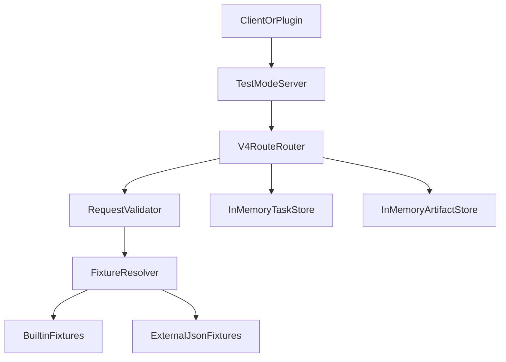

# 总览

本文档定义 Bible 测试模式。目的是让调用方在没有真实 Server 依赖的情况下，完成 v4 HTTP API 的契约级开发、联调和回归测试。

## 总体功能要求

Test Mode 在接口使用上，要遵守对现有的契约，避免设计漂移。

Test Mode 以 server 模式启动，提供可替代真实 BiBLE Atlas Server 的 HTTP 服务。

Test Mode 应当内置部分最核心的测试数据，同时也可接受以JSON形式传入的外部测试数据。

Test Mode 需具备对所有 v4 HTTP 路由，以及每个路由请求参数的模拟能力，并可以通过内置或用户提供的外部测试数据返回结果。返回结果应当符合 v4 API 契约约定的格式。

## 概要设计

### 设计边界

本设计以 Server v4 HTTP API 作为 Test Mode 的唯一契约基准。接口路径、请求字段、成功响应、错误响应与异步任务语义应以 `docs/designs/server_part/v4/02_API接口文档.md` 为准。

Test Mode 的服务端模式是一个可替代真实 BiBLE Atlas Server 的 HTTP 服务。它用于让客户端、插件、脚本和自动化测试在没有真实数据库、OpenSearch、向量模型、文件存储和 Celery Worker 的情况下，完成契约级联调。

本轮设计不以 Go CLI 的 `ok/data/error` 输出信封作为主契约，也不兼容 `bible_vscode/mock-cli` 的历史命令词汇。

> Note: Test Mode 的实现入口必须完全以 v4 HTTP API 为准。实现阶段不得从 CLI 契约或历史 mock-cli 命令词汇反向推导 Test Mode 行为。

### 职责边界

Test Mode 是面向调用方的 Server 模拟。所有 API 模拟都应遵循以下职责边界：

1. 校验调用方发送的 HTTP 请求字段是否合法，包括 method、path、content-type、必填字段、固定 `tag`、基础类型和枚举值。
2. 根据内置或外部 fixture 定义的场景，返回符合 v4 API 契约的、稳定且合理的 response。
3. 提供 Import 与 Download 的异步测试场景，支持客户端轮询、完成、失败和取消任务等交互验证。

Test Mode 不负责执行真实业务处理。以 Import 为例，Test Mode 可以校验 multipart 字段、文件字段是否存在、固定 `tag` 和文件名等请求层信息，但不解包 `.skill`、不检查压缩包内部是否存在 `SKILL.md`，也不执行真实解析脚本、向量化或入库流程。

### 目标

- 暴露 v4 API 中 Import、Search、Download、Control、Health 的测试替身。
- 内置最小核心测试数据，覆盖 KNOWLEDGE_BASE、SKILL、MEMORY 三个域。
- 支持通过单个外部 JSON fixture 覆盖或追加测试数据。
- 对所有 v4 路由的必填参数、可选参数和典型错误路径提供可预测响应。
- 模拟 Import 与 Download 的异步任务生命周期。
- 保持测试响应稳定，便于客户端做 golden test、契约测试和回归测试。

### 非目标

- 不启动真实 DB、OpenSearch、向量模型加载、文件系统归档或 Celery Worker。
- 不验证真实解析脚本、向量化质量、召回质量或排序质量。
- 不设计 CLI stdout 契约。
- 不把 legacy `status/result/error` 信封作为新 Test Mode 的默认响应格式。

## 运行模式

### server 模式

`server` 是默认模式。启动后 Test Mode 监听 HTTP 端口，并注册 v4 API 路由。调用方只需要把服务地址指向 Test Mode，即可像访问真实 Server 一样访问这些接口。

server 模式的核心行为：

- 所有路由都在 HTTP 层完成模拟。
- 请求参数按职责边界完成请求层校验，再进入 fixture 匹配。
- fixture 未命中时返回内置默认响应或明确的错误响应。
- Import 与 Download 返回异步任务，任务状态由内存任务仓库维护。
- Artifact 下载返回二进制流，而不是 JSON 响应。

## 总体架构



### 组件职责

| 组件 | 职责 |
| --- | --- |
| TestModeServer | 负责启动参数、监听地址、fixture 加载和 HTTP 生命周期 |
| V4RouteRouter | 注册并分发 v4 路由 |
| RequestValidator | 校验 method、path、content-type、必填字段、固定 tag 等基础契约 |
| FixtureResolver | 按请求选择内置或外部 fixture |
| BuiltinFixtures | 提供最小可用核心数据 |
| ExternalJsonFixtures | 载入用户提供的 JSON 测试数据，并覆盖内置数据 |
| InMemoryTaskStore | 保存 import/download 任务状态和结果 |
| InMemoryArtifactStore | 保存可下载产物内容和 metadata |

## 路由覆盖

### Health

| 方法 | 路径 | 行为 |
| --- | --- | --- |
| GET | `/health` | 返回服务健康状态。该接口可保持简单 JSON，不要求异步任务或 fixture 参与 |

### Import

| 方法 | 路径 | 域 | 行为 |
| --- | --- | --- | --- |
| POST | `/api/import/knowledge-base` | KNOWLEDGE_BASE | 校验 multipart、`files[]`、`kb_index`、`tag`，创建 import 任务 |
| POST | `/api/import/skill` | SKILL | 校验 multipart、`files[]`、`kb_index`、`tag=skill`，创建 import 任务 |
| POST | `/api/import/memory` | MEMORY | 校验 multipart、`files[]`、`kb_index`、`tag=memory`，创建 import 任务 |

### Search

| 方法 | 路径 | 域 | 行为 |
| --- | --- | --- | --- |
| POST | `/api/search/knowledge-base` | KNOWLEDGE_BASE | 按 `query`、`tag`、`search_type`、`top_k` 等字段返回知识库结果 |
| POST | `/api/search/skill` | SKILL | 按 `query`、固定 `tag=skill` 返回技能结果 |
| POST | `/api/search/memory` | MEMORY | 按 `query`、固定 `tag=memory` 返回记忆结果 |

### Download

| 方法 | 路径 | 域 | 行为 |
| --- | --- | --- | --- |
| POST | `/api/download/skill/file` | SKILL | 创建单文件下载任务 |
| POST | `/api/download/skill/batch` | SKILL | 创建批量下载任务 |
| GET | `/api/download/skill/artifact/{artifact_id}` | SKILL | 返回技能下载产物二进制流 |
| POST | `/api/download/memory/file` | MEMORY | 创建单文件下载任务 |
| POST | `/api/download/memory/batch` | MEMORY | 创建批量下载任务 |
| GET | `/api/download/memory/artifact/{artifact_id}` | MEMORY | 返回记忆下载产物二进制流 |

KNOWLEDGE_BASE 不支持 Download，Test Mode 应对相关未定义路径返回 404 或契约规定的错误。

### Control

| 方法 | 路径 | 行为 |
| --- | --- | --- |
| GET | `/api/control/admin/tasks/{task_id}` | 查询 import/download 异步任务状态 |
| DELETE | `/api/control/admin/tasks/{task_id}` | 取消未完成任务 |
| GET/PUT/DELETE | `/api/control/docs/*` | 返回 fixture 定义的文档管理响应 |
| GET | `/api/control/statistics/*` | 返回 fixture 定义的统计响应 |
| GET/POST | `/api/control/admin/*` | 返回 fixture 定义的运维响应 |

Control 的通配路由应优先覆盖 v4 文档中已有的明确路径。对于尚未细化字段的 control 子路由，第一版 Test Mode 不模拟具体业务细节，只根据 fixture 中显式声明的 route 提供响应；未声明路径返回稳定错误，避免隐式成功掩盖契约缺失。

> Note: 若真实 server 尚未实现 control 子路由细节，且 `bible-cli-go` 已覆盖相关能力，Test Mode 不需要重新定义这些业务行为，只需为契约测试提供 fixture 驱动的响应替身。

## Fixture 设计

### 数据来源

Test Mode 支持两类 fixture：

- 内置 fixture：随 Test Mode 发布，保证开箱可用。
- 外部 JSON fixture：由启动参数传入，第一版仅支持单个 JSON 文件，优先级高于内置 fixture。

外部 fixture 可以覆盖同一 selector 下的响应，也可以追加新的 selector。加载失败、JSON 格式错误或 schema 不合法时，Test Mode 应启动失败，而不是静默忽略。

> Note: 多 fixture 文件、fixture 目录、分层覆盖与合并策略不纳入第一版范围，后续可在明确优先级与冲突规则后扩展。

### 匹配键

fixture 按以下信息选择响应：

- `method`
- `path`
- `domain`
- `selector`

`selector` 用于描述请求参数匹配规则。不同 API 可以选择不同字段作为 selector，例如：

- Search：`query`、`tag`、`search_type`、`top_k`
- Import：`tag`、`kb_index`、`file_names`、`vector_model`
- Download：`storage_path`、`storage_paths`、`include_metadata`
- Task：`task_id`

### 外部 JSON 草案

```json
{
  "version": 1,
  "routes": [
    {
      "method": "POST",
      "path": "/api/search/memory",
      "domain": "MEMORY",
      "selector": {
        "tag": "memory",
        "query": "project context"
      },
      "response": {
        "status": 200,
        "json": {
          "success": true,
          "domain": "MEMORY",
          "tag": "memory",
          "total": 1,
          "results": {
            "memory": [
              {
                "id": "memory_fixture_001",
                "title": "Fixture memory",
                "content": "A stable memory search result.",
                "score": 0.99
              }
            ]
          }
        }
      }
    }
  ],
  "tasks": [
    {
      "task_id": "download_memory_001",
      "status": "completed",
      "result": {
        "artifact_id": "artifact_memory_001"
      }
    }
  ],
  "artifacts": [
    {
      "artifact_id": "artifact_memory_001",
      "domain": "MEMORY",
      "content_type": "application/zip",
      "file_name": "memory-fixture.zip",
      "body_base64": "UEsDBAoAAAAAA"
    }
  ]
}
```

### Fixture 优先级

1. 外部 JSON 中完全匹配 method、path、domain、selector 的 route。
2. 外部 JSON 中匹配 method、path、domain 且 selector 为空的默认 route。
3. 内置 fixture 中完全匹配的 route。
4. 内置 fixture 中该 path 的默认 route。
5. 契约错误响应，例如 `NOT_FOUND`、`INVALID_ARGUMENT` 或 `TAG_INVALID`。

### 内置核心数据

内置 fixture 只提供对 v4 API 接口的最小范围支持，定位为 happy day scenario，保证 Test Mode 无外部文件即可启动并跑通核心链路。内置 fixture 不负责覆盖完整错误路径矩阵；复杂错误场景应通过外部 fixture 显式定义。

内置 fixture 至少应包含：

- 一个 KNOWLEDGE_BASE tag，例如 `design`。
- 一个 SKILL 结果，固定 `tag=skill`。
- 一个 MEMORY 结果，固定 `tag=memory`。
- 一个 import queued 任务。
- 一个 completed download 任务和对应 artifact。

## 异步任务模拟

Import 和 Download 均按 v4 异步语义处理：

1. 提交接口返回 HTTP 202。
2. 响应体包含 `success=true`、`task_id`、`domain`、`tag`、`status=queued` 等字段。
3. Test Mode 将任务写入 InMemoryTaskStore。
4. 调用 `/api/control/admin/tasks/{task_id}` 查询任务状态。
5. 任务完成后，`result` 中可包含 `artifact_id`、导入计数、失败列表等字段。
6. Artifact 接口根据 `artifact_id` 返回二进制内容。

第一版固定使用 `delayed` 任务推进模式，暂不提供启动参数切换策略。任务状态按查询次数推进，避免基于真实时间导致测试不稳定：

1. 提交接口创建任务后，响应体固定返回 `status=queued`。
2. 首次查询任务状态时返回 `running`。
3. 第二次及后续查询返回最终态。默认成功任务进入 `completed`，并返回对应 `result`。
4. 需要测试失败路径时，由 fixture 显式声明任务最终态为 `failed` 及其错误信息。

InMemoryTaskStore 只保证单进程生命周期内的任务状态稳定。进程重启后任务状态允许丢失，调用方应重新提交任务或重新加载 fixture。

Artifact 处理同样遵循职责边界：

1. Artifact 接口只校验请求路径中的 domain 与 `artifact_id` 是否能匹配到 fixture 或内存任务结果。
2. 成功命中时，按 artifact fixture 返回二进制内容，并设置 `Content-Type` 与 `Content-Disposition`。
3. 未命中、domain/path 不匹配、过期等错误场景由 fixture 显式声明并返回对应错误响应。
4. 第一版不实现真实 TTL 计时、后台清理或存储生命周期管理；`expires_at` 仅作为 fixture response/result 中的契约字段。

取消任务时：

- `queued` 或 `running` 任务可变为 `cancelled`。
- `completed`、`failed`、`cancelled` 任务再次取消应返回稳定错误或幂等响应，具体以 v4 control 契约为准。
- 未知 `task_id` 返回 `NOT_FOUND` 类错误。

## 响应契约

### 成功响应

Search、Import、Download 提交和 Control 成功响应应遵守 v4 API 文档的字段形状。Search 响应使用平铺 JSON，例如包含 `success`、`domain`、`tag`、`total`、`results`。

Import 和 Download 提交成功应返回 HTTP 202。Artifact 下载返回二进制流，并设置合理的 `Content-Type` 与 `Content-Disposition`。

### 错误响应

错误响应应稳定表达：

- `code`
- `message`
- 可选 `details`

错误码应优先使用 v4 API 文档中定义的错误码，例如 `INVALID_ARGUMENT`、`TAG_INVALID`、`INDEX_NOT_BOUND`、`VECTOR_MODEL_CONFLICT`、`DOWNLOAD_NOT_FOUND`、`TASK_NOT_FOUND`。

当前仓库中存在 legacy `status/result/error` 信封和 FastAPI `detail` 错误体。Test Mode 的默认契约不应被 legacy 信封反向驱动；如未来需要兼容旧客户端，应通过显式兼容开关启用，而不是默认启用。

## 启动参数

建议的启动参数：

| 参数 | 默认值 | 说明 |
| --- | --- | --- |
| `--mode` | `server` | 当前仅定义 `server` 的完整行为 |
| `--addr` | `127.0.0.1:5555` | HTTP 监听地址 |
| `--fixture` | 空 | 外部 JSON fixture 文件路径；第一版最多指定一个文件 |
| `--strict` | `true` | fixture schema 或未知字段不合法时启动失败 |

运行参数只负责切换 Test Mode 行为，不应改变 v4 HTTP API 的路径和字段。

## 验收标准

### 路由验收

- Health、Import、Search、Download、Control 路由均有明确处理。
- 未定义路由返回稳定错误，不返回隐式成功。
- KNOWLEDGE_BASE Download 明确不支持。

### 契约验证

- 每个路由至少覆盖一个成功 fixture。
- 参数错误、固定 tag 错误、未知绑定、artifact not found、artifact expired 等错误路径不要求由内置 fixture 覆盖，可通过外部 fixture 或契约错误响应显式覆盖。
- Search 响应字段与 v4 文档一致。
- Import/Download 提交返回 HTTP 202。
- Artifact 返回二进制流。

### Fixture 验证

- 内置 fixture 无外部文件即可启动。
- 内置 fixture 仅覆盖最小 happy day scenario。
- 单个外部 JSON fixture 可以覆盖内置响应。
- fixture schema 错误会导致启动失败。
- selector 未命中时有明确降级顺序。

### 异步链路验证

- Import 提交、任务查询、完成结果可形成闭环。
- Download 提交、任务查询、artifact 下载可形成闭环。
- 固定 `delayed` 任务推进可用于测试客户端轮询逻辑，fixture 声明的 `failed` 最终态可用于测试错误处理。
- 取消任务行为稳定且可重复测试。

### 漂移防护

- 当 v4 API 文档新增路由、字段或错误码时，Test Mode 的路由覆盖清单和 fixture schema 应同步更新。
- Test Mode 的默认响应不得引入 v4 文档未定义的新必填字段。
- 旧信封兼容只能通过显式配置打开，不能成为默认行为。

## 设计 Review 发现

以下问题用于后续收敛设计边界和实现契约。

1. Fixture selector 匹配规则不够精确。需要补充 selector 是全量匹配还是子集匹配、可选字段缺省值如何参与匹配、数组是否按顺序匹配、字符串是否大小写敏感，以及多个 selector 同时命中时的优先级。

2. 错误响应契约仍偏泛。这很可能是 v4 API 文档遗漏的设计点，也是 Test Mode 需要重点暴露和覆盖的地方。当前只规定 `code`、`message`、可选 `details`，但没有明确完整 JSON shape、HTTP status、content-type 错误和参数校验错误是否模拟 FastAPI/Pydantic 的 `detail`。另外文中提到 `DOWNLOAD_NOT_FOUND`、`TASK_NOT_FOUND`，但 v4 错误码中是 `DOWNLOAD_ARTIFACT_NOT_FOUND`，且没有列出 `TASK_NOT_FOUND`。
