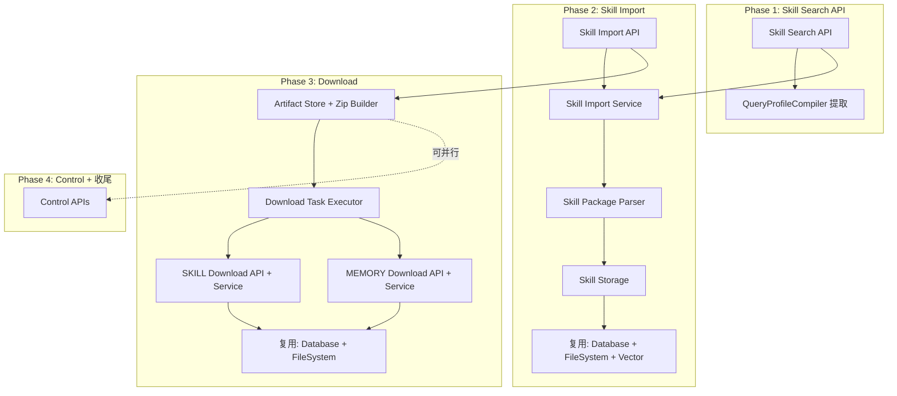

# BiBLE v4 Skill 支持开发计划

> 基于 `docs/designs/server_part/v4/` 设计文档与当前 `bible/` 实现代码对比分析
> 生成日期：2026-06-02
> **范围：SKILL 域导入、检索、下载 + 通用 Download 基础设施 + Control 端点。KNOWLEDGE_BASE 域不在本次计划内。**

---

## 一、现状总结

### 1.1 已实现能力（✅）

| 能力 | 覆盖范围 | 成熟度 |
|------|---------|--------|
| Memory Import | API → AsyncTask → Service → Store | 完整 |
| Knowledge Base Search | API → Service → Searcher → DB | 完整 |
| Memory Search | API → Service → Searcher → DB | 完整 |
| Skill Search（searcher层） | Searcher 存在，但无 API 端点 | 部分 |
| Async Task 基础设施 | Celery + Registry + Repository | 完整 |
| Parser Runtime | ASTGuard + SandboxRunner | 完整 |
| Database 抽象层 | OpenSearch / Elasticsearch / Postgres | 完整 |
| File System 抽象层 | Local / MinIO / S3 | 完整 |
| Vector 工具 | VectorTool + ModelPreloader + RerankTool | 完整 |
| Config 系统 | YAML/JSON 加载、单例缓存 | 完整 |
| Test Mode | Fixture-driven mock server | 完整 |

### 1.2 本次开发目标（Skill 聚焦）

| 能力 | 缺失项 | 本次 |
|------|--------|------|
| **Skill Import** | API端点、Service、Storage、Skill包解析器（.skill/SKILL.md） | ✅ |
| **Skill Search API** | API端点（searcher已存在） | ✅ |
| **Download（SKILL+MEMORY）** | 全部API端点、Service、Executor、ArtifactStore、ZipBuilder | ✅ |
| **Control 端点** | docs/statistics/admin API | ✅ |
| **QueryProfileCompiler 提取** | 当前嵌入在 Searcher 中，需提取为通用组件 | ✅ |
| **Download Task Executor** | Celery executor for download.* 任务 | ✅ |
| Knowledge Base Import | API端点、Service、Storage、Parser | ❌ 不在本次范围 |

---

## 二、开发阶段划分

### Phase 1：Skill Search API 补齐（1-2天）

**目标**：打通 Skill 检索的完整链路。

| # | 任务 | 文件 | 说明 |
|---|------|------|------|
| 1.1 | 创建 Skill Search API | `bible/api/search/skill_search_api.py` | POST /api/search/skill |
| 1.2 | 创建 Skill Search Service | `bible/features/search/skill_search/skill_search_service.py` | 编排层：参数校验、绑定读取、调用 searcher |
| 1.3 | 补齐 Skill Search Searcher | 检查 `bible/features/search/skill_search/searcher/search_skill.py` | 确保 search 方法签名与 KB/Memory 一致 |
| 1.4 | 提取 QueryProfileCompiler | `bible/features/search/common/query_profile_compiler.py` | 从 searcher 中提取 DSL 编译逻辑为通用组件 |
| 1.5 | 注册 Skill Search 路由 | `bible/api/search/__init__.py` | 将 skill_search_router 加入 search_router |
| 1.6 | 补充测试 | `tests/` | 覆盖 search/skill 端点 |

### Phase 2：Skill Import（3-4天）

**目标**：实现 .skill 包的导入与解析。

| # | 任务 | 文件 | 说明 |
|---|------|------|------|
| 2.1 | 创建 Skill Import API | `bible/api/import/skill_import_api.py` | POST /api/import/skill |
| 2.2 | 创建 Skill Import Service | `bible/features/import/skill_import/skill_import_service.py` | 脚本选择、安全门禁、manifest构建、解析调度 |
| 2.3 | 创建 Skill Parser | `bible/features/import/skill_import/parsers/parse_skill.py` | .skill 包解析：ZIP解压、SKILL.md 解析、防ZipSlip |
| 2.4 | 创建 Skill Package Parser | `bible/features/import/skill_import/skill_package_parser.py` | SKILL.md 结构化解析（name/description/正文） |
| 2.5 | 创建 Skill Storage | `bible/features/import/skill_import/storage/store_skill.py` | 文件落盘、绑定、向量化、内容+文件注册写库 |
| 2.6 | 创建 Skill Import Schemas | `bible/features/import/skill_import/schemas.py` | SkillImportPayload, ParseResult 等 |
| 2.7 | 注册 Skill Import Executor | `bible/features/import/import_task_executor.py` | 增加 `import.skill` 路由 |
| 2.8 | 注册 Skill Import 路由 | `bible/api/import/__init__.py` | 加入 import_router |
| 2.9 | 补充配置 | `bible/config/configure.py` | import_skill 配置项 |
| 2.10 | 补充测试 | `tests/` | 覆盖 import/skill 端点 |

### Phase 3：Download 功能（3-4天）

**目标**：实现 SKILL/MEMORY 的单文件和批量下载。

| # | 任务 | 文件 | 说明 |
|---|------|------|------|
| 3.1 | 创建通用 Artifact Store | `bible/features/download/common/artifact_store.py` | artifact 元信息存储、过期检查、TTL 清理 |
| 3.2 | 创建通用 Zip Builder | `bible/features/download/common/zip_builder.py` | 批量下载 ZIP 打包工具 |
| 3.3 | 创建 Download Task Executor | `bible/features/async_task/executors/download_task_executor.py` | download.skill.* / download.memory.* 任务路由 |
| 3.4 | 创建 SKILL Download API | `bible/api/download/skill_download_api.py` | POST file/batch + GET artifact/{id} |
| 3.5 | 创建 SKILL Download Service | `bible/features/download/skill_download/skill_download_service.py` | 单文件/批量下载编排 |
| 3.6 | 创建 MEMORY Download API | `bible/api/download/memory_download_api.py` | POST file/batch + GET artifact/{id} |
| 3.7 | 创建 MEMORY Download Service | `bible/features/download/memory_download/memory_download_service.py` | 单文件/批量下载编排 |
| 3.8 | 注册 Download 路由 | `bible/main.py` | 将 download_router 加入 app |
| 3.9 | 补充配置 | `bible/config/configure.py` | download 相关配置（artifact TTL、批量上限等） |
| 3.10 | 补充测试 | `tests/` | 覆盖 download 全链路 |

### Phase 4：Control 端点 + 收尾（2-3天）

**目标**：补齐运维与管理 API。

| # | 任务 | 文件 | 说明 |
|---|------|------|------|
| 4.1 | 创建 Tasks Admin API | `bible/api/control/` | GET/DELETE /api/control/admin/tasks/{task_id} |
| 4.2 | 创建 Docs API | `bible/api/control/docs_api.py` | 文档管理端点 |
| 4.3 | 创建 Statistics API | `bible/api/control/statistics_api.py` | 统计与观测端点 |
| 4.4 | 注册 Control 路由 | `bible/main.py` | 将 control_router 加入 app |
| 4.5 | 端到端集成测试 | `tests/` | 覆盖 Skill 全链路（import→search→download）+ Memory Download |

---

## 三、依赖关系

Phase 1 → Phase 2 → Phase 3 串行（每阶段依赖前一阶段的模块）；Phase 4 可与 Phase 3 部分并行。

---

## 四、风险与注意事项

| 风险 | 描述 | 缓解措施 |
|------|------|---------|
| **Skill包解析复杂性** | .skill/ZIP 解压需防 Zip Slip、解压炸弹、软链接穿越 | 严格参照设计文档中的安全约束实现 |
| **绑定不可变约束** | 索引首次创建后不可修改绑定 | store 层需严格校验，冲突返回明确错误码 |
| **Download Artifact 生命周期** | artifact 过期清理、并发安全 | TTL + 定时清扫 + 拉取时校验过期 |
| **向量模型冷启动** | 首次导入时模型下载可能超时 | 预加载 + 超时时返回明确错误码 |

---

## 五、工时估算

| Phase | 内容 | 预计工时 |
|-------|------|---------|
| Phase 1 | Skill Search API 补齐 | 1-2 天 |
| Phase 2 | Skill Import | 3-4 天 |
| Phase 3 | Download 功能 | 3-4 天 |
| Phase 4 | Control 端点 + 收尾 | 2-3 天 |
| **合计** | | **9-13 天** |

---

## 六、已确认决策

| # | 问题 | 决策 |
|---|------|------|
| 1 | Skill Search API 端点路径 | ✅ 按设计文档：`POST /api/search/skill` |
| 2 | Memory meta.json Parser | ✅ 当前复用默认解析器，不单独开发 |
| 3 | Download artifact 存储 | ✅ 使用 `infrastructure/file_system/` 统一管理 |
| 4 | Knowledge Base Import | ❌ 不在本次范围，延后到后续迭代 |
